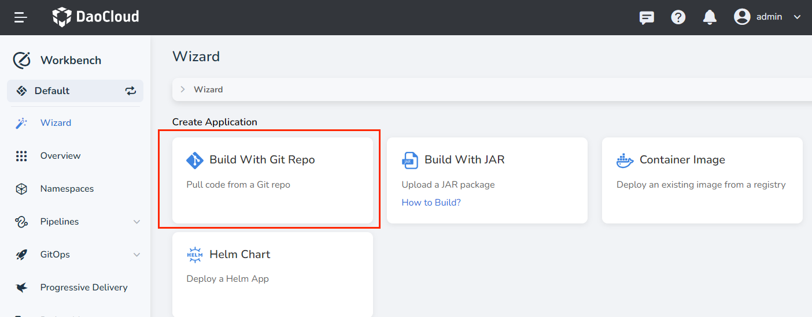

# Build microservice applications based on Git repository

Build traditional microservice applications based on the source code of the Git registry through the application workbench, so as to manage the traffic of the application, view logs, monitor, link tracking and other functions.

## prerequisites

- Need to create a workspace and a user, the user needs to join the workspace and give `workspace edit` role.
  Refer to [Creating Workspaces](../../../ghippo/04UserGuide/02Workspace/Workspaces.md), [Users and Roles](../../../ghippo/04UserGuide/01UserandAccess/User. md).
- Create two credentials that can access the codebase registry and the container registry, and name them respectively: `git-credential` and `registry`. For more information on creating credentials, please refer to [Credential Management](../Pipeline/Credential.md).
- Prepare a Gitlab registry, Harbor registry

## Create Credentials

1. Create two credentials on the Credentials page:

    - git-credential: username and password for accessing the code repository
    - registry-credential: username and password for accessing the container registry

1. After the creation is complete, you can see the credential information on the `Certificate List` page.

## Create a microservice application based on Git

1. On `Application Workbench` -> `Wizard` page, click `Build Based on Git Repository`.

    

1. On the `Build Based on Git Repository` page, set the following basic information and click `Next`:

    - Name: Fill in the name of the application.
    - Resource type: supports stateless load and stateful load. This demo chooses stateless load.
    - Enter or select an application group.
    - Set the deployment location, if you want to access microservices, please ensure that the current workspace
        - Cluster: Select the cluster where the application needs to be deployed.
        - Namespace: Select the namespace where the application needs to be deployed.
    - Number of instances: Fill in the number of instances and the number of Pods.

    

1. After setting the pipeline construction information, click `Next`.

    - code repository
        - codebase: Enter the Git registry address `https://gitlab.daocloud.cn/ndx/skoala.git`. Here is an example address, please use your own registry address in actual operation.
        - Branch: default is `main`, here is `main`, no need to change
        - Credentials: Select the credential `git-credential` to access the codebase, if it is a public registry, you do not need to fill in
    - Construct
        - Dockerfile path: Enter the absolute path of the Dockerfile in the codebase, the example address here is `demo/integration/springcloud-nacos-sentinel/code/Dockerfile`
        - Target image name: Enter the container registry name [`release-ci.daocloud.io/test-lfj/fromgit`](http://release-ci.daocloud.io/test-lfj/fromgit).
        - Tag: Enter the container registry version `v2.0.0`
        - Credentials: Select the credential `registry-credential` to access the container registry
    - advanced settings
        - ContextPath: ContextPath is the execution context path of the docker build command. Fill in the path relative to the root directory of the code, such as target, or the directory where the Dockerfile is located if not filled.
        - Build parameters: Build parameters will be passed to the parameters of the build command in the form of --build-arg, which supports setting the upstream product download address and upstream image download address as parameters, and supports custom arbitrary parameters.

    

1. After configuring the container, click `Next`.

    - service configuration
        - Access type: supports intra-cluster access, node access, and load balancing. Example values ​​are as follows:

        ```
        - name: http protocol: TCP port: 8081 targetPort: 8081
        - name: health-http protocol: TCP port: 8999 targetPort: 8999
        - name: service protocol: TCP port: 9555 targetPort: 9555
        ```

    - resource constraints
        - Specify the upper limit of resources that the application can use, including CPU and memory.

    

1. On the `Advanced Configuration` page, select `Enable Microservice Access`, configure the following fields and click `OK`.

    - Select framework: support `Spring Cloud`, `Dubbo`, here choose `Spring Cloud`.
    - Registry instance: currently only supports [Nacos registry instance managed by the microservice engine]().
    - Registry namespace: nacos namespace for microservice applications
    - Registry service grouping: service grouping of microservice applications
    - Registry instance grouping:
    - Username/Password: If the registry instance is authenticated, you need to fill in the username and password
    - Enable Microservice Governance: The registry instance that needs to be selected supports enabling it, otherwise it cannot be enabled
    - Observable:
        - Monitoring: Select Enable, and you can view service-related monitoring information after enabling it
        - Log: enabled by default
        - Link tracking: After opening, you can view the link tracking information of the service, currently only supports Java language

    

## View and access microservice related information

1. Click `Overview` on the left navigation bar, and in the `Native App` tab, hover the cursor over an app, and click `View More Details` on the floating menu.

    

1. Jump to the microservice engine to view service details.