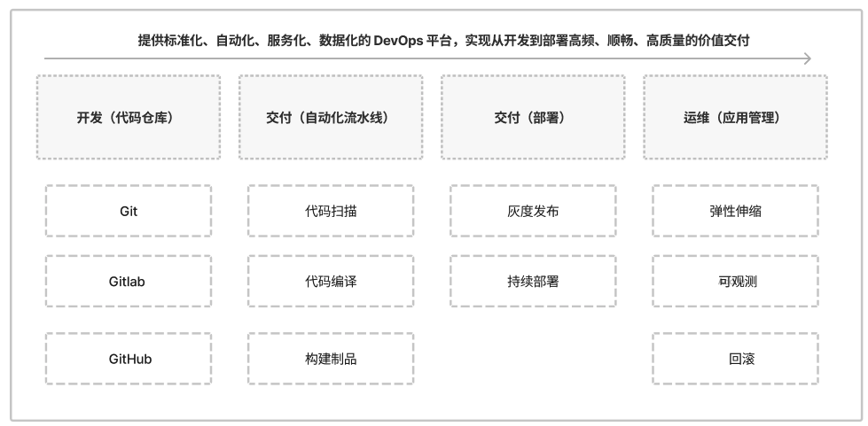
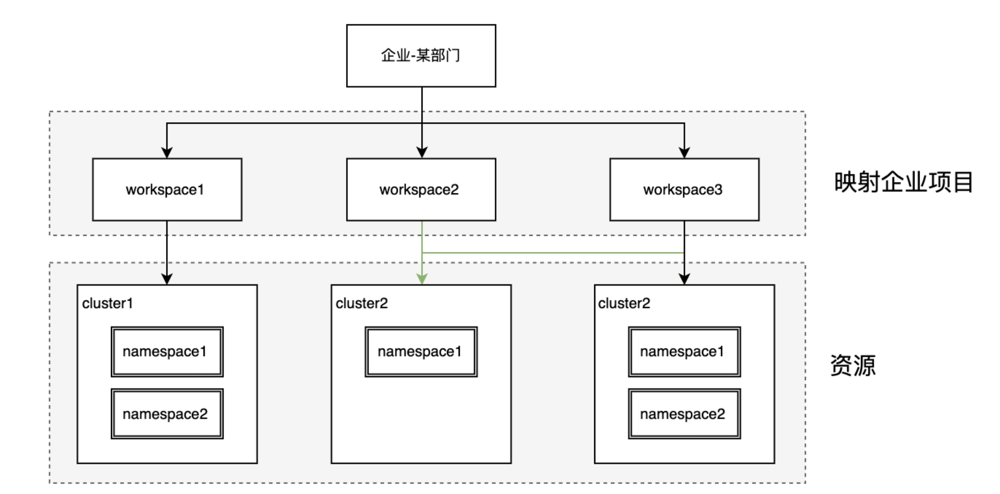
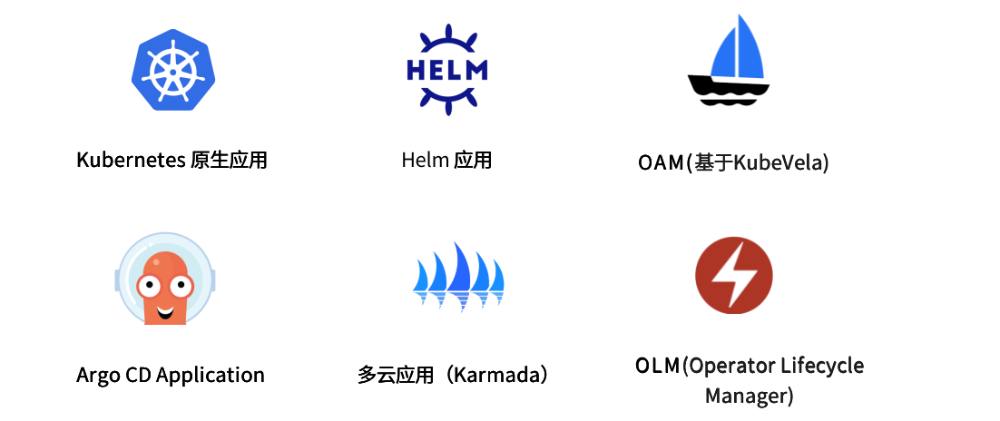
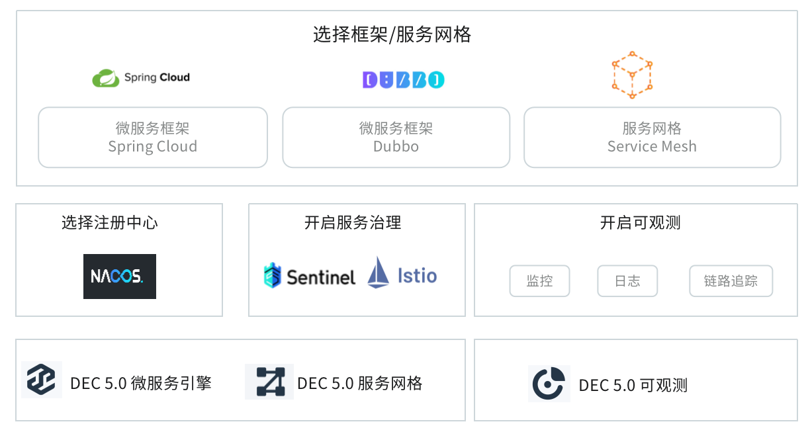
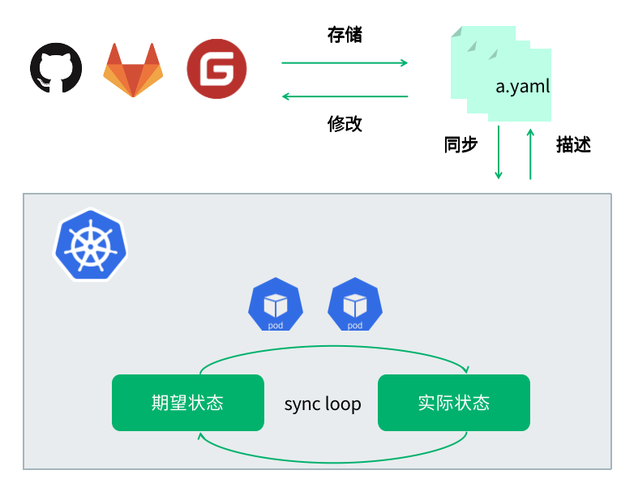

# 5.0 Application workbench capability introduction

Nowadays, with the rapid popularization of cloud-native concepts, cloud-native technology brings great convenience to enterprises in the process of digital transformation. However, enterprises face a series of challenges in the cloud-native process:

- How to satisfy resource isolation at the logical level under the multi-tenant design? How to satisfy the isolation of physical resources?
- Frequent continuous builds, how to find problems and fix bugs at an earlier stage in time, and continue to ensure that the code and environment meet expectations?
- The types of technologies under Cloud Native are complex. How to make good use of Cloud Native to build a CI/CD system under Cloud Native?
- Cloud-native technology brings complexity to application deployment. How to reduce the cognitive burden on developers?
- Fully automatic application deployment, how to make the release of new functions controllable, predictable, and reversible?

In the face of such challenges, DCE 5.0 is based on cloud-native technologies such as Kubernetes. The application workbench came into being, integrating DaoCloud DevOps practice and the cutting-edge research and development concepts of the cloud-native community.
Establish a set of automated development, operation and maintenance integrated environment for enterprises from source code construction to continuous deployment of applications, and can cover the full life cycle management of all forms of cloud-native applications. Help enterprises shorten the R&D cycle and improve application delivery efficiency.

## Graphical user interaction

In the digital economy era, cloud-native applications have become a must for digital transformation of enterprises. Therefore, the application workbench is application-centric and based on the DevOps concept to solve the entire life cycle of cloud-native application development, automated delivery, and operation and maintenance. Lower the threshold of cloud-native enterprise applications and increase the frequency of application delivery. The application workbench involves: hierarchical multi-tenant resources, cloud-native applications, pipeline CI/CD pipeline, GitOps, progressive delivery and other modules.

There are three main stages in the user's use process: **development stage, delivery stage, operation and maintenance stage. **

1. **In the development stage**: The application workbench provides the pipeline function. Enterprises can define the process of compiling code, code inspection, and building cloud native products in the pipeline to help developers test code in time, thereby improving code quality. In addition, the entire pipeline is set up once and reused multiple times, which greatly reduces the workload of developers and reduces unnecessary duplication of labor.

2. **In the delivery stage**: The application workbench gives the current GitOps concept, and deploys enterprise applications to the production environment frequently and continuously in an automated manner. As an extension of the previous stage, automated continuous deployment serves as a link between the past and the future, and is a closed-loop control of the entire process of software development. The application workbench can automatically and continuously monitor the codebase and compare it with the application in the production environment to ensure that the production environment is consistent with the expected state in the registry to achieve fully automated deployment. In addition, the application workbench also supports the docking of external capabilities on the basis of continuous deployment, so as to realize advanced release strategies such as grayscale release under progressive delivery.

3. **In the operation and maintenance phase**: The application workbench provides a unified observation plane for various forms of cloud-native applications, including monitoring, alarms, logs and other information. It also provides functions such as application upgrade, rollback, stop and delete application.

## Features

The application workbench provides hierarchical resource management, cloud-native applications, CI/CD pipelines, GitOps, and progressive delivery core services to meet the needs of different scenarios of the enterprise.

### Hierarchical resource management

In the enterprise environment, each department under the enterprise is composed of different projects, and each project is mapped to our workspace (workspace). The figure below shows the Kubernetes-based multi-tenant management solution provided by the application workbench.

Precondition: Users can be set as the administrator of the workspace in the 5.0 global management module to participate in the management of the workspace, thereby participating in the collaboration of the project.

Features:

- A workspace is the smallest tenant unit.
- The workspace supports the mode of weakly bound clusters, so that users can obtain the ability to share resources across clusters and namespaces.
- The workspace supports the mode of strongly binding clusters, so that users can obtain the ability to exclusively enjoy cluster resources.
- The administrator of a workspace can create namespace resources in the cluster associated with the workspace and manage quotas for the namespace.

Supports the deployment of various forms of cloud-native applications, including source code, Jar packages, and images to complete application deployment with one click, and can use the registration discovery and service governance capabilities of microservices during the creation process, and also supports one-click deployment of Helm through the application store application, OLM application. It lowers the threshold for enterprises to go to the cloud, and is easy to use, agile and efficient.

### Cloud Native Applications

The application workbench is application-centric and covers various forms of applications under the cloud-native technology. The application workbench adopts a more inclusive attitude towards the different forms of applications in the cloud-native community, rather than following its own understanding of the application on the platform. Define a set of own application specifications in . It aims to help users "use the cloud well" without learning cloud-native knowledge.

The cloud-native applications currently supported by the application workbench include:

The application workbench is oriented towards application development and operation and maintenance, covering the entire application lifecycle, including application creation, deletion, configuration modification, automatic scaling, and automatic operation and maintenance.
And support SpringCloud, Dubbo, ServiceMesh service governance architecture, and [5.0 Microservice Engine](../skoala/intro/features.md), [5.0 Service Grid](../mspider/01Intro/WhatismSpider.md) Seam integration:

### CI/CD pipeline

Pipeline is a custom CI/CD pipeline pattern that defines a complete build process including build, test, and release. The application workbench has the following advantages based on the pipeline capability:

- Build applications from different sources: support one-click deployment of applications using source code and software packages (Jar).
- Dual Engines: Supports Jenkins and Tekton as Pipeline Engines for Application Workbench.
- Abundant pipeline templates: multiple official pipeline templates are built in, which greatly reduces the threshold for users to use, and can adapt to different business scenarios and meet the daily needs of users.

### GitOps

GitOps is a philosophy of continuous deployment for cloud-native applications. The application workbench fully embraces GitOps. The core idea of GitOps is to have a Git registry, and store the declarative infrastructure and applications of the application system in the Git registry for version control.
GitOps combined with Kubernetes can use automatic delivery pipelines to apply changes to any number of specified clusters, thereby solving the problem of consistency across cloud deployments.

### Progressive release

In order to ensure the security of application deployment, enterprises have adopted the grayscale release solution. This deployment strategy makes application deployment more secure, but it still lacks automation. The process of publishing services to production and analyzing metrics remains a manual process. This will drive us to the next phase, progressive delivery.

The application workbench implements progressive grayscale release based on Argo Rollouts, allowing developers to choose their own analysis indicators, customize their progressive release steps, and even choose their own portal or service mesh provider to Perform flow control.

## Frequently Asked Questions

1. **What is DevOps**

     DevOps is the integration of development (Dev) and operations (Ops), referring to the integration of development, quality assurance and IT operations into a unified environment and software delivery process.
     By adopting a DevOps culture, practices, and tools, organizations can respond better to business needs, build applications faster, and achieve business goals faster.

     DevOps includes the following activities and operations:

     - **Continuous Integration (CI)** refers to the practice of frequently merging all developer code into a central code repository, followed by an automated build and test process.
       The goal is to quickly find and correct code issues, simplify deployment, and ensure code quality.
     - **Continuous Delivery (CD)** refers to the practice of automatically generating, testing, and deploying code to a production-like environment. The goal is to ensure that the code is always ready for deployment.
       Adding continuous delivery to create a full CI/CD pipeline helps detect code defects early. And make sure that properly tested updates can be released in a very short time.
     - **Continuous Deployment** is an additional process that automatically pulls in and deploys all updates passed through a CI/CD pipeline to production.
       Continuous deployment requires solid automated testing and advanced process planning, and may not be suitable for all teams.
     - **Continuous Monitoring** refers to the processes and techniques to incorporate monitoring capabilities at every stage of the DevOps and IT operations lifecycle.
       Monitoring helps ensure that applications and infrastructure maintain proper health, performance, and reliability as applications move from development to production. Continuous monitoring is based on the concepts of CI and CD.

1. **What is a pipeline? **

     Pipelines can automatically generate and test code projects, making them available to others.
     Works with any language or project type. Combine continuous integration (CI) and continuous delivery (CD) to test and generate code and send it to any target.
     The application workbench also supports a visual way to organize the pipeline, and the enterprise can visualize the existing R&D process through the pipeline.

1. How does **pipeline build an application? **

     The application workbench provides importing code from Git, uploading Jar packages to create applications.
     During the creation process, you only need to fill in part of the information required by the pipeline, and the application workbench will help you create a pipeline resource to automatically build, test, and release the application from source code to the Kubernetes cluster environment.
     Designed to help companies deliver software continuously at a faster rate while reducing risk.

1. Which cloud-native applications does **support? **

     Kubernetes native applications, Helm applications, OAM applications, OLM applications.

1. **How to operate and maintain various forms of cloud-native applications? **

     The application workbench is centered on the application and has a unified observation plane, including monitoring, alarm, log and other information.
     Make the operation and maintenance of cloud-native applications in different forms easier and more convenient.

[Learn About App Workbench](../amamba/01ProductBrief/WhatisAmamba.md){ .md-button }

[Download DCE 5.0](../download/dce5.md){ .md-button .md-button--primary }
[Install DCE 5.0](../install/intro.md){ .md-button .md-button--primary }
[Apply for community free experience](../dce/license0.md){ .md-button .md-button--primary }
