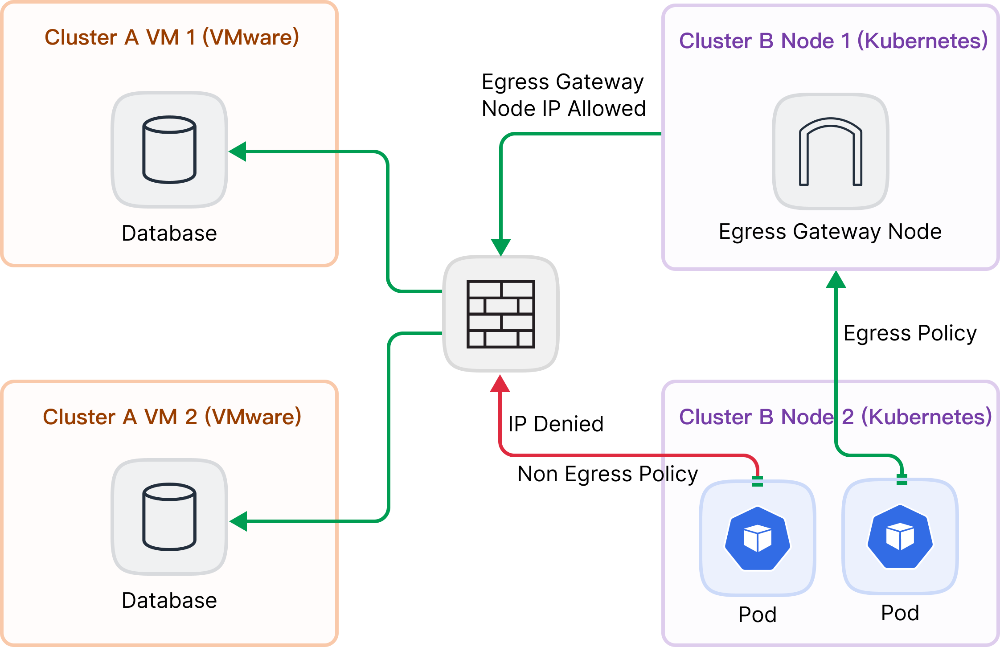

# egressgateway

Starting with 2021, we received some feedback as follows.

Assume that you have two clusters A and B. Cluster A is VMWare-based and runs mainly Database workloads,
and Cluster B is a Kubernetes cluster. Some applications in Cluster B need to access the database
in Cluster A, and the network administrator wants the cluster Pods to be managed through an egress gateway.

## Summary

The gateway provides network egress capabilities for Kubernetes clusters.

### Features

* Solve IPv4 IPv6 dual-stack connectivity
* Solve the high availability of Egress Nodes
* Allow filtering Pods Egress Policy (_Destination CIDR_)
* Allow filtering of egress Applications (_Pods_)
* Can be used in low kernel version
* Support multiple egress gateways instance
* Support namespaced egress IP
* Supports automatic detection of cluster traffic for egress gateways policies
* Support namespace default egress instances

### Compatibility

* Calico

### CRDs

* EgressNode
* EgressGateway
* EgressPolicy
* EgressClusterPolicy
* EgressEndpointSlice
* EgressClusterEndpointSlice
* EgressClusterInfo

You can follow the [Get Started](https://spidernet-io.github.io/egressgateway/usage/install)
to set up your own playground!

## Develop

Refer to [develop](https://github.com/spidernet-io/egressgateway/blob/main/docs/develop/dev.md).

## License

EgressGateway is licensed under the Apache License, Version 2.0.
See [LICENSE](https://github.com/spidernet-io/spiderpool/blob/main/LICENSE) for the full license text.

[egressgateway on GitHub](https://github.com/spidernet-io/egressgateway){ .md-button }
