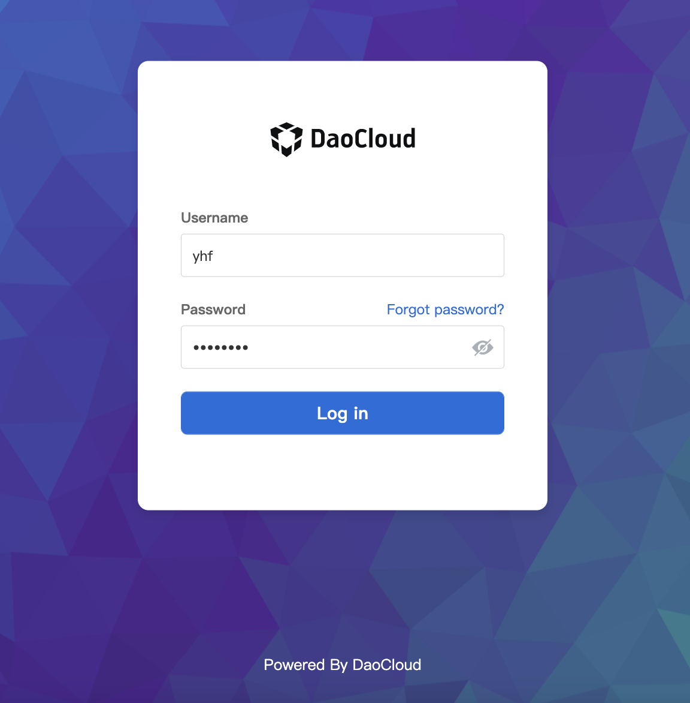

---
hide:
  - toc
---

# Log in

Before a user uses a new system, there is no data in the system, and the system cannot identify the new user. In order to identify the user identity and bind user data, the user needs an account that can uniquely identify the user identity.

DCE 5.0 assigns an account with certain permissions to the user through the way the administrator creates a new user in `User and Access Control`. All behaviors generated by this user will be associated with their own account.

The user logs in through the account/password, and the system verifies whether the identity is legal. If the verification is legal, the user logs in successfully.

!!! note

    If the user does not perform any operation within 2 hours after logging in, the login status will be automatically logged out. If the logged-in user is always active, the logged-in state will persist.

The simple process of user login is shown in the figure below.

```mermaid
graph TB

user[enter username] --> pass[enter password] --> judge([click to log in and verify username and password])
judge -.Correct.->success[login successful]
judge -.error.->fail[prompt error]

classDef plain fill:#ddd,stroke:#fff,stroke-width:1px,color:#000;
classDef k8s fill: #326ce5, stroke: #fff, stroke-width: 1px, color: #fff;
classDef cluster fill:#fff,stroke:#bbb,stroke-width:1px,color:#326ce5;

class user, pass cluster;
class judge plain
class success, fail k8s
```

The user login interface is as shown in the figure below. For the specific login screen, please refer to the actual product.

