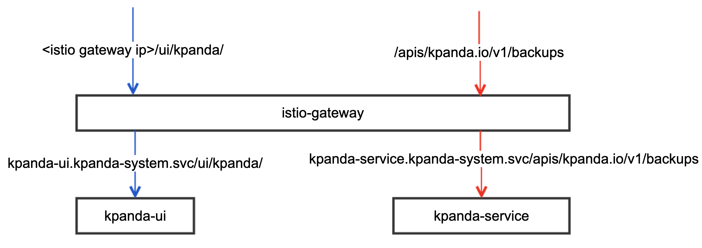

---
hide:
  - toc
---

# Access routing and login authentication

Unified login and password verification after docking, the effect is as follows:


The API bear token verification of each GProduct module goes through the Istio Gateway.

The routing map after access is as follows:



## Docking method

Take `kpanda` as an example to register GProductProxy CR.

```yaml
# GProductProxy CR example, including routing and login authentication
 
# spec.proxies: The route written later cannot be a subset of the route written first, and vice versa
# spec.proxies.match.uri.prefix: If it is a backend api, it is recommended to add "/" at the end of the prefix to indicate the end of this path (special requirements can not be added)
# spec.proxies.match.uri: supports prefix and exact modes; Prefix and Exact can only choose 1 out of 2; Prefix has a higher priority than Exact
 
apiVersion: ghippo.io/v1alpha1
kind: GProductProxy
metadata:
  name: kpanda  # (1)
spec:
  gproduct: kpanda  # (2)
  proxies:
  - labels:
      kind: UIEntry
    match:
      uri:
        prefix: /kpanda # (3)
    rewrite:
      uri: /index.html
    destination:
      host: ghippo-anakin.ghippo-system.svc.cluster.local
      port: 80
    authnCheck: false  # (4)
  - labels:
      kind: UIAssets
    match:
      uri:
        prefix: /ui/kpanda/ # (5)
    destination:
      host: kpanda-ui.kpanda-system.svc.cluster.local
      port: 80
    authnCheck: false
  - match:
      uri:
        prefix: /apis/kpanda.io/v1/a
    destination:
      host: kpanda-service.kpanda-system.svc.cluster.local
      port: 80
    authnCheck: false
  - match:
      uri:
        prefix: /apis/kpanda.io/v1 # (6)
    destination:
      host: kpanda-service.kpanda-system.svc.cluster.local
      port: 80
    authnCheck: true
```

1. Cluster-level CRDs
2. You need to specify the GProduct name in lowercase
3. Can also support exact
4. Whether istio-gateway is required to perform AuthN Token authentication for this routing API, false means to skip authentication
5. UIAssets recommends adding `/` at the end to indicate the end (otherwise there may be problems in the front end)
6. The route written later cannot be a subset of the route written earlier, and vice versa