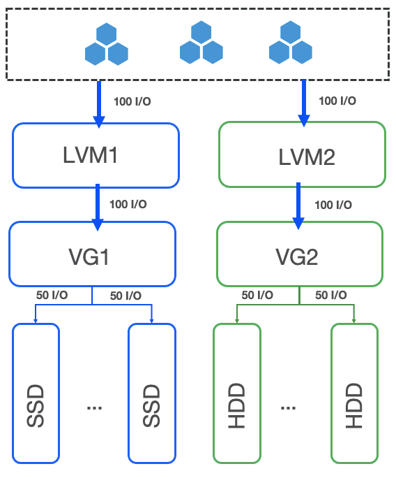
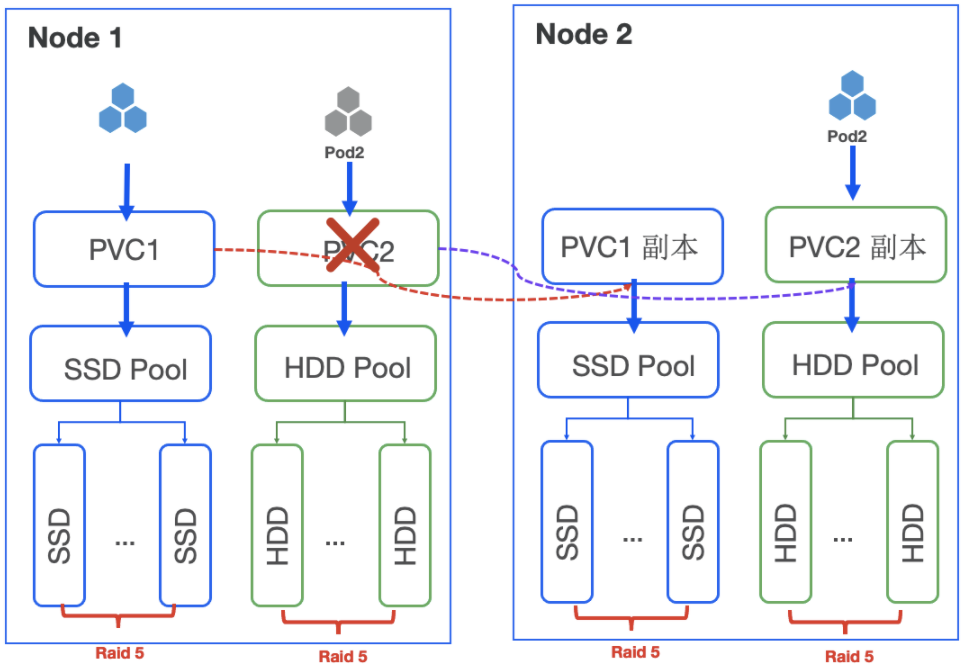
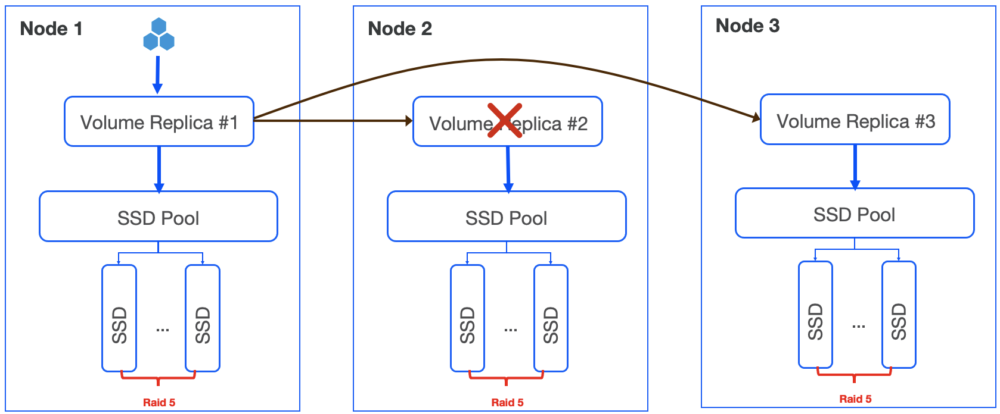
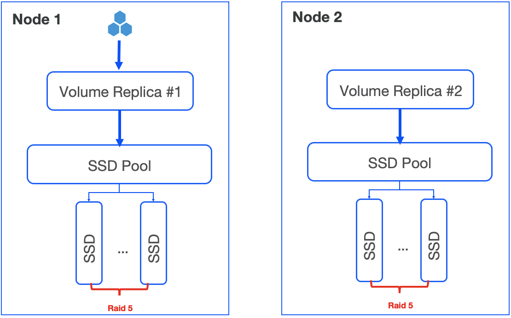

# overview

HwameiStor provides two kinds of local data volumes: LVM and Disk.

As a part of HwameiStor, the local disk is responsible for providing LVM local data volumes, including highly available LVM data volumes and non-highly available LVM data volumes.

Non-highly available LVM local data volumes are suitable for the following scenarios and applications:

- A **database** with high availability features, such as MongoDB
- **Message middleware** with high availability features, such as Kafka, RabbitMQ
- A **key-value store** with high availability features, such as Redis
- Other applications with high availability functions

Highly available LVM local data volume, suitable for the following scenarios and applications:

- **Database**, such as MySQL, PostgreSQL
- Other applications that require high data availability

## Hot backup mechanism

### Single node hot backup

Raid 5 guarantee, can tolerate 1 set of disk failure.

Control flow and data flow are independent of each other to ensure the stability of data access.

### Cross-node hot backup

Raid 5 + primary and backup copy protection.

The HA private network logical interface dce-storage is planned to synchronize storage traffic between nodes. Synchronously replicate data across nodes to ensure hot backup of data.

## Data rebalancing

Balanced placement of data in the cluster is achieved through data volume migration technology. Move data online to nodes with more headroom.

## Data volume type change

In order to support some special scenarios, single-copy data volumes are allowed to be changed to multiple copies, and cross-node hot backup is supported.

