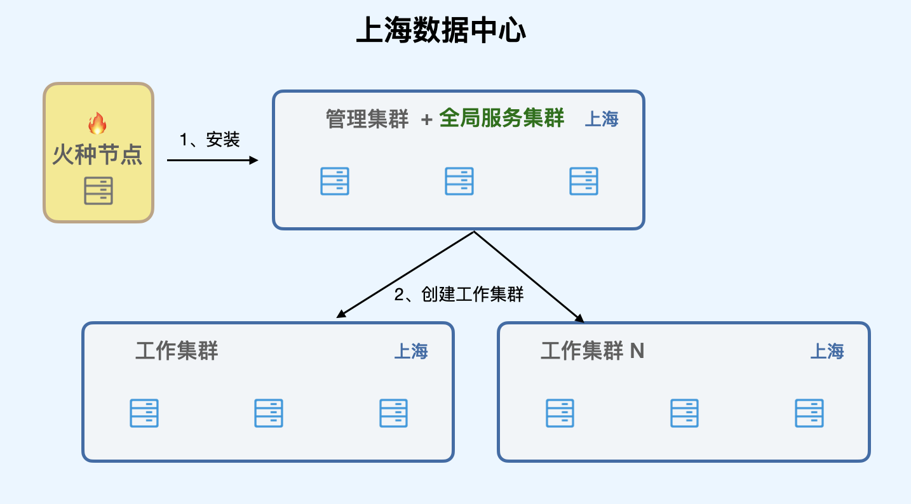
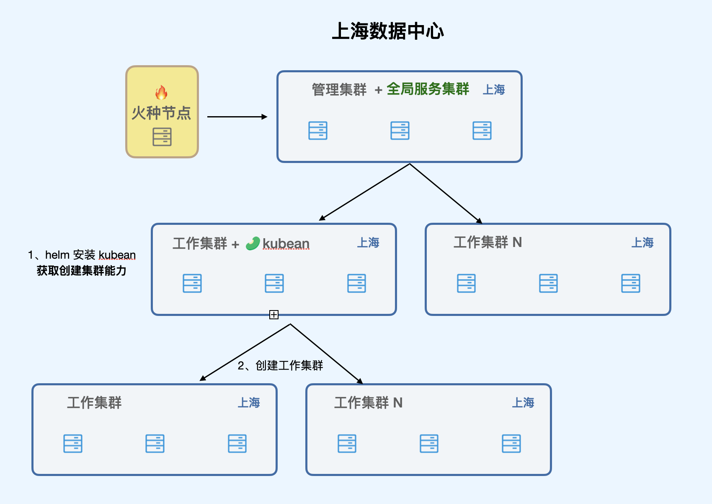

# Cluster deployment mode usage scenarios

DCE 5.0 provides [four cluster roles](../../kpanda/07UserGuide/Clusters/ClusterRole.md) to meet different usage scenarios. Users can freely combine different cluster deployment combinations based on their own business characteristics and infrastructure scenarios.

This article will describe several common usage scenarios.

## Single data center scenario

When most of the user's business is concentrated in a single data center in a certain area, there is no need for cross-network, and the requirements for data disaster recovery are low. Simple mode is recommended. That is, only one cluster is needed to run platform-related components (global service cluster + management cluster combined), and multiple clusters are deployed to run business loads (working clusters). The number of nodes in a single cluster depends on specific business scenarios. It is recommended to use 3 master nodes for each cluster to achieve high availability.

The specific deployment plan is based on business needs, refer to the following deployment process:

## Single data center single management cluster

Premise: Prepare a node. The operating system and architecture of the node must be consistent with the node to be created in the cluster.

1. Deploy the installer on the Tinder node, and use the installer to install a cluster that includes the two cluster roles of the global service cluster and the management cluster.

1. Create one or more working clusters based on the management cluster on the container management module under the platform as needed.

## Single data center multi-management cluster

When the user needs to add a management cluster in the current single data center to manage the life cycle of the new business cluster, there is no need to use the Tinder node to install it again, and only need to install the kubean operator on a working cluster that has already been created The component can endow the cluster with the ability and role to manage the cluster. As shown below:

Prerequisite: The previous step of deploying a single-data center single-management cluster has been completed.

1. Use the [helm template](../../kpanda/07UserGuide/helm/README.md) to install kubean on a working cluster details interface, and wait for the kubean status to change to running.

1. After the kubean is installed in the current working cluster, the cluster role will automatically become the management cluster, and one or more working clusters can be created based on the management cluster on the container management module under the platform as needed.

## Multi-data center scenario

When a user has multiple data centers, or the networks of different data centers are isolated, such as in disaster recovery scenarios such as two locations and three centers, the user has cluster lifecycle management requirements in different regions and different data centers. Classic mode is recommended. At this time, a management cluster can be deployed in different data centers or regions, and all management clusters can be connected to the global service cluster for management, so as to achieve unified management of the life cycle of clusters in different regions.

### Multi-data center multi-management cluster

Premise: Prepare a node. The operating system and architecture of the node must be consistent with the node to be created in the cluster.

#### Shanghai Data Center

1. Deploy the installer on the tinder node, and use the installer to install a management cluster.

1. After the management cluster is installed, a global service cluster will be automatically created based on the cluster configuration <!--link to be added-->.

1. Create one or more working clusters based on the management cluster on the container management module under the platform as needed.

In cross-region and network isolation scenarios, the cluster life cycle of other data centers needs to be managed in a unified manner. Please refer to the following configuration process.

#### Beijing Data Center

Premise: Prepare a node in the Beijing data center. The operating system and architecture of the node must be consistent with the node to be created in the cluster.

1. Deploy the installer on the tinder node, and use the installer to install a management cluster.

1. The container management module under the platform (running in the Shanghai data center) is connected to the newly installed management cluster in the Beijing data center.

1. Create one or more working clusters based on the management cluster of the Beijing data center on the container management module of the platform (running in the Shanghai data center) as needed.