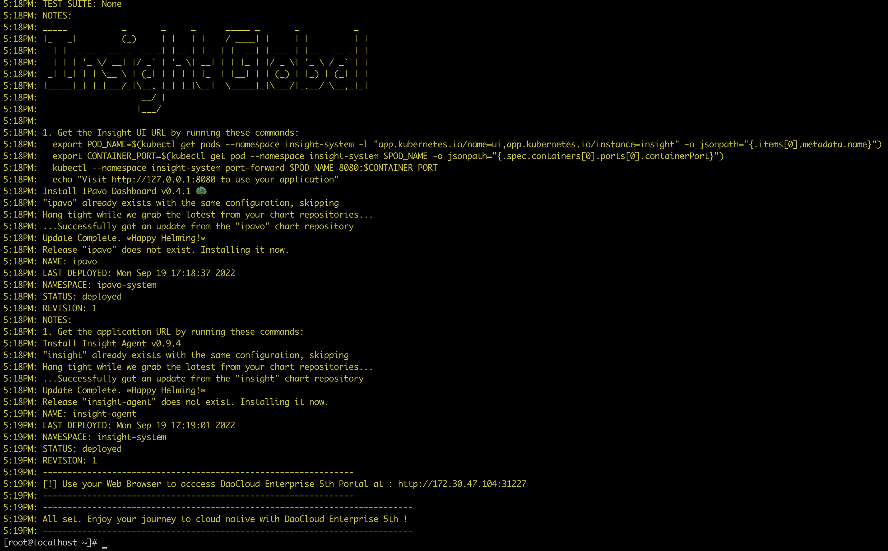

# Install DCE 5.0 Community Edition online using a kind cluster

This page explains how to install DCE 5.0 Community Edition online using a kind cluster.

!!! note

    Click [Install Community Edition Online](../../../videos/install.md#3) to watch a video demo.

## Preparation

- Prepare a machine, recommended machine resources: CPU > 10 cores, memory > 12 GB, disk space > 100 GB.
- Make sure Docker and Kubectl are installed on the node.

## Install kind cluster

1. Download the kind binary package.

    ```shell
    curl -Lo ./kind https://qiniu-download-public.daocloud.io/kind/v0.17.0/kind-linux-amd64
    ```

    Add executable permissions for `kind`:

    ```bash
    chmod +x ./kind
    ```

1. Add kind to the environment variable.

    ```bash
    mv ./kind /usr/bin/kind
    ```

1. Check the kind version.

    ```shell
    kind version
    ```

    The expected output is as follows:

    ```console
    kind v0.17.0 go1.19.2 linux/amd64
    ```

1. Set up the `kind_cluster.yaml` configuration file.

    Note that port 32000 in the cluster is exposed to port 8888 external to kind (you can modify it yourself). The configuration file example is as follows:

    ```yaml title="kind_cluster.yaml"
    apiVersion: kind.x-k8s.io/v1alpha4
    kind: Cluster
    nodes:
    - role: control-plane
      extraPortMappings:
      - containerPort: 32088
        hostPort: 8888
    ```

1. Create a v1.25.3 example cluster named `fire-kind-cluster`.

    ```shell
    kind create cluster --image release.daocloud.io/kpanda/kindest-node:v1.25.3 --name=fire-kind-cluster --config=kind_cluster.yaml
    ```

    The expected output is as follows:

    ```console
    Creating cluster "fire-kind-cluster" ...
     ✓ Ensuring node image (release.daocloud.io/kpanda/kindest-node:v1.25.3) 🖼
     ✓ Preparing nodes 📦
     ✓ Writing configuration 📜
     ✓ Starting control-plane 🕹️
     ✓ Installing CNI 🔌
     ✓ Installing StorageClass 💾
    Set kubectl context to "kind-fire-kind-cluster"
    ```

1. View the newly created cluster.

    ```shell
    kind get clusters
    ```

    The expected output is as follows:

    ```console
    fire-kind-cluster
    ```

## Install DCE 5.0 Community Edition

1. [Install dependencies](../../install-tools.md).

    !!! note

        If all dependencies are installed in the cluster, make sure the dependency versions meet the requirements:

        - helm ≥ 3.9.4
        - skopeo ≥ 1.9.2
        - kubectl ≥ 1.22.0
        - yq ≥ 4.27.5

1. Obtain the IP of the host where kind is located, such as `10.6.3.1`, and execute the following command to start the installation.

    ```shell
    ./dce5-installer install-app -z -k 10.6.3.1:8888
    ```

    !!! note

        The kind cluster only supports NodePort mode.

1. After the installation is complete, the command line will prompt that the installation is successful. congratulations! :smile: Now you can use the **default account and password (admin/changeme)** to explore the new DCE 5.0 through the URL prompted on the screen!

    

!!! success

    - Please record the URL of the reminder for the next visit.
    - After successfully installing DCE 5.0 Community Edition, please [apply for a community free trial](../../../dce/license0.md).
    - If you encounter any problems during the installation process, please scan the QR code and communicate with the developer freely:

        