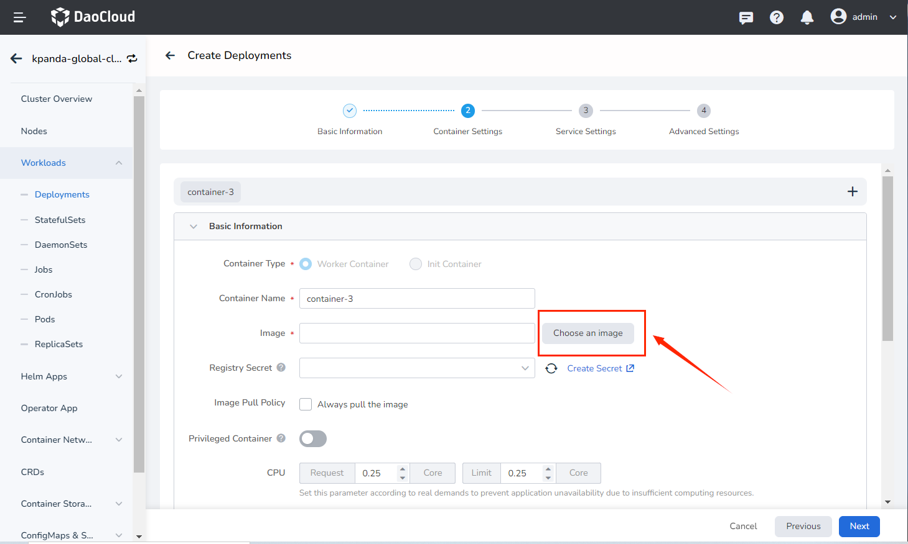
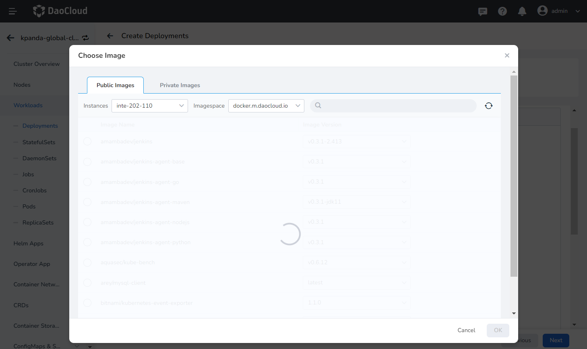
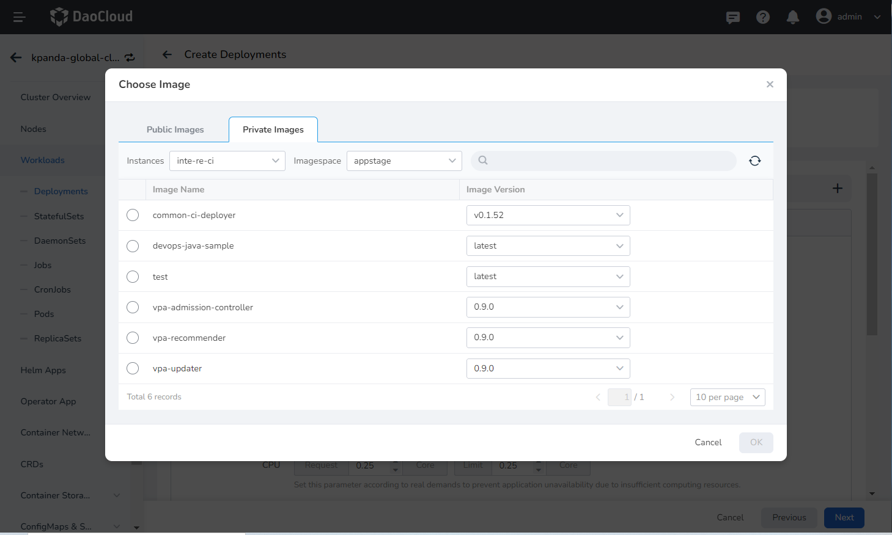

---
hide:
  - toc
---

# Admin quickly use the registry to serve the platform

In DCE 5.0, there are two registry management methods: hosting Harbor (self-built Harbor on DCE) and registry integration (integrating external Harbor or Docker Registry):

- [Hosted Harbor](../hosted.md) (recommended)
- [Repository Integration](../integrate.md)

DCE 5.0 mainly promotes Harbor as a registry to provide image services.

1. Assuming that you have created a managed harbor or connected to an external harbor, follow the steps below to share the public image with all namespaces (you can select the public image through the image selector when deploying the application):

    ```mermaid
    graph TB

    create[Create managed Harbor] --> setpublic[Create a registry spaceand set it to public]
    --> push[push image]
    --> deploy[deploy application]

    classDef plain fill:#ddd,stroke:#fff,stroke-width:1px,color:#000;
    classDef k8s fill:#326ce5,stroke:#fff,stroke-width:1px,color:#fff;
    classDef cluster fill:#fff,stroke:#bbb,stroke-width:1px,color:#326ce5;

    class create,setpublic,push,deploy cluster;

    click create "https://docs.daocloud.io/en/kangaroo/hosted/"
    click setpublic "https://docs.daocloud.io/en/kangaroo/create-registry/"
    click push "https://docs.daocloud.io/en/kangaroo/quickstart/push/"
    click deploy "https://docs.daocloud.io/kpanda/07UserGuide/Workloads/CreateDeploymentByImage/"
    ```

    Expected result: When all users on the platform deploy applications in the namespace, they can select images in the public registry space for deployment through the image selector.

    

    

1. Assuming that you have created a managed Harbor or connected to an external Harbor, follow the steps below to share the private image to the namespace under the specified workspace (tenant) (you can select the private image through the image selector when deploying the application image):

    The prerequisites are:

    ```mermaid
    graph TB

    create[created workspace] --> bind[namespace bound workspace]

    classDef plain fill:#ddd,stroke:#fff,stroke-width:1px,color:#000;
    classDef k8s fill:#326ce5,stroke:#fff,stroke-width:1px,color:#fff;
    classDef cluster fill:#fff,stroke:#bbb,stroke-width:1px,color:#326ce5;

    class create,bind cluster;

    click create "https://docs.daocloud.io/ghippo/04UserGuide/02Workspace/Workspaces/"
    click bind "https://docs.daocloud.io/ghippo/04UserGuide/02Workspace/quota/#_4"
    ```

    The operation steps are:

    ```mermaid
    graph TB

    create[Create managed Harbor] --> setpublic[Create a registry spaceand set it to public]
    --> push[push image]
    --> bind[registry spacebinding workspace]
    --> deploy[deploy application]

    classDef plain fill:#ddd,stroke:#fff,stroke-width:1px,color:#000;
    classDef k8s fill:#326ce5,stroke:#fff,stroke-width:1px,color:#fff;
    classDef cluster fill:#fff,stroke:#bbb,stroke-width:1px,color:#326ce5;

    class create,setpublic,push,bind,deploy cluster;

    click create "https://docs.daocloud.io/en/kangaroo/hosted/"
    click setpublic "https://docs.daocloud.io/en/kangaroo/create-registry/"
    click push "https://docs.daocloud.io/en/kangaroo/quickstart/push/"
    click bind "https://docs.daocloud.io/en/kangaroo/bind-to-ws/"
    click deploy "https://docs.daocloud.io/kpanda/07UserGuide/Workloads/CreateDeploymentByImage/"
    ```

    Expected result: Only when deploying applications in namespaces under this workspace, you can use the image selector to select private images under this registry space to deploy applications.

    

    

!!! tip

    1. The connected Harbor can achieve the same effect as above.
    2. Docker Registry itself only has public images, so after accessing, the images will be open to all namespaces.
