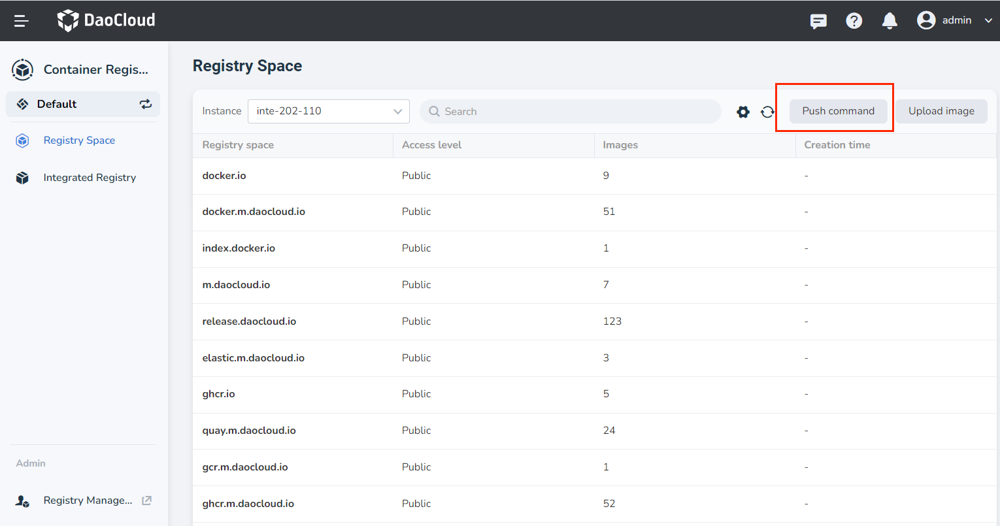
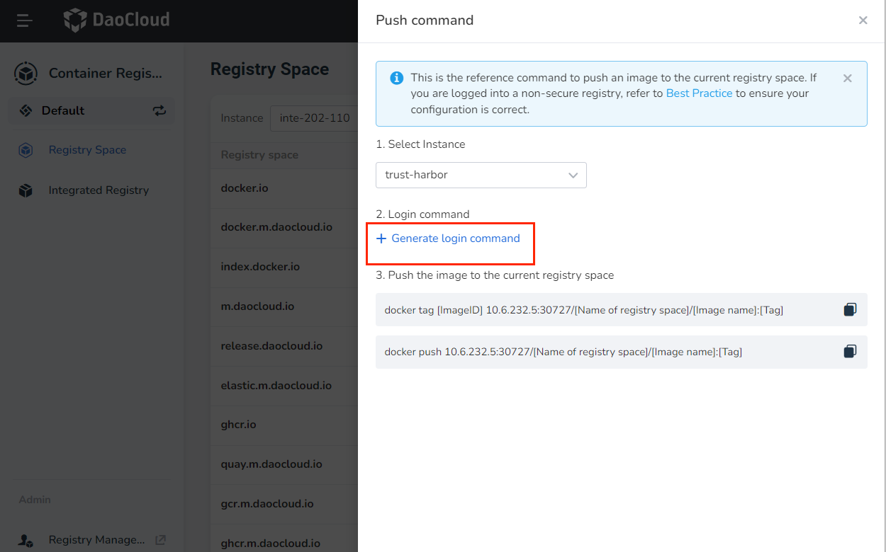

---
hide:
  - toc
---

# Image list

The image list is displayed based on the workspace, showing all available public and
private images under the tenant. There are two main sources of images:

1. The first part includes all public images in the integrated or hosted container registry
   of the platform, as well as private images assigned to the workspace separately through
   registry space and workspace binding.
2. The second part includes all public or private images obtained by the workspace actively
   associating with a specific container registry.


**The main features**

- Rapid application deployment: Both the image list and Workbench take the workspace
  as the dimension, so when you select the same workspace to deploy the application
  under Workbench, you can click the `Select Image` button to obtain the image list
  under the workspace with one click All visible images in, quickly complete the deployment.
- Fine-grained allocation: After integrating the platform or creating a managed Harbor
  instance, the administrator can assign different registry spaces to different workspaces
  by binding the registry space to the workspace to achieve fine-grained allocation.
- Image scanning: Provides image scanning and analysis features, visually checks the
  level and distribution of vulnerabilities, and provides scanning logs to facilitate
  tracking of vulnerabilities.
- Push image: The image can be pushed to the authorized registry space through the
  commands provided by the platform.
- View details such as levels: Provides a display of detailed information such as
  image versions, level information, creators, and creation times for images within the visible range.

**Functional advantages**

- Safe and reliable: Fine-grained image allocation is realized by binding the registry space
  and workspace, ensuring that private images can only be pulled by the specified workspace.
- Simple and convenient: After the platform administrator creates a managed Harbor or integrates
  other registrys, if he wants to share it with all workspaces and namespaces, he only needs to
  make the container registry public.
- Flexible access: In addition to platform-level registry integration capabilities, it also
  provides integrated registry features under each workspace. After integration,
  the container registry can only be used by the workspace.
- Global linkage: Workbench and container management provide the "image selector" feature
  for the container registry. When deploying the application, you can click the "select image"
  button to obtain all visible images with one click, and quickly complete the deployment.

## Push command

You can push an image to current registry space and set the command to push.

1. In the image list, click the `Push command` button on the right.

    

1. You can `+ Generate login command` and view the command to push images.

    

Here is a sample command to push image:

```bash
docker tag [ImageID] 10.6.194.1:30010/kangaroo/REPOSITORY[:TAG]
docker push 10.6.194.1:30010/kangaroo/REPOSITORY[:TAG]
```

Next step: [Artifacts and Description](./desc.md)
