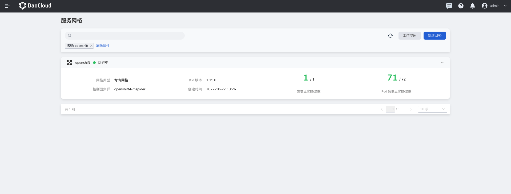

# Join an OCP cluster to service mesh

OCP (OpenShift Container Platform) is a container platform launched by Red Hat.

This page describes the operation steps for connecting the service mesh to the OCP platform.

## SCC Security Policy Settings

In the Openshift cluster, add the `privileged` user permission of the namespace to the service mesh, taking the two namespaces istio-operator and istio-system as examples:

```shell
oc adm policy add-scc-to-user privileged system:serviceaccount:istio-operator:istio-operator
oc adm policy add-scc-to-user privileged system:serviceaccount:istio-system:istio-system
```

## Connect to Openshift cluster

Create a mesh, hooked up to an Openshift cluster. Return to the mesh list and find that the Openshift cluster has been successfully connected.



But the backend will report an error:

```none
COMMIT
2022-10-27T07:06:50.610621Z info Running command: iptables-restore --noflush /tmp/iptables-rules-1666854410610268141.txt1105821213
2022-10-27T07:06:50.616716Z error Command error output: xtables parameter problem: iptables-restore: unable to initialize table 'nat'

Error occurred at line: 1
Try `iptables-restore -h' or 'iptables-restore --help' for more information.
2022-10-27T07:06:50.616746Z error Failed to execute: iptables-restore --noflush /tmp/iptables-rules-1666854410610268141.txt1105821213, exit status 2
```

Eliminate the error with the following steps.

## OCP activate iptables

### Modify YAML

Refer to the following YAML and modify the deployment according to the actual environment:

```yaml
apiVersion: apps/v1
kind: DaemonSet
metadata:
   name: dsm-init
   namespace: openshift-sdn
spec:
   revisionHistoryLimit: 10
   selector:
     matchLabels:
       app: dsm-init
   template:
     metadata:
       labels:
         app: dsm-init
         type: infra
     spec:
       containers:
       - command:
         - /bin/sh
         - -c
         -|
           #!/bin/sh
           set -x
           iptables -t nat -A OUTPUT -m tcp -p tcp -m owner ! --gid-owner 1337 -j REDIRECT --to-ports 15006
           iptables -t nat -D OUTPUT -m tcp -p tcp -m owner ! --gid-owner 1337 -j REDIRECT --to-ports 15006
           while true; do sleep 100d; done
         image: release.daocloud.io/mspider/proxyv2:1.15.0 # Modify the mirror address of the proxy
         name: dsm-init
         resources:
           requests:
             cpu: 100m
             memory: 20Mi
         securityContext:
           privileged: true
       dnsPolicy: ClusterFirst
       hostNetwork: true
       hostPID: true
       nodeSelector:
         kubernetes.io/os:linux
       priorityClassName: system-node-critical
       restartPolicy: Always
       schedulerName: default-scheduler
       securityContext: {}
       serviceAccount: sdn
       serviceAccountName: sdn
```

### Add parameters

Add the following line of parameters to the globalmesh YAML:

```yaml
istio.custom_params.components.cni.enabled: "true"
```

!!! note

     OpenShift 4.1+ drops iptables in favor of nftables.
     Therefore, the istio CNI plug-in needs to be installed, otherwise the following error will occur during sidecar injection, that is, the iptables-resotre command cannot be executed.

     ```none
     istio iptables-restore: unable to initialize table 'nat'
     ```

### Deploy istio-cni

```yaml
apiVersion: install.istio.io/v1alpha1
kind: IstioOperator
spec:
   components:
     cni:
       enabled: true
       namespace: istio-system
   values:
     sidecarInjectorWebhook:
       injectedAnnotations:
         k8s.v1.cni.cncf.io/networks:istio-cni
     cni:
       excludeNamespaces:
         -istio-system
       psp_cluster_role: enabled
       cniBinDir: /var/lib/cni/bin
       cniConfDir: /etc/cni/multus/net.d
       cniConfFileName: istio-cni.conf
       chained: false
```