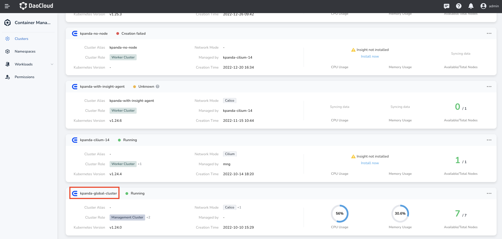
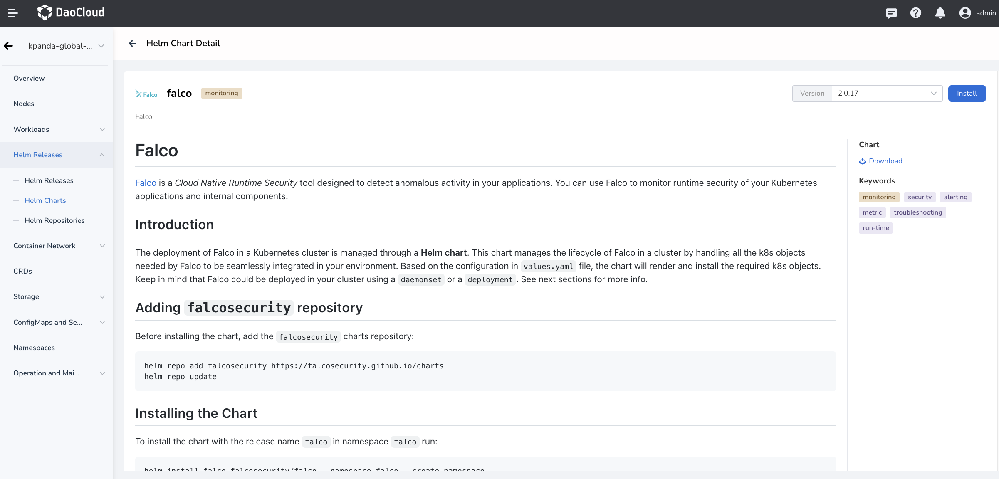
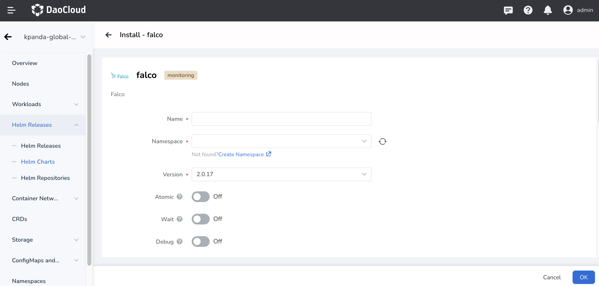
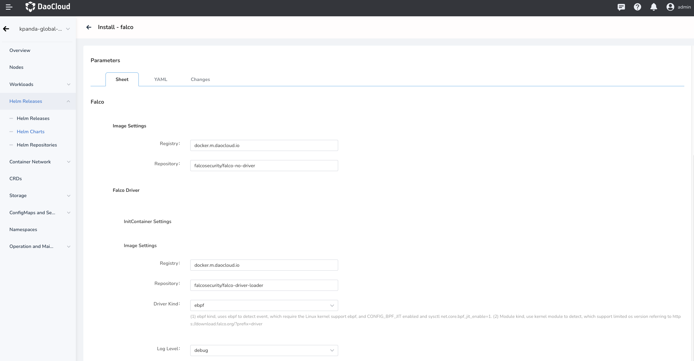

# Install Falco

Please confirm that your cluster has successfully connected to the `Container Management` platform, and then perform the following steps to install Falco.

1. Click `Container Management`->`Cluster List` in the left navigation bar, then find the cluster name where you want to install Falco.

    

2. In the left navigation bar, select `Helm Applications` -> `Helm Templates`, and then find and click `Falco`.

    

3. Select the version you want to install in `Version selection`, and click `Install`.

    

4. On the installation page, fill in the required installation parameters.

    

    In the screen as above, fill in the `application name`, `namespace`, `version`, etc.

    

   In the screen as above, fill in the following parameters:

    - `Falco` -> `Image Settings` -> `Registry`: set the repository address of the Falco image, which is already filled with the available online repositories by default. If it is a private environment, you can change it to a private repository address.

    - `Falco` -> `Image Settings` -> `Repository`: set the Falco image name.

    - `Falco` -> `Falco Driver` -> `Image Settings` -> `Registry`: set the repository address of the Falco Driver image, which is already filled with available online repositories by default. If it is a private environment, you can change it to a private repository address.

    - `Falco` -> `Falco Driver` -> `Image Settings` -> `Repository`: set the Falco Driver image name.

    - `Falco` -> `Falco Driver` -> `Image Settings` -> `Driver Kind`: set the Driver Kind, providing the following two options.

        (1) ebpf: use ebpf to detect events, which requires the Linux kernel to support ebpf and enable CONFIG_BPF_JIT and sysctl net.core.bpf_jit_enable=1.

        (2) module: use kernel module detection with limited OS version support. Refer to module support [system version](https://download.falco.org/?prefix=driver).

    - `Falco` -> `Falco Driver` -> `Image Settings` -> `Log Level`: the minimum log level to be included in the log.

        Optional values include: `emergency`, `alert`, `critical`, `error`, `warning`, `notice`, `info`, `debug`.

5. Click the `OK` button in the bottom right corner to complete the installation.
