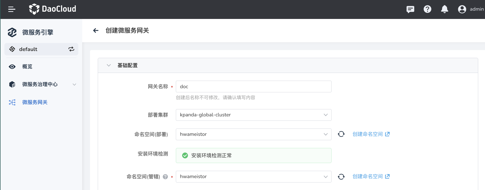

---
hide:
  - toc
---

# Create a microservice gateway

The microservice gateway supports a high-availability architecture of multi-tenant instances, and is compatible with the unified gateway access capability of microservices in various modes. This page describes how to create a microservice gateway instance.

The steps to create a microservice gateway are as follows:

1. Click `Microservice Gateway` on the left navigation bar, and click `Create Gateway` in the upper right corner of the `Microservice Gateway List` page to enter the microservice gateway creation page.

    

2. Fill in the configuration

    Gateway configuration is divided into two parts: basic configuration (required) and advanced configuration (optional). Note the following when filling in the configuration information:

    - Gateway name: the length does not exceed 63 characters, supports letters, numbers, and underscores, and cannot be changed after the gateway is created.
    - Deployment location: Only one gateway can be deployed in a namespace.
    - Jurisdiction namespace: the namespace where the default jurisdiction gateway is located. It supports the jurisdiction of multiple namespaces at the same time. The same namespace cannot be governed by two gateways at the same time.
    - Control the number of nodes: a single copy is unstable and needs to be selected carefully.

        
        

3. Confirm the filled information and click `Confirm` in the lower right corner of the page.

    

After clicking `Confirm`, a message that the gateway is successfully created will pop up in the upper right corner. The system will automatically return to the `Microservice Gateway List` page, and you can see the newly created gateway instance in the list.