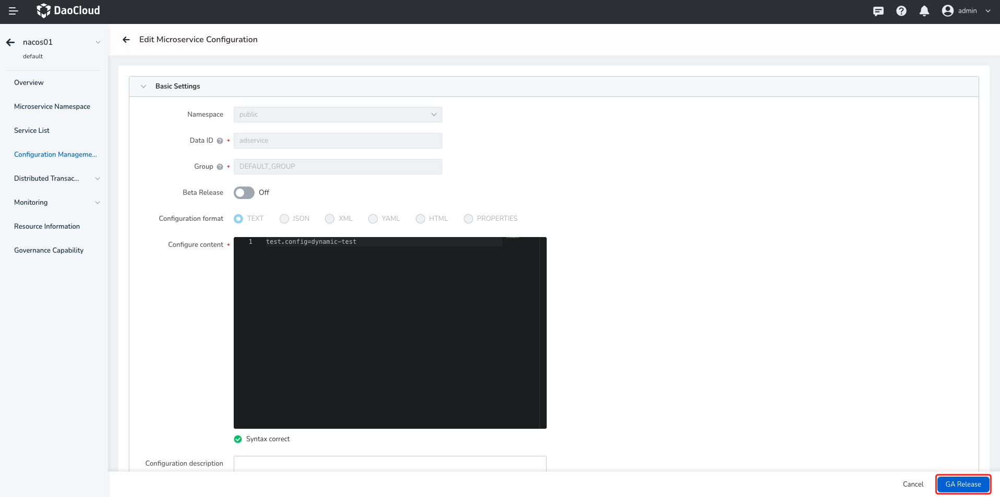
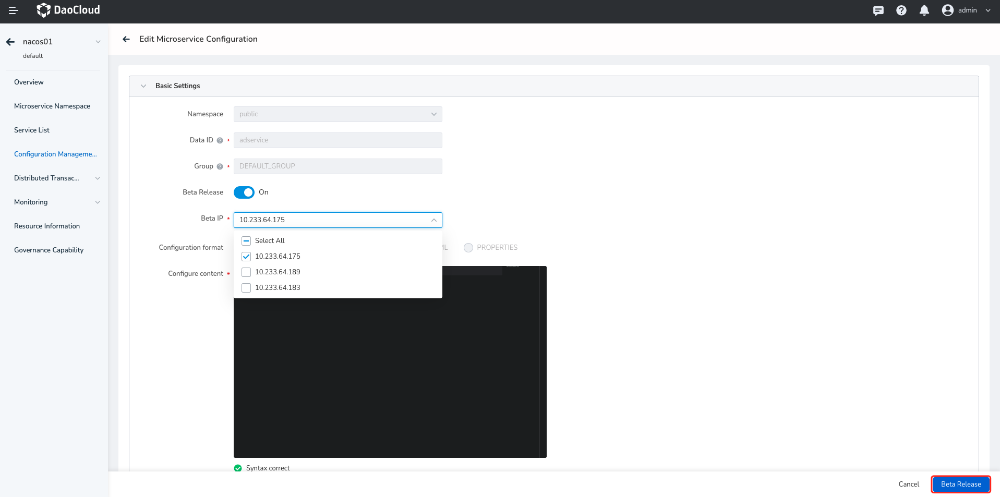
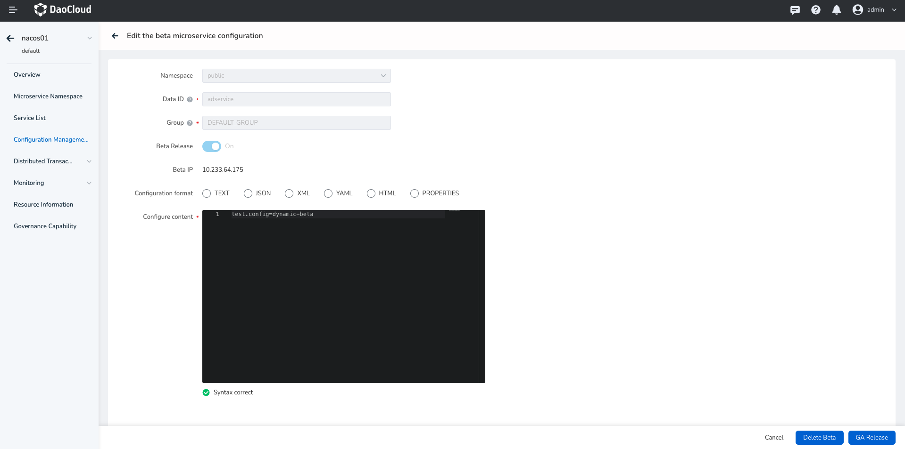

# Microservice configuration list

The micro-service engine supports group management of micro-services based on the micro-service namespace, so that you can flexibly manage micro-services and a large number of configurations of Spring according to your needs by grouping environment, application, module, etc. The configuration list mainly provides core management capabilities, such as adding, deleting, modifying, checking, viewing historical versions, rolling back, and subscriber query of micro-service configurations.

## New configuration

1. Enter `Microservices` -> `Traditional Microservices` -> `Hosted Registry` module, click the name of the target registry.

   

2. Click `Configuration List` in the left navigation bar, then click `Create` in the upper right corner.

   

3. Enter the configuration information

   

    - Namespace: Select the micro-service namespace to which the current configuration belongs. The default is `public`

        !!! note

            Services and configurations in different namespaces are strictly isolated and cannot reference each other. For example, A service in namespace A cannot reference a configuration in namespace B.

    - Data ID: indicates the name of the current configuration file. The Data ids in the same group cannot be the same.

        The full format is `${prefix}-${spring.profiles.active}.${file-extension}`.

        -  `prefix` default to `spring.application.name` value, can also through the configuration items `spring.cloud.nacos.config.prefix` to configure.
        -  `spring.profiles.active` Indicates the profile of the current environment. For details, see the Spring Boot documentation. Note: When `spring.profiles.active` is empty, the corresponding concatenator `-` also does not exist, and the Data ID concatenation format becomes `${prefix}.${file-extension}`.
        -  `file-exetension` Indicates the data format of the configuration content. You can configure the configuration item `spring.cloud.nacos.config.file-extension`.

    - Group: Select the group to which the current configuration belongs. The default value is `DEFAULT_GROUP`.

        !!! note
  
            Namespaces are typically used to isolate environments and groups to separate projects.

    - Configuration format: Sets the format of the current configuration file.

    - Configuration content: Enter a configuration item in the service source code with an annotation `@Value`.

        - Format verification is supported. If the format of the configuration is incorrect, the system automatically displays an error message.
        - Configuration items in the service source code with annotations `@RefreshScope` support dynamic updates.

    - More Configurations -> Owning Application (Optional) : Select the application to which the current configuration belongs.

      

4. Click `OK` in the bottom right corner of the page.

## Viewing configuration

1. Enter `Microservices` -> `Traditional Microservices` -> `Hosted Registry` module, click the name of the target registry.

   

2. In the left navigation bar, click `Configuration Management` and click the Data ID of the target configuration.

   

3. You can view the basic configuration information, configuration content, historical version, listener, and example code.

    - Novice users can quickly consume this configuration using client-side programming with the help of sample code, lowering the threshold for novice users.
    - You can query the listener of the current configuration and the MD5 checksum to learn about the microservice that is using this configuration and whether the configuration changes are successfully pushed to the client.

      

## The historical version is rolled back

The micro-service configuration list records the historical version of the configuration file and supports one-click rollback to a specific historical version. This helps users quickly recover incorrect configurations and reduces configuration availability risks in the micro-service system. Comparison between the current version and the target rollback version is supported during the rollback. This helps you verify the changes and reduce risks caused by error correction.

1. Enter `Microservices` -> `Traditional Microservices` -> `Hosted Registry` module, click the name of the target registry.

   

2. In the left navigation bar, click `Configuration Management` and click the Data ID of the target configuration.

   

3. Click the `History Version` TAB to find the corresponding record. Click `ⵗ` on the right of the record and select `Rollback`.

   

4. Compare the version differences and confirm, then click `Rollback` in the lower right corner.

   

## The GA configuration was updated

1. Enter `Microservices` -> `Traditional Microservices` -> `Hosted Registry` module, click the name of the target registry.

   

2. Click `Configuration Management` in the left navigation bar, and click `ⵗ` on the right of the target configuration and select `Edit GA Release`.

   

3. Modify configuration content，and click `GA Release`。

   

## New Beta configuration

1. Enter `Microservices` -> `Traditional Microservices` -> `Hosted Registry` module, click the name of the target registry.

   

2. Click `Configuration Management` in the left navigation bar, and click `ⵗ` on the right of the target configuration and select `Edit GA Release`.

   

3. Enable `Beta Release`, select service instance from the `Beta IP` dropdown menu, modify the configuration content, and click `Beta Release`.
   
   - When configuring Beta release, the Data ID of the configuration needs to match the microservice name. Otherwise, it will not be possible to select service instance.

   

## The Beta configuration was updated

1. Enter `Microservices` -> `Traditional Microservices` -> `Hosted Registry` module, click the name of the target registry.

   

2. Click `Configuration Management` in the left navigation bar, and click `ⵗ` on the right of the target configuration and select `Edit Beta Release`.

   

3. Modify configuration content，and click button in the lower right corner to delete beta release or publish GA release as required.

   - Click `Delete Beta`，then the beta configuration will be deleted.
   - Click `GA Release`,then the beta configuration will be published as GA release，and the original GA release will be deleted and is no longer effective.

   

## The configuration was deleted

1. Enter `Microservices` -> `Traditional Microservices` -> `Hosted Registry` module, click the name of the target registry.

   

2. Click `Configuration Management` in the left navigation bar, and click `ⵗ` on the right of the target configuration to delete.

   
