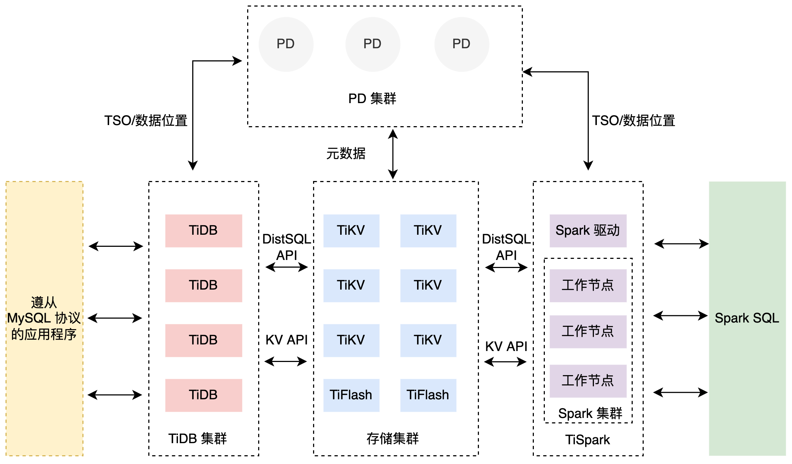
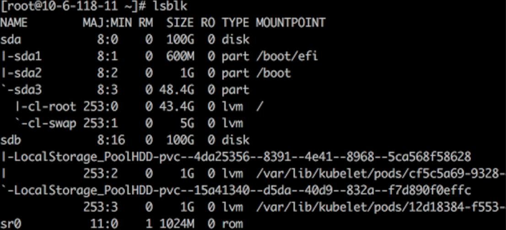
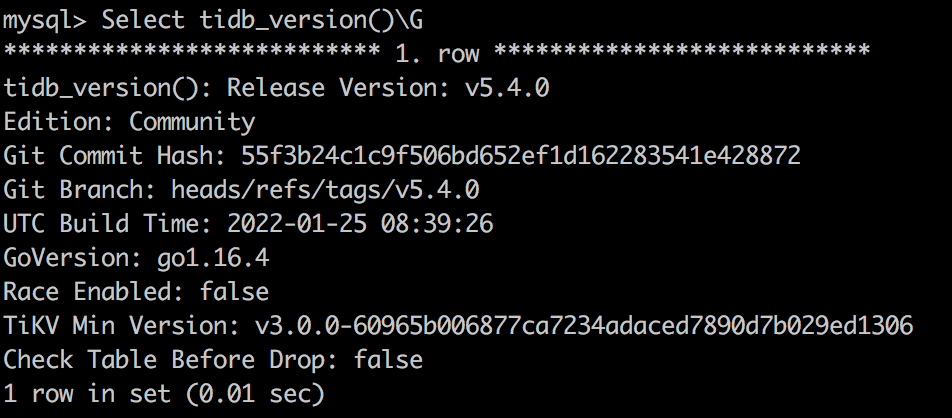
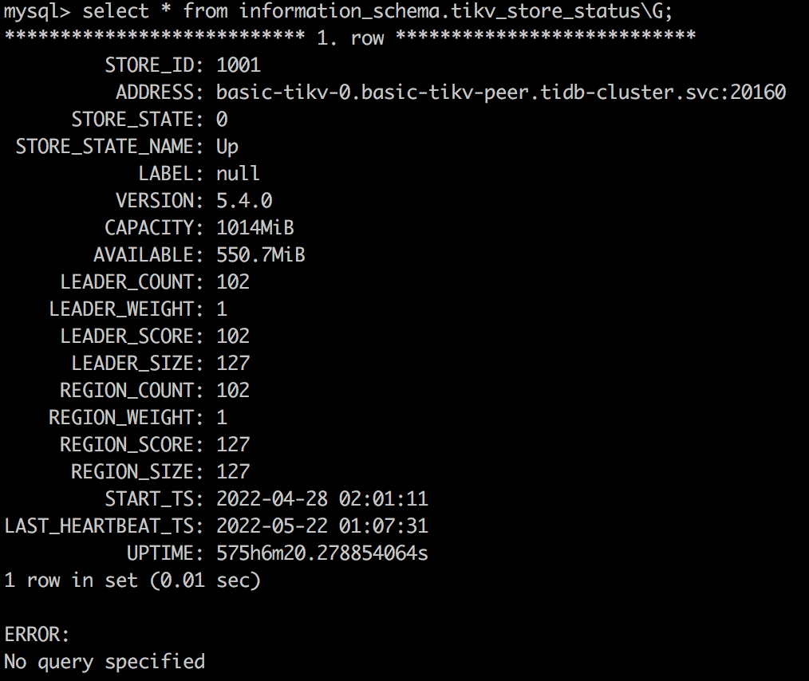

# TiDB

TiDB is a converged distributed database product that supports both online transaction processing (OLTP) and online analytical processing (OATP). A native distributed database, compatible with important features such as the MySQL 5.7 protocol and the MySQL ecosystem. The goal of TiDB is to provide users with one-stop OLTP, OLAP, and HTAP solutions, which are suitable for various application scenarios such as high availability, high requirements for strong consistency, and large data scale.

## Overall structure of TiDB

The TiDB distributed database splits the overall architecture into multiple modules, and each module communicates with each other to form a complete TiDB system. The corresponding architecture diagram is as follows:



- **TiDB Server**
  
     The SQL layer exposes the connection endpoints of the MySQL protocol, is responsible for accepting client connections, performing SQL parsing and optimization, and finally generating a distributed execution plan. The TiDB layer itself is stateless. In practice, multiple TiDB instances can be started, and a unified access address is provided externally through load balancing components (such as LVS, HAProxy, or F5). Client connections can be evenly distributed among multiple TiDB instances. In order to achieve the effect of load balancing. TiDB Server itself does not store data, but only parses SQL and forwards actual data read requests to the underlying storage node TiKV (or TiFlash).

- **PD (Placement Driver) Server**
  
     The meta information management module of the entire TiDB cluster is responsible for storing the real-time data distribution of each TiKV node and the overall topology of the cluster, providing the TiDB Dashboard management and control interface, and assigning transaction IDs to distributed transactions. PD not only stores meta information, but also sends data scheduling commands to specific TiKV nodes according to the real-time data distribution status reported by TiKV nodes, which can be said to be the "brain" of the entire cluster. In addition, the PD itself is also composed of at least 3 nodes and has high availability capabilities. It is recommended to deploy an odd number of PD nodes.

- **Storage Node**

- TiKV Server: Responsible for storing data. From the outside, TiKV is a distributed Key-Value storage engine that provides transactions. The basic unit for storing data is Region, and each Region is responsible for storing data of a Key Range (the left-closed right-open interval from StartKey to EndKey), and each TiKV node is responsible for multiple Regions. TiKV's API provides native support for distributed transactions at the KV key-value pair level, and provides the isolation level of SI (Snapshot Isolation) by default, which is also the core of TiDB's support for distributed transactions at the SQL level. After the SQL layer of TiDB completes the SQL parsing, it will convert the SQL execution plan into an actual call to the TiKV API. Therefore, the data is stored in TiKV. In addition, the data in TiKV will automatically maintain multiple copies (the default is three copies), which naturally supports high availability and automatic failover.

- TiFlash: TiFlash is a special type of storage node. Different from ordinary TiKV nodes, inside TiFlash, data is stored in the form of columns, and its main function is to accelerate analytical scenarios.

## Storage of TiDB database


- **Key-Value Pair**

     The choice of TiKV is the Key-Value model, and it provides an ordered traversal method. Two key points of TiKV data storage:

     - This is a huge Map (can be compared to C++'s std::map), which stores Key-Value Pairs.

     - The Key-Value pairs in this Map are ordered according to the binary order of the Key, that is, you can Seek to a certain Key position, and then continuously call the Next method to obtain the Key-Value greater than this Key in increasing order.

- **Local Storage (Rocks DB)**
  
     For any persistent storage engine, data must be stored on disk after all, and TiKV is no exception. However, TiKV did not choose to write data directly to the disk, but saved the data in RocksDB, and RocksDB is responsible for the specific data landing. The reason for this is that developing a stand-alone storage engine requires a lot of work, especially for a high-performance stand-alone engine, which requires various meticulous optimizations. RocksDB is an excellent stand-alone KV storage engine open sourced by Facebook. It can meet various requirements of TiKV for a stand-alone engine. Here you can simply think of RocksDB as a stand-alone persistent Key-Value Map.

- **Raft protocol**
  
     TiKV chooses the Raft algorithm to ensure that data will not be lost and errors will not occur in the case of a single machine failure. Simply put, it is to copy data to multiple machines, so that when a certain machine cannot provide services, the copies on other machines can still provide services. This data replication scheme is reliable and efficient, and can handle the failure of replicas.

- **Region**
  
     TiKV chooses to divide Range by Key. A certain continuous Key is stored on one storage node. Divide the entire Key-Value space into many segments, and each segment is a series of consecutive Keys, called a Region. Try to keep the data stored in each Region within a certain size. Currently, the default size in TiKV is no more than 96MB. Each Region can be described by a left-closed right-open interval like [StartKey, EndKey].

- **MVCC**
  
     TiKV implements Multi-Version Concurrency Control (MVCC).

- **Distributed ACID transactions**
  
     The transaction of TiKV adopts the transaction model used by Google in BigTable: Percolator.

## Set up a test environment

### Kubernetes cluster

This test uses three virtual machine nodes to deploy a Kubernetes cluster, including 1 master node and 2 worker nodes. Kubelete version is 1.22.0.


### HwameiStor local storage

1. Deploy HwameiStor local storage on the Kubernetes cluster

     

2. Configure a 100G local disk sdb for HwameiStor on the two worker nodes respectively

     

     

3. Create storageClass

     

### Deploy TiDB on Kubernetes

You can use TiDB Operator to deploy TiDB on Kubernetes. TiDB Operator is an automatic operation and maintenance system for TiDB clusters on Kubernetes, providing full lifecycle management of TiDB including deployment, upgrade, scaling, backup and recovery, and configuration changes. With TiDB Operator, TiDB can seamlessly run on public cloud or privately deployed Kubernetes clusters.

The correspondence between TiDB and TiDB Operator versions is as follows:

| TiDB version | Applicable TiDB Operator version |
| ------------------ | ------------------------- |
| dev | dev |
| TiDB >= 5.4 | 1.3 |
| 5.1 <= TiDB < 5.4 | 1.3 (recommended), 1.2 |
| 3.0 <= TiDB < 5.1 | 1.3 (recommended), 1.2, 1.1 |
| 2.1 <= TiDB < 3.0 | 1.0 (end of maintenance) |

#### Deploy TiDB Operator

1. Install TiDB CRDs

     ```bash
     kubectl apply -f https://raw.githubusercontent.com/pingcap/tidb-operator/master/manifests/crd.yaml
     ```

2. Install TiDB Operator

     ```bash
     helm repo add pingcap https://charts.pingcap.org/
     kubectl create namespace tidb-admin
     helm install --namespace tidb-admin tidb-operator pingcap/tidb-operator --version v1.3.2 \
     --set operatorImage=registry.cn-beijing.aliyuncs.com/tidb/tidb-operator:v1.3.2 \
     --set tidbBackupManagerImage=registry.cn-beijing.aliyuncs.com/tidb/tidb-backup-manager:v1.3.2 \
     --set scheduler.kubeSchedulerImageName=registry.cn-hangzhou.aliyuncs.com/google_containers/kube-scheduler
     ```

3. Check TiDB Operator components

     

#### Deploy TiDB cluster

```bash
kubectl create namespace tidb-cluster && \
kubectl -n tidb-cluster apply -f https://raw.githubusercontent.com/pingcap/tidb-operator/master/examples/basic/tidb-cluster.yaml
kubectl -n tidb-cluster apply -f https://raw.githubusercontent.com/pingcap/tidb-operator/master/examples/basic/tidb-monitor.yaml
```


#### Connect TiDB cluster

```bash
yum -y install mysql-client
```


```bash
kubectl port-forward -n tidb-cluster svc/basic-tidb 4000 > pf4000.out &
```


#### Check and verify TiDB cluster status

1. Create the Hello_world table

     ```sql
     create table hello_world (id int unsigned not null auto_increment primary key, v varchar(32));
     ```
     

2. Query the TiDB version number

     ```sql
     select tidb_version()\G;
     ```
     

3. Query Tikv storage status

     ```sql
     select * from information_schema.tikv_store_status\G;
     ```
     

#### HwameiStor storage configuration

Create a PVC for tidb-tikv and tidb-pd from `storageClass local-storage-hdd-lvm`:


```bash
kubectl get po basic-tikv-0-oyaml
```


```bash
kubectl get po basic-pd-0-oyaml
```


## Test content

### Database SQL Basic Ability Test

After completing the deployment of the database cluster, the following basic capability tests were performed and all passed.

#### Distributed transaction

Test purpose: to support the realization of the integrity constraints of distributed data operations, that is, ACID properties, under multiple isolation levels

Test steps:

1. Create a test database CREATE DATABASE testdb

2. Create a test table CREATE TABLE `t_test ( id int AUTO_INCREMENT, name varchar(32), PRIMARY KEY (id) )`

3. Run the test script

Test results: Support the integrity constraints of distributed data operations, namely ACID properties, under multiple isolation levels

#### Object Isolation

Test purpose: to test different schemas to achieve object isolation

Test script:

```sql
create database if not exists testdb;
use testdb
create table if not exists t_test
( id bigint,
   name varchar(200),
   sale_time datetime default current_timestamp,
   constraint pk_t_test primary key (id)
);
insert into t_test(id,name) values (1,'a'),(2,'b'),(3,'c');
create user 'readonly'@'%' identified by "readonly";
grant select on testdb.* to readonly@'%';
select * from testdb.t_test;
update testdb.t_test set name='aaa';
create user 'otheruser'@'%' identified by "otheruser";
```

Test results: Support creating different schemas to achieve object isolation

#### Table operation support

Test purpose: Test whether it supports creating, deleting and modifying table data, DML, columns, and partition tables

Test steps: execute the test script step by step after connecting to the database

Test script:

```sql
# Create and drop tables
drop table if exists t_test;
create table if not exists t_test
( id bigint default '0',
   name varchar(200) default '' ,
   sale_time datetime default current_timestamp,
   constraint pk_t_test primary key (id)
);
# delete and modify
insert into t_test(id,name) values (1,'a'),(2,'b'),(3,'c'),(4,'d'),(5,'e');
update t_test set name='aaa' where id=1;
update t_test set name='bbb' where id=2;
delete from t_dml where id=5;
# Modify, add, delete columns
alter table t_test modify column name varchar(250);
alter table t_test add column col varchar(255);
insert into t_test(id,name,col) values(10,'test','new_col');
alter table t_test add column colwithdefault varchar(255) default 'aaaa';
insert into t_test(id,name) values(20,'testdefault');
insert into t_test(id,name,colwithdefault ) values(10,'test','non-default');
alter table t_test drop column colwithdefault;
# Partition table type (only some scripts are excerpted)
CREATE TABLE employees (
     id INT NOT NULL,
fname VARCHAR(30),
lname VARCHAR(30),
     hired DATE NOT NULL DEFAULT '1970-01-01',
     separated DATE NOT NULL DEFAULT '9999-12-31',
job_code INT NOT NULL,
store_id INT NOT NULL
)
```

Test results: support for creating, deleting and modifying table data, DML, columns, and partition tables

#### Index Support

Test purpose: Verify multiple types of indexes (unique, clustered, partitioned, Bidirectional indexes, Expression-based indexes, hash indexes, etc.) and index rebuild operations.

Test script:

```sql
alter table t_test add unique index udx_t_test (name);
# The default is the primary key clustered index
ADMIN CHECK TABLE t_test;
create index time_idx on t_test(sale_time);
alter table t_test drop index time_idx;
admin show ddl jobs;
admin show ddl job queries 156;
create index time_idx on t_test(sale_time);
```

Test results: support creation, deletion, combination, single column, unique index

#### expressions

Test purpose: To verify that the expression of the distributed database supports statements such as if, casewhen, forloop, whileloop, loop exit when (up to 5 types)

Prerequisite: The database cluster has been deployed.

Test script:

```sql
SELECT CASE id WHEN 1 THEN 'first' WHEN 2 THEN 'second' ELSE 'OTHERS' END AS id_new FROM t_test;
SELECT IF(id>2,'int2+','int2-') from t_test;
```

Test results: Support statements such as if, case when, for loop, while loop, loop exit when (up to 5 types)

#### Execution plan analysis

Test purpose: Verify the execution plan parsing support of the distributed database

Prerequisite: The database cluster has been deployed.

Test script:

```sql
explain analyze select * from t_test where id NOT IN (1,2,4);
explain analyze select * from t_test a where EXISTS (select * from t_test b where a.id=b.id and b.id<3);
explain analyze SELECT IF(id>2,'int2+','int2-') from t_test;
```

Test results: support for execution plan parsing

#### Execution plan binding

Test purpose: Verify the execution plan binding function of the distributed database

Test steps:

1. View the current execution plan of the sql statement

2. Using the binding feature

3. View the execution plan after the sql statement is bound

4. Delete the binding

Test script:

```sql
explain select * from employees3 a join employees4 b on a.id = b.id where a.lname='Johnson';
explain select /*+ hash_join(a,b) */ * from employees3 a join employees4 b on a.id = b.id where a.lname='Johnson';
```

Test result: It may not be hash_join when no hint is used, but it must be hash_join after using hint.

#### Common Functions

Test purpose: to verify the standard database functions of distributed databases (supported function types)

Test results: support standard database functions

#### Explicit/Implicit Transactions

Test purpose: verify the transaction support of the distributed database

Test results: support for explicit and implicit transactions

#### Character set

Test purpose: verify the data type support of the distributed database

Test results: Currently only UTF-8 mb4 character set is supported

#### Lock support

Test purpose: verify the lock implementation of the distributed database

Test results: Describe the implementation of locks, the blocking situation in the case of R-R/R-W/W-W, and the deadlock handling method

#### Isolation level

Test purpose: verify the transaction isolation level of the distributed database

Test results: support si isolation level, support rc isolation level (4.0 GA version)

#### Distributed Complex Query

Test purpose: to verify the distributed complex query capabilities of distributed databases

Test results: support distributed complex queries and operations such as cross-node join, support window functions, and hierarchical queries

### System Security Test

This part tests system security. After the database cluster deployment is completed, the following security tests all pass.

#### Account Management and Permission Test

Test purpose: verify the account authority management of the distributed database

Test script:

```sql
select host,user,authentication_string from mysql.user;
create user tidb IDENTIFIED by 'tidb';
select host,user,authentication_string from mysql.user;
set password for tidb = password('tidbnew');
select host, user, authentication_string, Select_priv from mysql.user;
grant select on *.* to tidb;
flush privileges;
select host, user, authentication_string, Select_priv from mysql.user;
grant all privileges on *.* to tidb;
flush privileges;
select * from mysql.user where user='tidb';
revoke select on *.* from tidb;
flush privileges;
revoke all privileges on *.* from tidb;
flush privileges;
grant select(id) on test.TEST_HOTSPOT to tidb;
drop user tidb;
```

Test Results:

- Support creation, modification and deletion of accounts, configuration and passwords, support separation of powers among security, audit and data management

- According to different accounts, the authority control of each level of the database includes: instance/library/table/column level

#### Access control

Test purpose: To verify the access control of the distributed database, and the database data is controlled by granting basic additions, deletions, changes, and queries

Test script:

```sql
mysql -u root -h 172.17.49.222 -P 4000
drop user tidb;
drop user tidb1;
create user tidb IDENTIFIED by 'tidb';
grant select on tidb.* to tidb;
grant insert on tidb.* to tidb;
grant update on tidb.* to tidb;
grant delete on tidb.* to tidb;
flush privileges;
show grants for tidb;
exit;
mysql -u tidb -h 172.17.49.222 -ptidb -P 4000 -D tidb -e 'select * from aa;'
mysql -u tidb -h 172.17.49.222 -ptidb -P 4000 -D tidb -e 'insert into aa values(2);'
mysql -u tidb -h 172.17.49.222 -ptidb -P 4000 -D tidb -e 'update aa set id=3;'
mysql -u tidb -h 172.17.49.222 -ptidb -P 4000 -D tidb -e 'delete from aa where id=3;'
```

Test results: Database data is controlled by granting access rights for basic addition, deletion, modification, and query.

#### whitelist

Test purpose: verify the whitelist function of the distributed database

Test script:

```sql
mysql -u root -h 172.17.49.102 -P 4000
drop user tidb;
create user tidb@'127.0.0.1' IDENTIFIED by 'tidb';
flush privileges;
select * from mysql.user where user='tidb';
mysql -u tidb -h 127.0.0.1 -P 4000 -ptidb
mysql -u tidb -h 172.17.49.102 -P 4000 -ptidb
```

Test results: support IP whitelist function, support IP segment wildcard operation

#### Operation Logging

Purpose of the test: to verify the operation monitoring capability of the distributed database

Test script: `kubectl -ntidb-cluster logs tidb-test-pd-2 --tail 22`

Test results: record key operations or wrong operations performed by users through the operation and maintenance management console or API

### Operation and maintenance management test

This part tests system operation and maintenance. After the database cluster deployment is completed, the following operation and maintenance management tests all pass.

#### Data import and export

Test purpose: To verify the tool support for data import and export of distributed databases

Test script:

```sql
select * from sbtest1 into outfile '/sbtest1.csv';
load data local infile '/sbtest1.csv' into table test100;
```

Test results: support logical export and import at the table, schema, and database levels

#### Slow log query

Test purpose: to obtain SQL information of slow queries

Precondition: The SQL execution time must be greater than the configured slow query record threshold, and the SQL execution is complete

Test steps:

1. Adjust the slow query threshold to 100ms

2. execute sql

3. Check the slow query information in log/system table/dashboard

Test script:

```sql
show variables like 'tidb_slow_log_threshold';
set tidb_slow_log_threshold=100;
select query_time, query from information_schema.slow_query where is_internal = false order by query_time desc limit 3;
```

Test result: slow query information can be obtained

> For testing details, please refer to [TiDB on hwameiStor Deployment and Test Records](file/TiDBonHwameiStor.docx).
