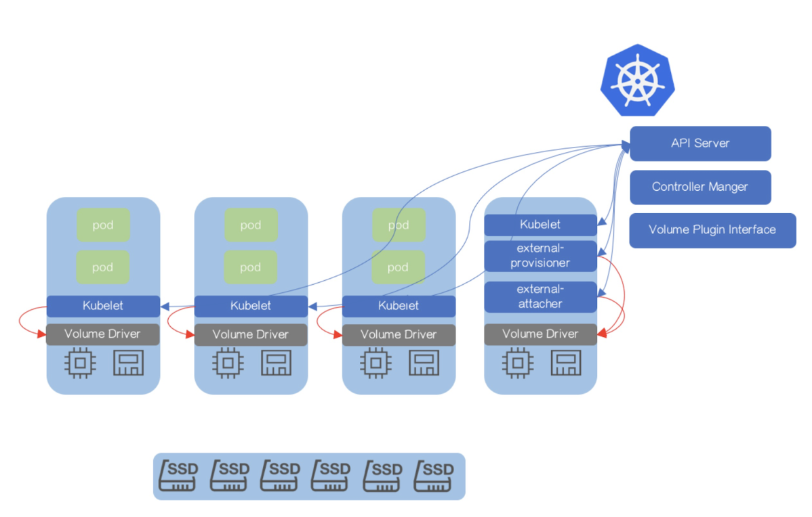

# CSI interface

CSI stands for Container Storage Interfaces, container storage interface. Currently, there are still some issues with the storage subsystem in Kubernetes. Storage driver code is maintained in the Kubernetes core repository, which is difficult to test. Kubernetes also requires licensing storage providers to embed code into the Kubernetes core repository.

CSI aims to define an industry standard that will enable CSI-enabled storage providers to be used in CSI-enabled container orchestration systems.

The diagram below depicts a high-level Kubernetes archetype integrated with CSI.



- Introduced three new external components to decouple Kubernetes and storage provider logic
- The blue arrows indicate the normal way of making calls against the API server
- The red arrow shows gRPC to make calls against the Volume Driver

## Extending CSI and Kubernetes

To implement the ability to extend volumes on Kubernetes, several components should be extended, including the CSI specification, the "in-tree" volume plugin, external-provisioner, and external-attacher.

## Extended CSI specification

The latest CSI 0.2.0 still does not define the ability to extend volumes. 3 new RPCs should be introduced: `RequiresFSResize`, `ControllerResizeVolume` and `NodeResizeVolume`.

```jade
service Controller {
  rpc CreateVolume (CreateVolumeRequest)
    returns (CreateVolumeResponse) {}
...
  rpc RequiresFSResize (RequiresFSResizeRequest)
    returns (RequiresFSResizeResponse) {}
  rpc ControllerResizeVolume (ControllerResizeVolumeRequest)
    returns (ControllerResizeVolumeResponse) {}
}
service Node {
  rpc NodeStageVolume (NodeStageVolumeRequest)
    returns (NodeStageVolumeResponse) {}
...
  rpc NodeResizeVolume (NodeResizeVolumeRequest)
    returns (NodeResizeVolumeResponse) {}
}
```

## Extend the "In-Tree" volume plugin

In addition to the expanded CSI specification, the `csiPlugin` interface in Kubernetes should also implement `expandablePlugin`. The `csiPlugin` interface will extend the `PersistentVolumeClaim` that represents the `ExpanderController`.

```jade
type ExpandableVolumePlugin interface {
Volume Plugins
ExpandVolumeDevice(spec Spec, newSize resource. Quantity, oldSize resource. Quantity) (resource. Quantity, error)
RequiresFSResize() bool
}
```

### Implement the volume driver

Finally, to abstract implementation complexity, separate storage provider management logic should be hardcoded into the following functions, which are clearly defined in the CSI specification:

-CreateVolume
-DeleteVolume
- ControllerPublishVolume
-ControllerUnpublishVolume
- ValidateVolumeCapabilities
-ListVolumes
- GetCapacity
-ControllerGetCapabilities
-RequiresFSResize
-ControllerResizeVolume

## exhibit

Demonstrate this functionality with a concrete user case.

- Create storage classes for CSI storage providers

  ```yaml
  allowVolumeExpansion: true
  apiVersion: storage.k8s.io/v1
  kind: StorageClass
  metadata:
    name: csi-qcfs
  parameters:
    csiProvisionerSecretName: orain-test
    csiProvisionerSecretNamespace: default
  provisioner: csi-qcfsplugin
  reclaimPolicy: Delete
  volumeBindingMode: Immediate
  ```

- Deploy CSI volume drivers including the storage provider `csi-qcfsplugin` on Kubernetes clusters
- Create PVC `qcfs-pvc` which will be dynamically configured by storage class `csi-qcfs`

  ```yaml
  apiVersion: v1
  kind: PersistentVolumeClaim
  metadata:
    name: qcfs-pvc
    namespace: default
  ....
  spec:
    accessModes:
    - ReadWriteOnce
    resources:
      requests:
        storage: 300Gi
    storageClassName: csi-qcfs
  ```

- Create MySQL 5.7 instance to use PVC `qcfs-pvc`
- To reflect the exact same production-level scenario, there are actually two different types of workloads, including:
  - Bulk inserts make MySQL consume more file system capacity
  - Surge query request
- Configure dynamically expanding volume capacity by editing pvc `qcfs-pvc`