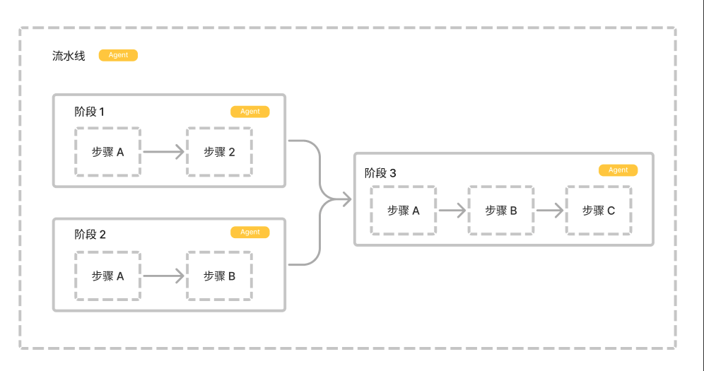

# 流水线中的概念

不论图形化或文本类型，编辑器本质上都是用来方便用户查看与编辑构建流程的核心——Jenkinsfile（过程描述文件），因此在讨论编辑器之前需理解「过程描述文件」的几个重要概念。

## 流水线

`流水线`是用户定义的一个工作模型，流水线的代码定义了软件交付的完整流程，一般包含构建、测试和交付应用程序等阶段。有关流水线语法，请参见 [Jenkins 官方文档](https://www.jenkins.io/zh/doc/book/pipeline/jenkinsfile/)。

## Agent

Agent 描述了整个`流水线`执行过程或者某个`阶段`的执行环境，必须出现在`描述文件`顶格或者每一个`阶段`。有关更多信息，请参见[选择 Jenkins Agent](https://kubesphere.io/zh/docs/v3.3/devops-user-guide/how-to-use/pipelines/choose-jenkins-agent/)。

## 阶段

一个`阶段`定义了一系列紧密相关的`步骤`。每个`阶段`在整条流水线中各自承担了独立、明确的责任。比如 “Build”、“Test”或“Deploy” 阶段。通常来讲，所有的实际构建过程都放置在`阶段` 里面。有关更多信息，请参见[选择 Jenkins Stage](https://www.jenkins.io/zh/doc/book/pipeline/#阶段)。

## 并行阶段

并行用来声明一些并行执行的`阶段`，通常适用于`阶段`与`阶段`之间不存在依赖关系的情况下，用来加快执行速度。有关更多信息，请参见[选择 Jenkins Agent](https://kubesphere.io/zh/docs/v3.3/devops-user-guide/how-to-use/pipelines/choose-jenkins-agent/)。

## 步骤

`步骤列表`描述了一个`阶段`内具体要做什么事，具体要执行什么命令。比如有一个`步骤（step）` 需要系统打印一条“构建中…”的消息，即执行命令`echo '构建中...'`。有关更多信息，请参见[选择 Jenkins Step](https://www.jenkins.io/zh/doc/book/pipeline/#阶段)。