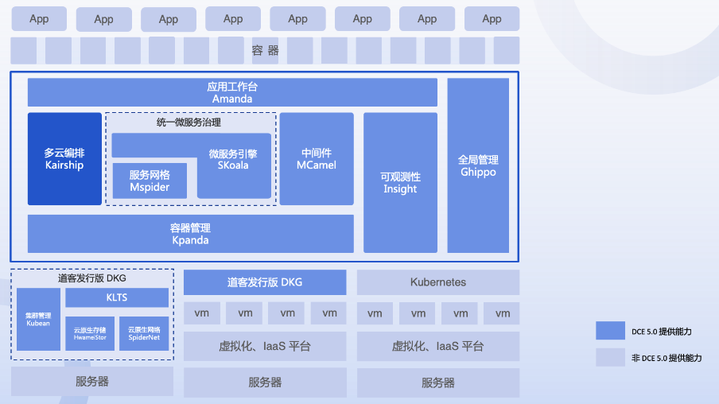

# 5.0多云编排能力介绍

在过去的两年里，随着公有云服务的成熟、云供应商产品的差异化，许多企业为了在数字化转型的队伍中，提高效率并保持竞争优势，开始采用混合 IT 和多云解决方案，从而加速多云战略的步伐。
以前位于本地数据中心的集中式应用和工作负载逐渐变得分散，这一趋势正在重新定义传统数据中心的边界，并迫使应用现代化和基础设施的扩展，以便适应日益重要的分布式工作负载。
依靠私有云、多个公有云和传统基础设施平台的组合，企业可以根据自己的特定优势自由选择云，从每个云提供商的特定优势中受益。
通过这种方式，构建最适合企业的应用架构，从而保证业务高可用、增强应用弹性、提升负载能力。
当然，企业也可以通过构建冗余部署，实现快速的故障转移 ，来降低单个云供应商的宕机的风险。

在面对复杂的多云环境，5.0多云编排将给我们带来一致的集群运维，降低管理负担；跨集群应用分发能力，打破数据孤岛，实现应用跨集群级别的容灾部署。

## 功能特性

多云编排的主要功能如下：

**多云集群实例管理**

- 多云集群实例一键部署，通过 Web 界面快速部署企业级 Karmada 集群，支持创建多个 Karmada 实例，它们之间同时工作，实例之间互不感知、互不影响。
- 工作集群一键导入，支持从 Kpanda 现有纳管集群中一键导入集群到 Karmada 实例中，并实时同步 Kpanda 集群最新信息。
- 实例信息概览，支持查看实例内已接入的工作集群的 CPU、内存的使用率等情况。
- 工作集群管理，支持动态将新集群加入到 Karmada 实例中；支持动态将特定集群从 Karmada 移除。
- CloudShell，支持获取 KubeConfig 链接信息，用户可在本地终端管理 Karmada 实例。
- Karmada 原生 API 支持，支持所有 Karmada 原生 API。

**多云工作负载** 

- 支持界面化创建无状态工作负载，添加差异化配置、分发策略
- 支持查看无状态负载的部署详情，单 Pod  监控、日志信息
- 应用故障转移，内置提供应用多云故障转移能力
- 跨集群工作负载分发，丰富的多云应用分发策略、覆盖策略
- 可观测性，丰富的审计、Metrics 暴露

**资源管理** 

- 支持多云命名空间管理
- 支持多云存储声明管理
- 支持多云配置、密钥管理
- 支持多云 Service 和 Ingress 资源管理

**策略中心** 

支持部署策略、差异化策略管理，查看策略关联的工作负载，提供删除空闲的部署策略、差异化策略的功能。

## 图形化用户交互

多云编排模块是一个多集群管理的聚合平台，支持用户接入不同厂商、不同地域的集群进行统一管理。
帮助企业快速跨集群部署工作负载，满足用户跨集群管理、容灾部署等使用场景。
在层级结构上，采用两级架构的形式，最上层提炼出多云集群列表，选择进入多云集群管理中心，查看到概览、工作集群管理、多云工作负载、资源管理、策略中心。

用户在多云集群实例列表界面，能够清晰的感知每一个多云集群实例的运行状态、资源用量、集群数等实时信息。
并且能够基于多云集群实例名称进入详情。同时如果用户想使用 kubectl 的方式管理集群，也可以在界面上使用基于 Cloudtty 桌面控制台工具。

在`概览`界面，用户能够查阅到详细的集群概览信息、跨集群工作负载的健康状态、资源信息等。

在`工作集群管理`界面，用户能够对多云集群的接入集群，进行管理，并能够查看到每个集群的状态、发行版本等信息。

在`多云工作负载`界面，用户能够感知所拥有权限的当前多云集群下的工作负载状态、实例数等信息。并可以通过名称进入工作负载详情，查看日志、监控等。

在`资源管理`界面，用户能够管理服务与路由、命名空间、存储声明、配置与密钥模块。这些资源都是跨集群创建，以满足跨集群工作负载的部署所依赖的资源。

在`策略中心`，用户可以对通过工作负载所关联创建出来的部署策略、差异化策略进行查看，但不允许对正在使用中的策略进行删除。
另外，用户也可以自定义创建部署策略、差异化策略，解锁高级使用模式。

## 多云编排可以做什么

您能够通过 Web UI 的方式，对多云编排进行管理。您可以借助多云编排模块实现创建多云集群实例、接入集群、应用跨集群部署等功能操作。
其中，多云工作负载的能力，完全对齐 Kubernetes 的工作负载。

**创建多云集群**

在多云编排模块，用户可以一键创建多云集群实例，然后在实例创建成功之后，在详情页面，进行工作集群的既接入、移除。同时可以通过给工作集群打上污点，实现工作负载的驱逐。

**接入成员集群**

多云编排会同步所有已经接入容器管理模块的集群，用户只需要在多云集群实例的**工作集群**处点击接入集群按钮，选择需要接入的集群，点击确认，既完成了对集群的接入操作。

**部署多云工作负载**

多云编排模块支持基于 Kubernetes 原生的工作负载类型部署和管理能力，包括：创建、配置、扩容、删除等全生命周期管理。另外支持集群差异化配置，让用户轻松应对不同集群的配置管理。

- **实例调度策略**

  目前多云编排支持以**复制**的方式，将实例数部署到用户所选择的集群上，也就是说，实例数配置成 2，并选择了Cluster A 和 Cluster B 两个工作集群，那么，会在 A 和 B 上同时部署一个实例数为 2 的工作负载。后续会逐步支持更多的实例调度策略。

- **集群亲和性和反亲和性**

  用户可以通过地域、可用区进行集群的选择，也可以通过亲和性和反亲和性配置，实现更精细的集群选择。

- **差异化配置**

  用户可以选择需要差异化配置的集群，然后会看到前面步骤已经配好的的通用配置，在差异步骤，去修改配置，实现不同集群上的工作负载使用不同配置运行。

- **资源管理**

对于跨集群的工作负载创建时，集群间的配置差异不可避免。所以，我们可以在资源管理模块，进行配置与密钥、存储声明的创建，从而在创建工作负载的时候，快读进行差异化配置。资源管理模块还有对命名空间、Service 和 Ingress 的管理，这些资源均会跨集群创建。

- **策略中心**

在策略中心，用户可以管理通过工作负载关联创建出来的部署策略和差异化策略，提供对空闲策略的删除功能。也支持以 YAML 的方式维护创建和编辑部署策略、差异化策略。

## 常见问答

- **问：多云编排兼容哪些厂商的****集群****？**

  答：5.0 多云编排兼容 5.0容器管理支持的厂商集群，包括亚马逊云、谷歌云、信创架构、边云融合等任何基于标准 Kubeneters ApiServer 的发行版容器集群。

- **问：如何实现对其它厂商集群的管理？**

  答：通过获取其它厂商集群的 KubeConfig 文件，在容器管理模块执行接入集群操作，填入目标集群的 KubeConfig 文件，即完成了对一个容器集群在容器管理的接入管理。然后在多云编排模块，可以在多云集群实例的工作集群列表中，接入新加入容器管理模块的集群。

  

- **问：应用如何实现跨集群通信？**

  答：目前，多云编排模块没有内置应用跨集群通信的实现。我们可以集成 Submariner，将连接的集群之间的网络扁平化，实现集群间 Pod 和服务的IP可达性，Submariner 还通过 Lighthouse 提供跨集群的服务发现能力。

- **问：如何获取多集群资源的实时状态？**

  答：借助自研开源组件 ClusterPedia，通过在目标集群上安装 Agent 组件，结合 Watch 机制能够实时将目标集群的资源变动信息同步到容器管理集群的 ETCD 内。多云编排直接查询容器管理的 ETCD，从而获取多集群资源的实时状态。

  

- **问：5.0多云编排在第五代产品中的定位？**

  答：在第五代产品中，多云编排模块处于承上启下的核心位置，对上：对接 DCE 5.0 应用工作台。对上层的场景化管理模块而言，多云编排模块能够把任何一个标准的 Kubernetes API 对上暴露，轻松实现应用跨集群分发、容灾部署。对下：对接容器管理平台 Kpanda，而 Kpanda 对接 Any Kubernetes ，例如边缘的 K3S、信创环境、DCE、DKG、DKE、以及外部的 Openshift，Tanzu、CCE等等，多云编排基于容器管理模块，快速实现多集群管理。

  

- **问：谁能够创建多云集群？**

  答：拥有 Global Admin、Kairship Owner 角色的用户能够去创建多云集群。
