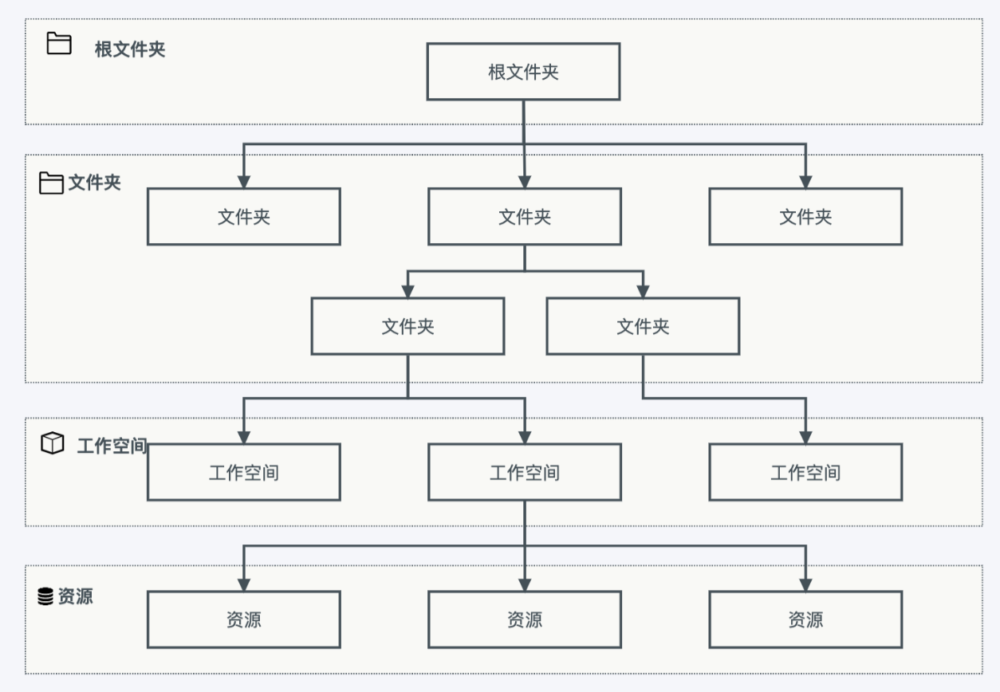

# 5.0 资源管理能力介绍

随着企业规模的扩大，管控的资源必定日渐庞杂复：成千上万台的服务器、机器设备、电子器件等有形固定资产；日常办公软件、专业财务/人事/OA/项目管理/开发等专业软件；管理层、雇员、职员等资源。

如何高效管理这些资源？

基于资源的管理能力本质上是建立一套与企业相关的，基于资源使用的关系结构。
在 DCE 5.0 中主要通过工作空间与层级模块实现，该模块具有全局一致性的特点，方便您基于此关系结构对平台上多个子模块内的各种资源进行高效规划和管理。

工作空间与层级模块中有两个概念：层级和工作空间。
层级可以映射为企业中的项目、环境、供应商等概念，方便您基于企业的业务或生态环境构建出体现资源关系的企业层级关系。
同时层级具有权限继承能力，上级层级管理员能够创建和管理下级层级及工作空间，有效解决层级结构中的一次性授权问题。
工作空间与资源直接关联，支持资源独享、资源共享等多维度，跨集群的资源管理能力，满足数百个集群下的资源快速授权和资源灵活调配需求。
同时，工作空间与层级模块还支持移动层级和移动工作空间功能，随时应对企业层级关系调整等带来的资源调整。

## 资源管理的用户交互

资源管理模块是一个具有层级的资源隔离和资源分组模块，主要解决资源统一授权、资源分组以及资源限额问题。
资源管理模块有两个概念：层级和工作空间。
在资源管理模块中您可以通过层级构建企业业务层级关系，通过工作空间中的资源组和共享资源管理资源，使资源管理模块的用户（用户组）之间能够共享工作空间中的资源。

资源处于资源管理模块层级结构的最低层级，资源包括 Cluster、Namespace、Pipeline、网关等。
所有这些较低层级的资源的父级只能是工作空间，而工作空间作为资源容器是一种资源分组单位。
工作空间通常代指一个项目或环境，每个工作空间的资源相对于其他工作空间中的资源时逻辑隔离的。
您可以通过工作空间中的授权，授予用户（用户组）同一组资源的不同访问权限。

从层次结构的底层算起，工作空间位于第一层，且包含资源。
除共享资源外，所有资源有且仅有一个父项。所有工作空间也有且仅有一个父级层级。

层级是在工作空间基础之上的进一步分组机制，具有层级结构。一个层级可以包含工作空间、其他层级或两者的组合，能够形成树状的组织关系。
借助层级您可以映射企业业务层级关系，按照部门对工作空间进行分组。层级不直接与资源挂钩，而是通过工作空间间接实现资源分组。
层级有且仅有一个父级层级，根层级是层次结构的最高层级，因此没有父级，层级和工作空间均挂靠到根层级下。

同时，用户（用户组）在层级中能够通过层级结构继承来自于父项的权限。
用户在层次结构中每个节点权限来自于直接在该节点获取的权限和继承其父项权限的组合结果，权限之间是加合关系不存在互斥。

资源通过工作空间进行分组，而工作空间中存在两种分组模式，分别是资源组和共享资源。
一个资源只能加入一个资源组，资源组与工作空间一一对应，资源被加入到资源组后，工作空间的所有者将获得资源的管理权限，相当于该资源的所有者。
而对于共享资源来说，多个工作空间可以共享同一个或者多个资源。资源的所有者，可以选择将自己拥有的资源共享给工作空间使用，一般共享时资源所有者会限制被共享工作空间能够使用的资源额度。
资源被共享后，工作空间的所有者仅具有资源限额下的资源使用权限，无法管理资源或者调整工作空间能够使用的资源量。
同时共享资源对于资源本身也具有一定的要求，仅具有层级的资源能够被共享，比如 Cluster-Namespace，Cluster 资源所有者能够将 Cluster 资源分享给不同的工作空间使用，并且限制工作空间在此 Cluster 上的使用额度，工作空间所有者在资源限额内能够创建多个Namespace，但是 Namespace 的资源额度总和不能超过 Cluster 在该工作空间的资源限额。对于 K8S 资源，当前能够分享的资源类型仅有 Cluster。

[申请社区免费体验](../dce/license0.md){ .md-button .md-button--primary }

## 资源管理要素

安装DCE5.0后，在初始化阶段平台会自动为用户创建根层级，根层级位于资源管理模块资源层级结构的顶层，没有父级。资源关系依据根层级向下分布，最多支持5级层级。

### 层级

平台管理员根据企业现有的层级结构在根层级下创建新的层级。
层级可以映射为企业的项目、环境、供应商等概念，层级具有层级结构和权限继承，是资源管理模块资源层级结构的节点。
一个层级可以包含工作空间、其他层级或两者的组合。
新创建的层级必须具有父级，且下级层级和工作空间会继承父级文件的权限，因此用户在层级或工作空间的实际权限是来自于继承父级层级的权限和在该节点获得的权限之和。

### 工作空间

工作空间是资源管理模块中的资源隔离单元，具有资源组和共享资源两种模式，与资源直接关联。
工作空间有且只有一个父级层级，工作空间及其下的资源会继承父级层级的权限。

在 DCE 5.0 中，由于资源存在不同的授权方式，因此衍生出了强依赖于工作空间授权的资源，如网关、Pipeline 等；以及可以选择性绑定到工作空间的资源，如 Cluster、Namespace。

应用工作台、微服务引擎、服务网格的资源由于以工作空间为顶层概念，资源完全依赖于工作空间进行授权，因此资源会被自动绑定到某个工作空间，工作空间的所有者即是资源的所有者。
此类资源无需手动绑定，资源也无需在工作空间的资源组进行显示，用户（用户组）使用资源的前提是被授予工作空间的相应权限。
而对于 Cluster、Namespace 资源，由于容器管理有独立的授权模块，资源所有者有选择性绑定的权利。
资源被手动绑定到工作空间的资源组，表示允许工作空间所有者能够管理使用该资源，此时工作空间所有者相当于资源所有者，被绑定的资源将在工作空间的资源组进行显示，并可以随时解绑。
资源被绑定到到工作空间的共享资源，表示允许资源所有者在资源限额内使用资源，当前能够被共享的资源类型仅有 Cluster。

### 资源限额

共享资源不意味着被共享者可以无限的使用被共享的资源，一般资源所有者会限制工作空间在该资源上能够使用的额度上限。
比如，当 Cluster 被共享到工作空间后，工作空间所有者就获得了在该 Cluster 上创建 Namespace 的权利。
若 Cluster 所有者设置了工作空间在该 Cluster 上的资源额度上限为 Quota=100，那么 Namespace 的 Quota 总和不能超过 100。
同样的，当多个 Cluster 被共享到该工作空间时，那么每个 Cluster 所有者都可以设置工作空间在各个 Cluster 上的额度使用上限。
另外，除了 Quota 外，资源所有者还可以通过 CPU、内存、Secret 等多个维度对资源额度上限进行限制。
（资源所有者能够共享资源的前提：同时是 Cluster 和工作空间的所有者）。

### 移动层级和工作空间

部门关系或项目关系的调整随时可能使资源的授权关系发生变化，为了能够随机应变，移动层级和移动工作空间功能应用而生。以移动层级为例，由于资源、工作空间、层级的权限具有继承关系，因此移动层级后，原父级层级将失去对该层级以及其子层级、工作空间、空间中资源的管理权限，新的父级获得对该层级以及其子层级、工作空间、空间中资源的管理权限。对于层级本身以及其下的子层级授权关系没有发生任何变化。工作空间同理。

## 谁需要资源管理

需要对K8S、微服务引擎、服务网格等资源进行管理，且资源具有一定规模的企业用户

### 解决什么问题

1. 企业人员众多同时存在多层级结构，如多级供应商，多级部门等，而资源往往聚焦在少部分运维人员手中，资源下发与资源管理耗费大量的人力物力
2. 企业层级结构多变，无法灵活应对部门调整带来的人员权限和资源归属变化
3. 以项目为驱动力的企业，对于同一批人，同样的资源需要进行多次授权
4. 对于同一种资源，多人拥有相同的权限存在安全风险

### 适用场景

1. 探索更为便捷的资源下发与资源管理方式，减少人力物力消耗，缩减成本
2. 资源管理方式映射企业层级结构，按照层级进行分权自制，更为灵活的应对企业变化，同时接入更多供应商，扩大业务范围
3. 更为精细化的资源权限控制，同一种资源设置管理、使用、只读等多种权限，为不同的成员下发不同的权限，将安全风险降到最低，进一步降低事故率

## FAQs

1. 什么场景下需要使用层级？

   答：层级可以映射为企业的项目、环境、供应商等概念，具有层级结构和权限继承能力。可以有效应对企业遇到的多级供应商的资源分配问题。

2. 什么场景下需要使用工作空间？

   答：资源与工作空间直接关联，同时资源会继承工作空间的权限。
   当资源数量很大时，通过工作空间对资源进行统一授权能够有效减少资源运维的工作量。
   另外在 DCE 5.0 中，应用工作台、微服务引擎、服务网格中的资源依赖于工作空间授权，因此创建此类资源的前提是拥有工作空间的相应权限。

3. 层级、工作空间及资源的关系？

   答：资源与工作空间直接关联，资源权限继承工作空间的权限；而工作空间一定归属于某个层级，且工作空间权限继承层级权限，所以拥有层级权限的用户相当于对其下工作空间中的资源有相应权限，但是资源不与层级直接绑定。

4. 移动层级或者工作空间，资源和权限是否会发生变化？

   答：资源绑定在工作空间下，会随着层级或者工作空间的移动而移动。
   因为资源继承工作空间的权限，工作空间继承层级的权限，所以移动工作空间或者层级后会改变原有的权限继承关系，原来层级或者工作空间的上级失去对层级或者工作空间的管理权限，目标层级及其上级开始拥有对该层级或者工作空间的管理权限。

5. 谁能够创建 Folder？

   答：Admin、Workspace Owner 和上一级 Folder Admin。

6. 谁能够创建 Workspace？

   答：Admin、Workspace Owner、Folder Admin。
   
7. 想要获得 微服务治理、应用工作台、服务网格权限找谁授权？

   答：微服务治理、应用工作台、服务网格下的资源均自动绑定 Workspace，且权限强依赖于 Workspace，需要通过获得 Workspace 权限继而获取相关的资源权限。
   能够进行 Workspace 授权的有 Admin、Workspace Owner、Folder Admin、Workspace Admin。