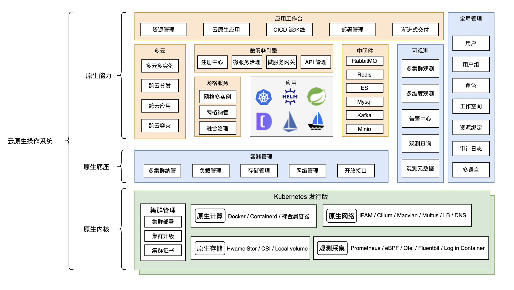

# 什么是 DCE 5.0

「DaoCloud Enterprise 5.0」是高性能可扩展的云原生操作系统，在任何基础设施上、任意环境上提供一致、稳定的体验，支持信创异构、边云协同、多云编排，融合前沿的服务网格和微服务技术，将可观测性贯穿于每一个流量生发的始终，助力洞察集群、节点、应用和服务的详细指标，通过动态仪表盘和拓扑大图可视化掌握应用健康状态。原生支持 DevOps 开发运维模式，实现应用交付的全流程标准化和自动化，原生集成各类精选数据库和中间件，使得运维治理更高效。DCE 5.0 的各个产品模块独立解耦，灵活升级，业务无感知，开放对接超百家云原生生态产品，形成完整的解决方案体系，经近千家行业客户生产场景锤炼，构建坚实可靠的数字底座，释放云原生生产力，助力企业定义数字边界。

## 功能模块

DCE 5.0 云原生操作系统的功能丰富，具体组成模块如下图所示。

=== "容器管理"

容器管理是基于 Kubernetes 开源技术构建的面向云原生应用的容器管理平台，基于原生多云架构，解耦底层基础设施平台，实现多云与多集群统一化管理，简化企业的应用上云流程，降低运维管理和人力成本。
便捷创建 Kubernetes 集群，帮助企业快速搭建企业级的容器云平台。

兼容 OpenShift、开源 Kubernetes 等，跨异构 Kubernetes 发行版如履平地。
基于 Kubernetes 开源技术打造容器管理平台，构建面向云原生应用的容器管理平台，基于原生多云架构，解耦底层基础设施平台，实现多云与多集群统一化管理，简化企业的应用上云流程，降低运维管理和人力成本。

进一步了解[容器管理](../kpanda/03ProductBrief/WhatisKPanda.md)。

=== "全局管理"

全局管理是以用户为中心的综合性服务模块。围绕用户、用户组、租户（工作空间与层级）、授权、资源管理、操作审计、密码策略、正版授权、多语言以及个性化定制等功能提供了统一的管理入口，并通过平台默认配置简化用户操作，帮助用户高效完成平台基础设置，实现激活即可用，为平台其他功能模块的使用奠定了基础。
进一步了解[全局管理](../ghippo/01ProductBrief/WhatisGhippo.md)。

- 用户与访问控制：帮助用户安全地管理资源的访问权限，您可以创建、管理、删除用户/用户组，并灵活配置用户/用户组权限，来完成用户职能权限的划分。

- 工作空间与层级：是具有层级结构和访问权限控制的资源隔离单元，您可以按照企业开发环境、部门结构等设置层级结构，并控制哪些人对哪些资源具有访问权限。

- 审计日志：为您提供资源的操作记录，通过操作记录您可以快速实现安全分析、资源变更、问题定位等。

- 平台设置：可以通过平台安全策略、邮件服务器、外观定制等，来提高用户信息的安全性和平台的个性化

=== "可观测性"

可观测模块 (Insight) 是以应用为中心、开箱即用的新一代云原生可观测性平台，实时监控应用及资源，采集各项指标、日志及事件等数据分析应用健康状态，提供告警能力以及全面、清晰、多维度数据可视化能力，兼容主流开源组件，并提供快捷故障定位及一键监控诊断的能力。

提供 Metrics、Log、Tracing 三合一的云原生可观测性。可观测性是以云原生可观测性为核心实现的新一代运维产品，支持实时采集指标、日志和链路的数据，提供告警及灵活的通知配置，实现快速的故障定位和快捷的故障排查。

进一步了解[可观测性](../insight/03ProductBrief/WhatisKInsight.md)。

=== "应用工作台"

零门槛的应用工作台，可以让开发人员体验一条龙式的流水线，轻松搞定 CI/CD 全流程。致力于帮助企业在任何云上构建、运行管理云原生应用程序，覆盖应用全生命周期管理。
并通过敏捷化开发交付流程和现代化应用架构，持续交付用户喜爱的产品。进一步了解[应用工作台](../amamba/01ProductBrief/WhatisAmamba.md)。

=== "更多模块有待您的发现和探索"

| 模块名称                                        | 功能说明                                                     |
| ----------------------------------------------- | ------------------------------------------------------------ |
| [集群生命周期管理](../community/kubean.md)      | 全自动、全生命周期（安装、升级、配置）的 Kubernetes 集群管理。管理集群和业务集群分离的双态架构，让应用稳如泰山。Kubernetes 版本升级，结合跨集群调度技术，平滑完成底层 Kubernetes 集群升级。 |
| [网络](../network/intro/what-is-net.md)         | 能够兼容各种底层网络环境 （公有云、私有云、虚拟化、物理机、SDN）的自适应网络方案，支持多网络模式组合、网络策略、网络加速等能力。 |
| [存储](../hwameistor/intro/what.md)             | 提供强企业级存储服务接入能力，自带高性能本地存储，支持文件存储、块存储、对象存储，能够对接 99% 的主流存储供应商。 |
| 镜像仓库                                        | 容器镜像及 Helm Charts 标准制品的全生命周期管理，提供简单易用、安全可靠的制品管理功能，同容器平台无缝结合，帮助企业降低交付复杂度，打造云原生应用部署一站式解决方案。 |
| [多云编排](../kairship/01product/whatiskair.md) | 多云分发，多集群容灾 ，跨集群网络。结合底层存储技术，可实现跨级群双活架构。多云编排是一个以应用为中心、开箱即用的多云应用编排平台。实现了多云和混合云的集中管理，提供跨云的应用部署、发布和运维的能力；支持基于集群资源的应用弹性扩缩，实现全局负载均衡；提供了故障恢复的能力，彻底解决多云应用灾备的问题。 |
| [中间件](../middleware/rabbitmq/intro/what.md)  | 精选中间件，可以在生产环境可靠运行的有状态中间件，包括 RabbitMQ 高性能消息队列、Kafka 日常消息队列、MySQL 关系型数据库、Redis 内存数据库、Elasticsearch 日志检索等等。 |
| [微服务引擎](../skoala/intro/features.md)       | 为客户提供一站式微服务治理解决方案平台软件，基于传统微服务治理及云原生微服务治理提供统一的产品功能和体验，并解决客户从传统微服务迁移至云原生微服务过程中的各种问题。 |
| [服务网格](../mspider/01Intro/What'smSpider.md) | 提供非侵入式流量治理功能，解决用户在多云多集群复杂云原生容器环境下的服务治理问题，实现统一治理、统一监控的目标。并为综合微服务管理引擎提供容器化微服务的治理能力支持和传统微服务接入支持。 |

就像乐高搭积木一样，糅合社区最优秀的几十种开源技术，经过众多辩证选型、适配磨合、编码调试、海量测试，“十年磨一剑，一朝试锋芒”，全新搭建的新一代容器化平台能够满足企业上云的各类场景需求。

## 版本划分

=== "社区版"

    以云原生底座为核心，自研开源组件加持，提供云原生计算、网络、存储等能力，支持多云、多集群全生命周期统一纳管，屏蔽底层基础设施复杂性，降低企业使用云原生应用门槛，提高应用开发效率。

    [申请社区免费体验](license0.md){ .md-button .md-button--primary }

=== "标准版"

    生产级云原生底座，兼容多种底层基础设施，支持信创异构、云边协同，轻松创建和纳管大规模多集群，CI/CD 流水线实现自动化的应用交付及部署，创新引入 Gitops、渐进式交付能力体系，应用商店精选十大领域生态应用，面向企业用户提供完整的软件堆栈。

=== "高级版"

    在标准版基础上，采用前沿的微服务和网格技术，支持无感接入传统微服务、云原生微服务和开源微服务框架，统一实现微服务生命周期管理；提供非侵入式流量治理功能，解决用户在多云多集群复杂云原生环境下的服务治理问题。 将可观测性贯穿于每一个流量生发的始终，实现自动化数据采集，实时洞察集群、节点、应用和服务的详细指标，快速故障定位。

=== "白金版"

    在高级版基础上，引入多云编排技术，实现多云和混合云的集中管理，提供跨云的应用部署、发布和运维能力，支持基于集群资源的应用弹性扩缩，实现全局负载均衡，具备故障恢复能力，有效解决多云应用灾备问题。精选各类数据库、分布式消息和日志检索等中间件，提供多租户、部署、观测、备份、运维操作等全生命周期的中间件管理能力，实现数据服务的自助化申请、弹性扩展、高并发处理和稳定高可用。

