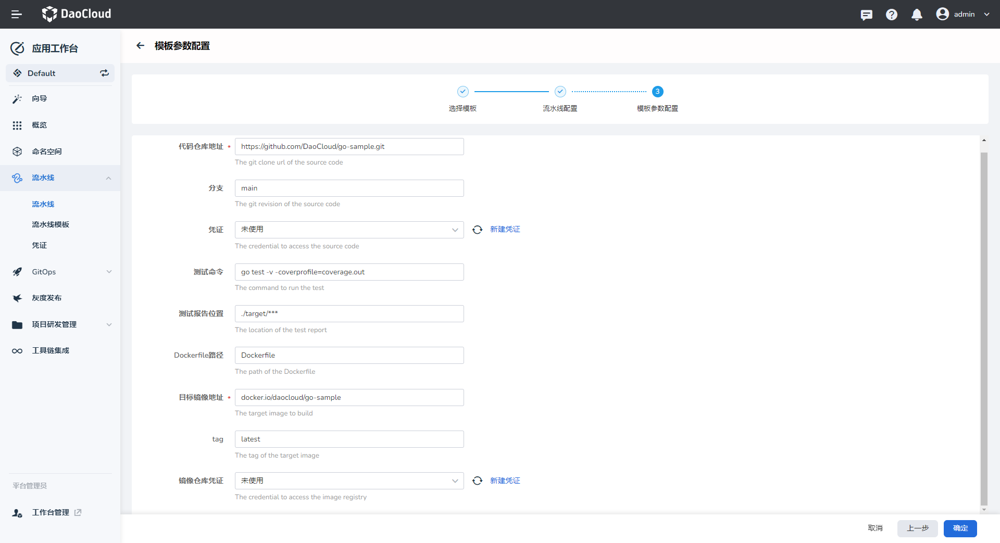

# 基于内置模板创建流水线

应用工作台模块支持基于内置模板或用户的[自定义模板](../template/custom-template.md)快速创建流水线。根据常见的使用场景，应用工作台模块内置了 Golang、Nodejs、Maven 模板。

## 操作步骤

基于内置模板创建流水线的步骤如下：

1. 在流水线列表页点击`创建流水线`。

    

2. 在弹出的对话框中，选择`模板创建`，点击`确定`。

    

3. 选择合适的流水线模板，然后点击`下一步`。

    > `推荐模板`标题下列出了所有的内置模板，`自定义模板`标题下列出了用户创建的所有自定义模板。

    

4. 参考[自定义创建流水线](custom.md)填写流水线配置，然后点击`下一步`。

5. 参考下列说明填写模板参数，然后点击`确定`。

    - 代码仓库地址：远程代码仓库的地址，必填
    - 分支：基于哪个分支的代码构建流水线，必填
    - 凭证：如果是私有仓库，需要提前[创建凭证](../credential.md)并在此处选择该凭证
    - 测试命令：单元测试命令

        > 如果使用 Golang 模板，则测试命令默认为 `go test -v -coverprofile=coverage.out`
        > 如果使用 Nodejs 模板，则测试命令默认为 `npm test`
        > 如果使用 Maven 模板，则测试命令默认为 `mvn -B test -Dmaven.test.failure.ignore=true`

    - 测试报告位置：测试报告所在的位置，并进行分析生成测试报告
    - Dockerfile 路径：Dockerfile 文件在代码仓库中的绝对路径，必填
    - 目标镜像地址：输入镜像仓库名称，必填
    - tag：为运行此流水线后新生成的镜像添加 tag
    - 像仓库凭证：访问镜像仓库的凭证。如果是私有仓库，需要提前[创建凭证](../credential.md)并在此处选择该凭证

        

6. 完成创建后，可以在流水线列表查看新建的流水线。在流水线右侧点击更多操作按钮，可以进行执行、编辑、复制流水线等操作。

    