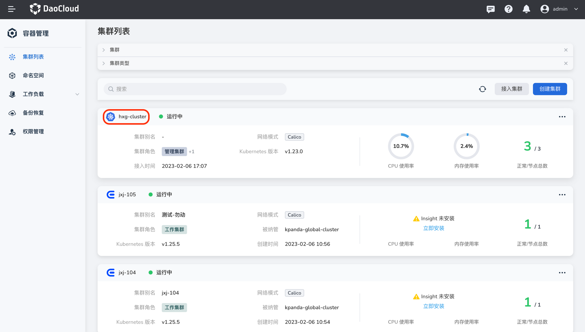
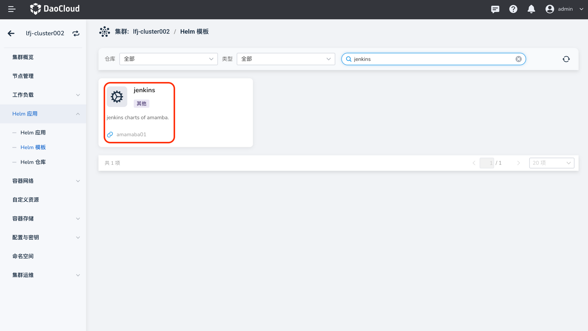
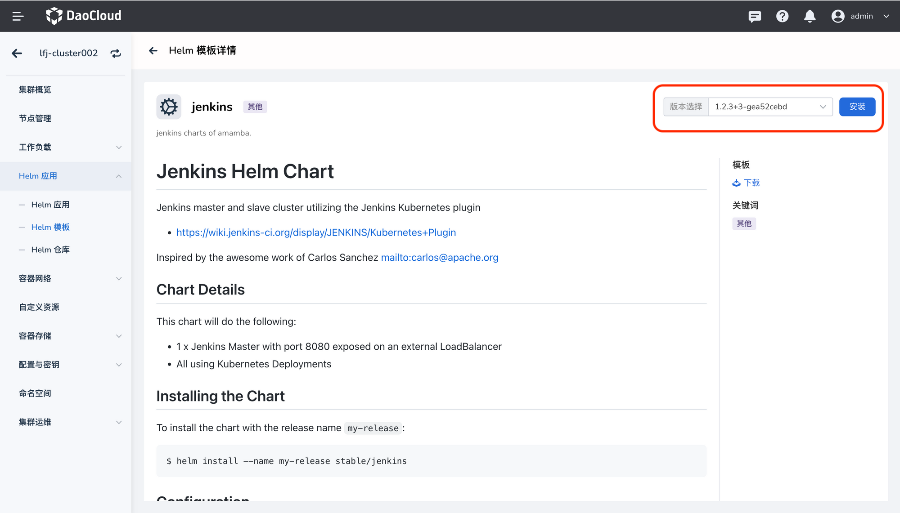
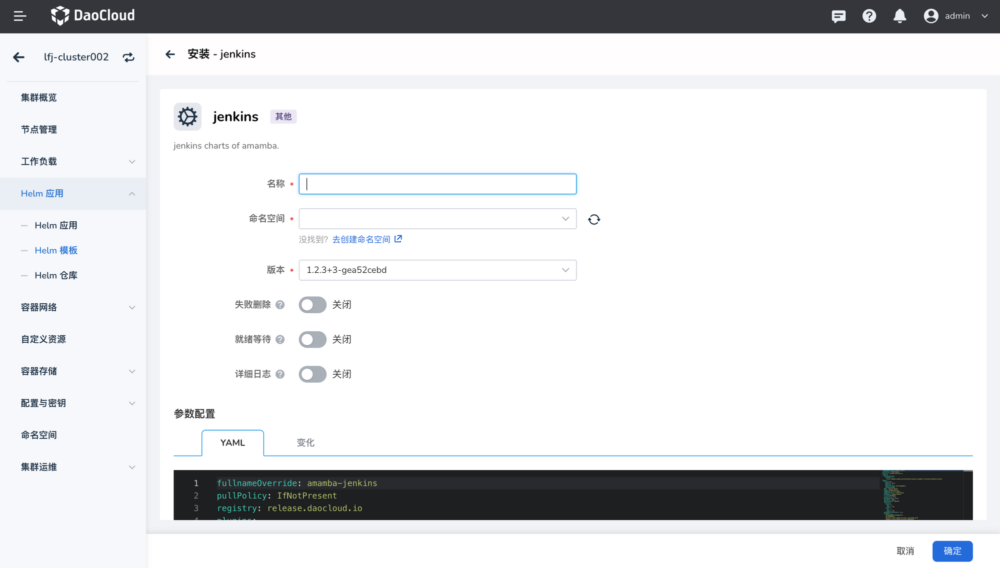

# 安装 Jenkins

安装 Jenkins 之前需要确保将要 Jenkins 的集群中存在默认的存储类。

1. 进入`容器管理`模块，在`集群列表`中找到需要安装 Jenkins 的集群，点击该集群的名称。

    !!! note

        需要根据实际情况选择 Jenkins 的部署集群。目前不建议将其部署在全局服务集群，因为 Jenkins 执行流水线高并发时会占用大量资源，可能会导致全局服务集群的瘫痪。

    

2. 在左侧导航栏中选择 `Helm 应用` -> `Helm 模板`，找到并点击 `Jenkins`。

    

3. 在`版本选择`中选择想要安装的版本，点击`安装`。

    

4. 参照下列说明填写各项配置。

    - `registry`: Jenkins 镜像的存储地址
    - `Master.AdminUser`: Jenkins 账户的用户名
    - `Master.AdminPassword`: Jenkins 用户名对应的密码
    - `Master.resources.requests`: Jenkins 的资源请求值
    - `Master.resources.limits`: Jenkins 的资源限制值
    - `Deploy.JenkinsHost`: Jenkins 的访问链接。如果选择 `Node Port`，访问地址规则为：http://{集群地址:端口}
    - `eventProxy.enabled`: `true` 代表部署在 **非** 全局服务集群，`false` 代表部署在全局服务集群
        > 如果 `eventProxy.enabled=true`，则必须填写该字段下的其他各项配置，例如 `eventProxy.image.registry`、`eventProxy.image.repository`、`eventProxy.image.tag`、`eventProxy.imagePullPolicy` 等
    - 有关 `eventProxy.configMap.eventroxy.token` 字段中 token 的获取方式，可参考文档：[访问密钥](../../../ghippo/user-guide/password.md)

        

    !!! info

        如需了解 YAML 文件中的其他配置说明，可参考 Jenkins Helm 模板详情页面中 `Configuration` 部分的说明。

        

Jenkins 安装成功后，需要将其集成到应用工作台的工具链中。相关功能和文档正在开发中，敬请期待。

<!--
## 集成 Jenkins

目前仅支持集成通过 DCE 5.0 安装的 Jenkins。

1.使用具有 Admin 角色的用户登录 Web 控制台并进入应用工作台。

2.在左侧导航栏点击平台管理下的`工具链集成`，点击右上角的`集成`按钮。

3.选择工具链类型 `Jenkins`，填写集成名称，Jenkins 地址，用户名和密码。如果 Jenkins 地址为 https 协议时，需要提供证书。

-->