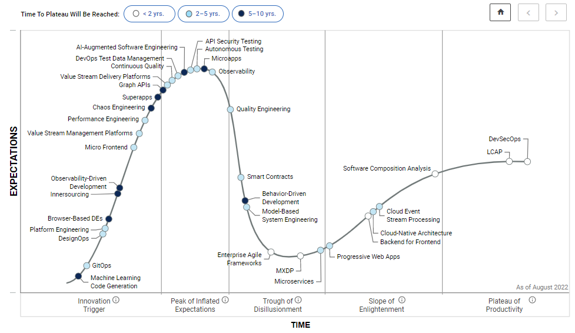
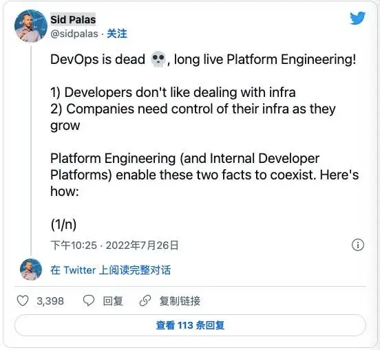
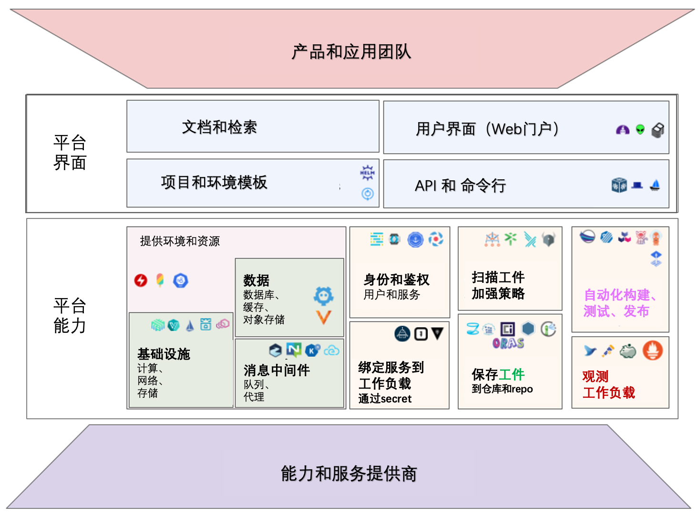

# CNCF 平台工程白皮书

!!! quote

    引子（译者 [panpan0000](https://github.com/panpan0000) 注）：2022 年，“平台工程”这个概念很火热，也在 Gartner 的炒作周期曲线上。
    还有言论说“DevOps 已死，平台工程才是未来“。开发者不愿意和基础设施打交道，企业发展又需要自己的基础设施。
    “平台工程”统一这两个矛盾点，或者说“平台工程”是 DevOps 的下一站。

    
    
    

    但关于平台工程的诠释，一直比较模糊。几天前，CNCF 的应用交付技术小组（App-Delivery TAG）（TAG：Technical Advisory Groups）
    发布了[《平台白皮书》](https://tag-app-delivery.cncf.io/whitepapers/platforms/) 让我们一起来看看吧。

## 概述

受到 DevOps 成功推动跨职能合作的启发，平台工程 (Platform Engineering) 也开始在企业中作为明确的协作形式而涌现。
"平台"所提供的基础能力、框架和经验，提供便利并加速着内部用户的工作（如应用程序开发者、数据科学家和信息处理者）。
特别是在云计算方面，“平台”已经帮助企业实现了云计算长期承诺的价值：
如快速产品发布、跨基础设施的可移植性、更安全更弹性的产品，以及更高的开发者生产力。

本文旨在帮助企业技术决策者们（企业管理者、企业架构师、平台组管理者），去调研、规划、推广内部的云计算平台。
我们相信"平台"对企业的价值流 (Value Streams) 会产生重要影响，但因为这个影响是间接性的，
所以管理者们的共识和支持，对于平台团队的可持续性和成功是至关重要的。
在本文中，我们将讨论几个要点：定义、衡量、实施和最大化平台的价值。

目录：

1. [为什么需要一个平台](#_2)
2. [平台是什么](#_3)
3. [一个成功的平台应具备的属性](#_5)
4. [一个成功的平台团队应具备的属性](#_6)
5. [实施平台的挑战](#_7)
6. [如何度量平台的成功](#_9)
7. [平台的能力](#_13)

## 为何需要一个平台?

平台和平台工程在云计算世界中是一个热门话题。在深入平台构建的定义、技术和度量之前，让我们首先探讨这火热的平台概念所提供的价值。

过去二三十年间的软件流程改进，为开发者提供了丰富的基础架构（如计算、网络、存储、开发者服务如构建、测试、交付和可观测性等），
显著提高了开发的敏捷性。但这种自治和流程改进，也逐渐使得基础服务的运营职责，（从基础团队）左移到了产品开发团队，
迫使他们在基础架构方面花费越来越多的时间和认知精力，减少他们为组织（和产品）产生价值的时间。

为了能让开发团队重新聚焦于他们的核心任务，和减少组织内重复工作，这个目标驱动着企业去实施云原生计算平台。
通过投资这个平台，企业可以收获：

1. 减轻产品团队的认知负担，从而加速产品的开发和交付。
2. 通过专家的配置和管理，提高依赖于平台能力的产品的可靠性和弹性。
3. 在团队之间重用、共享平台工具和知识，加速产品的开发和交付。
4. 通过治理平台能力，治理与其相关的用户、工具和流程，来减少产品和服务在安全、监管和功能问题上的风险。
5. 充分利用公共云和托管服务提供商，实现降本增效， 同时保持对用户体验的控制。

这些好处来源于三方面原因：一方面是因为少量平台团队可服务于许多产品团队，从而放大了他们的影响；
第二个方面是因为平台团队整合了常见功能的管理，并促进了治理；第三个方面是因为平台团队强调用户界面和体验优于一切。

平台专家团队不仅减轻了产品开发团队的常规工作，还优化了这些产品中使用的平台能力。
平台团队还能维护了一组公共的约定范式、知识和工具，在这共通的基础上，开发者能够快速为其他团队和产品做出贡献。
这种模式还能（通过技术手段）把治理和管控的目的融入模板、模式和能力中。
最后，因为平台团队在公有云或私有化供应商之上，集中构筑一致体验，
所以能对那些基础但无差别的服务的使用更加高效：如数据库、身份访问、基础架构操作和应用程序生命周期。

## 什么是平台

云原生计算平台，是根据平台用户的需求能力的集成。它确保了一致的体验，集成通用应用场景的典型服务能力。
良好的平台提供一致的用户体验来使用其服务，例如 Web 门户、项目模板和自助式 API。

据 [Atlassian 的说法](https://www.atlassian.com/devops/frameworks/team-topologies)：
“平台团队创建的能力，可以被众多流程一致的产品开发团队使用，而几乎没有额外的开销.....
平台团队最小化了团队的资源和认知负担....平台团队可以将不同产品的体验统一起来。”

[Martin Fowler 和 Evan Bottcher 说过](https://martinfowler.com/articles/talk-about-platforms.html)，“数字平台是一组自助式 API、工具、服务、知识和支持的基础，这些都被组织到一个统一的内部产品中。自治的开发团队可以利用平台，更快交付产品功能，减少协调。”

平台支持的特定能力和场景，应由利益相关者和用户的需求确定。虽然平台“提供”这些能力，但需要注意的是，平台团队不应总是自己“实现”它们。
可以让托管服务提供商或专门的内部团队来维护和实现，而平台则是提供一致性的“最薄合理层”，以满足组织的要求。
例如，一个非常简单的“平台”: 可以是一个 wiki 页面，
包含从提供商[获取能力的方法和流程](https://teamtopologies.com/key-concepts-content/what-is-a-thinnest-viable-platform-tvp)。

由于这些平台的目标用户，不多不少，正是企业的内部使用者，因此我们通常将它们称为“内部”平台。

平台对云原生架构息息相关，因为它们比以前的范例，更分离支持能力与特定于应用程序的逻辑。
在类似云的环境中，资源和能力通常是独立管理的，并与业务紧密集成；
这些资源可能包括数据库和对象存储、消息队列和代理、可观察性采集器和仪表板、用户目录和身份验证系统、任务执行器和协调器等等。
内部平台不单单向企业团队提供这些资源能力，并以一种能够被应用简单集成的方式来提供。

### 平台成熟度

最初，内部平台能提供单一服务的能力和一致性体验：比如 CI 的流水线 runner、数据库或密钥 (secret) 存储。
随着它们的成熟，内部平台还提供了这些服务的“组合”：比如用于关键场景（如 Web 应用程序开发、如数据分析（即 MLOps））的自助式模板。

平台的使用中，可能会经历以过程：

1. 产品开发人员可以按需提供能力，并立即使用它们来运行系统，例如计算、存储、数据库或身份认证信息。
2. 产品开发人员可以按需提供服务空间，并使用它们来运行管道和任务，存储 artifacts 和配置，和收集遥测数据。
3. 第三方软件的管理员，可以按需提供依赖项，例如数据库，并轻松安装和运行之。
4. 产品开发人员可以从模板（包括运行时和开发时所需的服务）中，按需提供完整的环境，例如 Web 开发或 MLOps。
5. 产品开发人员和经理可以通过自动化的工具和标准仪表板，观察已部署服务的功能、性能和成本。

内部平台通过单个能力或能力组合，提供一致、符合要求的体验，最终使其用户更轻松、更高效地交付有价值的产品。

## 平台的属性

在定义了平台是什么，以及为什么组织希望构建一个平台之后，让我们识别一些影响平台成功的关键属性。

1. 平台即产品（Platfrom as a Product）：平台是为了满足其用户的需求而存在，类似于任何其他软件产品，应基于这些需求进行设计和演进。
   平台应提供必要的能力，优先支持大多数产品团队的常见需求，而非优先考虑仅某个团队使用的具体能力，以最大化提供的价值。
2. 用户体验：平台应通过一致的界面，并专注于用户体验。平台应努力满足不同用户的需求，这可能意味着 GUI、API、命令行工具、IDE
   和门户都要有。例如，平台通常提供部署应用程序的能力。开发人员可以通过 IDE 来使用这种能力，测试人员可以使用命令行工具，
   而产品经理可以使用基于 GUI 的 Web 门户。
3. 文档和快速入门：文档是成功软件产品的关键方面。为了能够使用平台的产品，用户需要文档和示例。
   平台应随着适当的文档一起交付，以满足其用户的需求。它还应提供工具，以加速使用平台服务的新项目的上手。
   例如，平台可以提供一个可复用的工作流，为在 Kubernetes 上构建、扫描、测试、部署和观察 Web 应用程序。
   这样的典型工作流，可以作为一个新手上手模板和文档，这个组合通常被称为“黄金路径”。
4. 自助式：平台应是自助式的。用户必须能够自主且自动地请求和接收能力。
   这是允许一个平台团队能支撑许多产品团队并按需“扩容”的关键。平台能力应按需提供，并仅需最少的手动干预。
   例如，用户应能运行命令行工具或在 Web 门户上填写表单来申请一个数据库，并能看到它的 locator 和认证信息。
5. 减少认知负担：平台的一个重要目标是减少产品团队的认知负荷。平台应封装实现细节，并隐藏可能从其架构中产生的任何复杂性。
   例如，平台可能将某些服务委托给云提供商，但不应向用户暴露此类细节。
   同时，平台应允许用户按需配置和查看某些服务。用户不应负责运维底层服务。
   例如，用户经常需要一个数据库，但他们不应该管理数据库服务器。
6. 可选和可组合：平台旨在使产品开发更加高效，而不是”成为障碍“。
   平台应该是可组合的，并使产品团队仅使用部分能力。当平台不具备某些能力时，产品团队还应能自己部署和使用外部组件。
   例如，如果平台不提供 Graph 数据库，而这是产品所需的，那么产品团队应能够自行提供和运维 Graph 数据库。
7. 默认安全：平台应默认情况下是安全的，并提供符合组织定义的规则，和标准的合规性和验证能力。

## 平台团队的属性

平台团队负责平台功能的接口和体验，例如 Web 门户、自定义 API 和“黄金路径模板”。
一方面，平台团队与实施基础设施和支持服务的团队合作，以定义一致的体验；另一方面，他们与产品和用户团队合作。收集反馈并确保这些体验符合要求。

以下是平台团队应负责的工作：

1. 研究平台用户需求并规划 Roadmap
2. 在企业内宣贯和传播平台的价值
3. 管理和开发界面，包括门户、API、文档、模板、以及 CLI 工具

最重要的是，平台团队必须了解平台用户的需求，以告知并不断改进其平台提供的功能和界面。
了解用户需求的方法包括用户访谈、交互式黑客马拉松、问题跟踪和问卷调查，以及通过可观察性工具直接观察使用情况。
例如，平台团队可以发布一个表单供用户提交功能申请，主持 Roadmap 会议以分享即将推出的功能，并分析用户的使用方式以调整优先级。

收集外部反馈和周到设计是平台团队工作的一方面；另一方面是主动对外营销和宣传。
如果该平台真正是根据用户需求构建的，那么这些用户将很高兴使用所提供的功能。
平台团队可以通过内部营销活动，包括公告、引人入胜的演示以及定期反馈和沟通会议，来提高用户采用度。
这里的关键是在用户所在的地方与他们会面，并让他们踏上与平台互动并从中受益的旅程。

平台团队不一定运维计算、网络、存储或其他服务。实际上一个内部平台应尽可能依赖外部提供的服务和能力；
平台团队只有在无法从托管供应商或内部基础设施团队那里获得这些能力时，才应构建和维护自己的能力。
相反，平台团队主要负责接口（即 GUI、CLI 和 API）以及平台提供的服务和功能的用户体验。

例如，平台中的网页可能会有个按钮来为应用程序提供身份认证；而该功能的实现可能是通过云托管的身份服务。
内部平台团队可能会管理网页和 API，但不会管理实际的服务实现。平台团队通常应仅在其他地方无法提供所需功能时才考虑创建和维护自己的功能。

## 平台的挑战

虽然平台承诺了很多价值，但它们也带来了如下挑战，实施者应牢记这些挑战：

1. 平台团队必须像对待产品一样对待他们的平台，并与用户一起开发它们

2. 平台团队必须谨慎选择优先级，和初始合作的应用开发团队

3. 平台团队必须寻求企业领导层的支持并展示对价值流的影响

也许最重要的是将平台视为面向客户的产品，其成功直接取决于其用户和产品的成功；
因此，平台团队与应用程序团队等用户合作，对平台的功能和用户体验进行优先排序、规划、实施和迭代至关重要。
平台团队在没有反馈的情况下发布功能和体验，或者依靠自上而下强制推动采用，几乎肯定会遭到用户的抵制和不满，
并丢失很多承诺的价值。为了解决这个问题，平台团队应该从一开始就要有产品经理角色，来分享路线图、收集反馈并普遍理解和代表平台用户的需求。

在采用平台时，首先选择正确的功能和体验至关重要。经常需要且区分度不高的功能，
如 CI Pipeline、数据库和可观察性，可能是一个很好的起点。
平台团队也可以选择首先关注少数优秀的应用程序团队。来自他们的反馈改善了首次平台体验；
他们未来还能为平台宣传给后续采用者。

最后，在大型企业中，获得领导的支持至关重要。许多企业领导者将 IT 基础架构视为与其主要价值流完全脱节的支出，
并可能试图限制分配给 IT 平台的成本和资源。从而导致实施不力、承诺无法兑现和挫败感。
为了缓解这种情况，平台团队需要证明他们对产品和价值流团队的直接影响和关系（见前两段），
将平台团队展示为产品团队的战略合作伙伴，共同为客户提供价值。

### 如何赋能平台团队

平台团队面临着许多导致认知负担的挑战。就像同行的应用程序团队一样，这一挑战随着产品的用户的数量和多样性而增加。

重要的是将平台团队的精力集中在他们特定业务所独有的经验和能力上。减轻平台团队负担的方法包括：

1. 寻求在托管供应商的实施之上，构建最薄的可行平台层
2. 利用开源框架和工具包，创建供应用程序团队使用的文档、模板和能力组合
3. 确保平台团队配备适合其领域和客户数量的团队成员

## 如何衡量平台的成功

企业很希望衡量他们的平台投入，是否能实现上面讨论的价值和属性。
此外，在本文中，我们一直强调将内部平台视为产品的重要性，良好的产品管理取决于对产品的定量和定性的衡量。
为了满足这些要求，内部平台团队应不断收集用户反馈，并衡量用户活动。

然而，与内部平台的其他方面一样，平台团队应该尽最小的努力来收集他们需要的反馈。
我们会建议去建立一些指标（但在初期，对用户行为进行简单的调查和分析可能最有用）。

如下，是一些有助于企业和平台团队了解其平台影响的指标类别：

### 用户满意度和生产力

许多平台追求的第一质量是改善用户体验以提高生产力。反映用户满意度和工作效率的指标包括：

- 活跃用户和保留：包括提供的功能数量和用户增长/流失
- 净推荐值（Net Promoter Score, NPS) 或其他衡量用户对产品满意度的调查
- 开发人员生产力的指标，例如 SPACE 框架[4](https://queue.acm.org/detail.cfm?id=3454124) 中讨论的指标

### 组织效率

从许多平台寻求的另一个好处是:有效地为大量用户群提供共同需求。这靠提供用户自助服务并减少手动步骤和人工干预来实现的，
同时实施“策略管理”以确保安全性和合规性。要衡量平台在减少重复工作方面的收效，请考虑以下措施：

- 从请求到实现服务或功能（例如数据库或测试环境）的延迟
- 构建全新服务并将其部署到生产中的延迟
- 一个新用户提交 Pull Request 到产品的耗时

### 产品和功能交付

内部平台的最终目标是更快地为客户提供商业价值，因此它对企业自身产品和功能发布的收效，是平台最好的成果展示。
谷歌的 DevOps 研究与评估 (DORA) 研究所建议 [5](https://cloud.google.com/blog/products/devops-sre/the-2019-accelerate-state-of-devops-elite-performance-productivity-and-scaling)跟踪以下指标：

- 部署频率
- 更改的准备时间（Lead time for changes）
- 故障后恢复服务的时间
- 更改失败率

通常，平台团队的一个关键目标，是使基础设施等 IT 功能与企业的价值流（其产品）保持一致。
因此，归根结底，组织的产品和应用程序的成功，才是衡量平台成功与否的真正标准。

## 平台能力

正如我们所描述的，云原生计算平台提供并组合了来自许多提供商的功能和服务。
这些提供商可能是同一企业内的其他团队或第三方，如云服务提供商。
简而言之，平台是从底层“能力提供者”到平台用户（如应用程序开发人员）的桥梁；
并在此过程中实施和执行安全、性能、成本治理和一致体验所需的实践。
下图说明了产品、平台和能力提供者之间的关系。

我们在本文中重点讨论了如何构建一个好的平台和平台团队；现在，在最后一节中，我们将描述平台实际可能提供的功能。
此列表旨在指导平台如何建设，并包括云原生应用所需的功能。正如我们一直说的，一个好的平台反映了其用户的需求，
因此最终平台团队应该和用户一起，来挑选和排序平台将要实现的能力。

能力可能包含几个“特征”，诠释父能力的一些具体属性。例如，可观察性（作为一个能力）可能包括用于收集和发布指标、
跟踪和日志以及用于观察成本和能源消耗（这些特征）。考虑组织中每个功能或方面的需求和优先级。
以后的 CNCF 出版物可能会进一步扩展每个领域。

以下是构建云原生计算平台时需要考虑的能力领域：

1. Web 门户：查看和部署产品能力
2. API 和 CLI：自动配置产品和功能
3. “黄金路径”模板和文档：呈现使用的最佳姿势
4. 构建和测试的自动化服务
5. 交付和验证的自动化服务
6. 开发环境：托管 IDE 和远程连接工具等
7. 可观察性：使用采集器和 dashboard 等方式，进行包括功能性、性能和成本的观察
8. 基础设施服务：包括计算运行时、可编程网络以及块和卷存储
9. 数据服务：包括数据库、缓存和对象存储
10. 消息中间件和事件服务：包括 broker 代理、消息队列和 Event Fabrics
11. 身份和密钥管理服务：例如身份和授权、证书和密钥颁发以及静态密钥存储
12. 安全服务：包括代码和 artifact 的静态分析/运行时分析，还有 Policy 增强
13. 工件（artifact）存储：包括容器镜像和特定语言包、自定义二进制文件和库，以及源代码的存储

如下列表，通过关联一些 CNCF 或者 CDF 的项目，帮助读者理解这些能力：

| **能力**              | **能力的描述**                                                                                       | **范例 CNCF/CDF 的项目**                                                                                 |
| --------------------- | ---------------------------------------------------------------------------------------------------- | -------------------------------------------------------------------------------------------------------- |
| Web 门户              | 发布：文档、服务目录（service catalogs）和项目模板；发布遥测能力                                     | Backstage, Skooner, Ortelius                                                                             |
| API                   | 结构化、自动化创建、升级、删除、观测各种服务                                                         | Kubernetes, Crossplane, Operator Framework, Helm, KubeVela                                               |
| 黄金模板和文档        | 用于快速项目开发的优秀集成代码和功能的模板组合                                                       | ArtifactHub                                                                                              |
| 自动化构建和测试      | 自动化构建和测试软件产品                                                                             | Tekton, Jenkins, Buildpacks, ko, Carvel                                                                  |
| 自动化发布和验证      | 自动化发布和过程观测                                                                                 | Argo, Flux, Keptn, Flagger, OpenFeature                                                                  |
| 开发环境              | 支持应用程序和系统的研发                                                                             | Devfile, Nocalhost, Telepresence, DevSpace                                                               |
| 应用观测              | 收集、分析遥测数据，汇总发布给相关者                                                                 | OpenTelemetry, Jaeger, Prometheus, Thanos, Fluentd, Grafana, OpenCost                                    |
| 基础设施              | 运行应用程序代码、连接应用组件，并持久化数据                                                         | Kubernetes, Kubevirt, Knative, WasmEdge CNI, Istio, Cilium, Envoy, Linkerd, CoreDNS Rook, Longhorn, Etcd |
| 数据服务              | 持久化结构化数据                                                                                     | TiKV, Vitess, SchemaHero                                                                                 |
| 消息队列和 Event 服务 | 使应用程序能够彼此异步通信                                                                           | Strimzi, NATS, gRPC, Knative, Dapr                                                                       |
| 身份和密钥服务        | 确保工作负载具有使用资源和功能的认证和密钥能力，使服务能够向其他服务标识自己                         | Dex, External Secrets, SPIFFE/SPIRE, Teller, cert-manager                                                |
| 安全服务              | 观察运行时行为并报告/修复异常；验证构建和工件的漏洞；根据企业要求限制平台上的活动；通知和/或修复异常 | Falco, In-toto, KubeArmor, OPA, Kyverno, Cloud Custodian                                                 |
| 工件（artifacts）存储 | 存储、发布和保护用于生产目的的构建工件；缓存和分析第三方工件；存储源代码                             | ArtifactHub, Harbor, Distribution, Porter                                                                |

## 词汇表

也可以参考 <https://glossary.cncf.io/>

**平台** 聚合了开发和交付软件时所需的能力。根据其所应用的场景，一个平台可能被命名为“开发者平台”、“交付平台”、“应用平台”、甚至“云平台”。
旧术语 “PaaS（平台即服务）”也很有影响力。

**平台** 通过提供和管理通用能力，使开发人员和运营商，可以更快地交付应用和服务。
平台在平台用户和平台能力提供者之间架起桥梁，由平台团队构建和维护。

**平台能力提供者 (Platform capability providers)**：开发和维护平台提供的能力。
提供者可以是外部组织或内部团队，“能力”可以是基础设施、运行时或其他支持服务。

**平台工程师**：负责根据平台产品经理提供的需求和指示，开发和维护接口和工具，以赋能用户去配置和集成平台的能力。
平台开发人员通常在平台团队组织架构中。

**平台产品经理**：负责了解平台用户的体验，构建路线图，以解决平台产品的空白、需求和发展机会，并在日常工作中管理平台团队。

**平台团队**：负责开发和维护平台功能的接口和体验——如 Web 门户、自定义 API 和“黄金路径模板”。
平台团队由平台产品经理管理，并涉及开发人员。随着平台的发展和变得更加先进，其他角色可以成为平台团队的一部分，
包括但不限于运维人员、QA、UI/UX 设计师、文档工程师、开发者布道师。

**平台用户**：包括但不限于应用程序开发人员和运营商、数据科学家、商业软件的运维人员、信息处理人员—— 那些在平台上运行软件或使用平台提供的功能的人。

**最薄可行平台（Thinnest viable platform, TVP）**：TVP 是 by Matthew Skelton 和 Manuel Pais. 在《Team Topologies》一书中最初定义的一个概念：
“TVP 是保持一种谨慎的平衡：保持平台的【小】，和平台加速和简化软件交付效果之间的平衡。”
