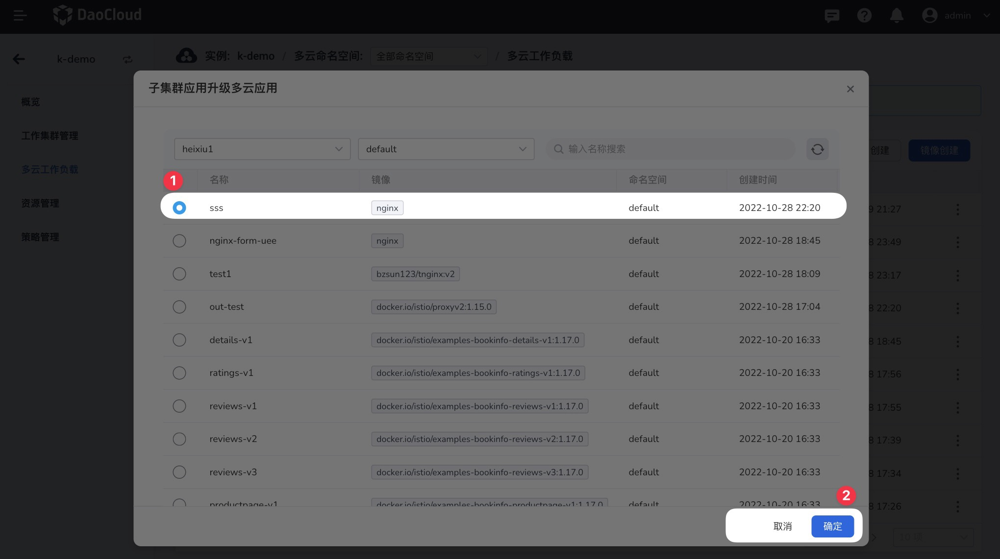

# 一键升级为多云工作负载[Beta]

多云编排支持通过简单的选取操作，即可将子集群的工作负载，一键升级为多云工作负载。

## 操作指南

点击上面的 `立即体验` 按钮，即可快速将子集群的应用升级为多云应用；目前此功能处于体验版，如有遇到任何问题，可在下方按钮中反馈。

- 选择对应的子集群，注意这里仅展示当前工作负载已接入的工作集群，未接入当前工作负载不支持查看，具体接入列表可以到工作集群管理页面查看
- 选取应用，这里支持根据命名空间和工作负载名称模糊检索的能力，帮助您快速定位应用
- 点击 `确认` 即可完成工作负载的多云化

完成多云化之后，即可按照正常的多云工作负载进行编辑、更新等动作，与标准多云工作负载没有区别。

## 注意事项

- 升级时，可选择工作负载仅支持选取子集群内的工作负载；已有多云编排分发的多云工作负载不支持再次选择
- 多云化时，会自动将工作负载关联的 ConfigMap、Secret 同步升级为多云资源
- 升级多云时，会自动创建对应的部署策略，纳管原子集群

## 常见问题

- 升级多云工作负载后，原子集群工作负载是否会重启 ？

不会进行重启，升级多云工作负载时，自动纳管原子集群，同时保证原子集群工作负载无感升级。

- 升级多云工作负载后，原子集群被踢出部署策略后，该子集群工作负载会被删除吗?

会的，由一旦纳管到多云编排后，原子集群就是成为一个标准的多云工作负载，当部署策略发生变化且不再传播子集群时，根据 Karmada 的设计原理会被删除，以保证一致性。

- 当前支持用户升级的 Kubernetes Resource 类型有哪些 ？

目前在开放的操作入口，仅支持对 Deployment 的多云化；但如果在子集群内 Deployment 被关联了对应的 ConfigMap、Secret，此时自动进行该资源多云化；这样做的目的是为了当多云化之后的工作负载被分发到其他集群时，该工作负载依赖的资源也同步存在，否则可能会导致工作负载启动异常。