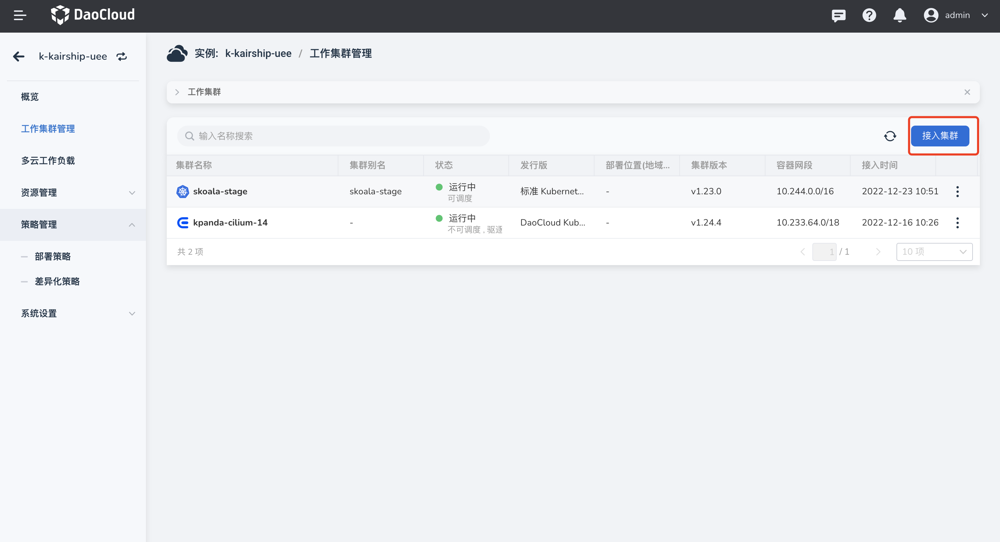

---
hide:
  - toc
---

# 接入集群

创建多云实例后，需要先接入工作集群。

1. 点击左侧导航栏的`工作集群管理`，进入多云集群管理页面，列表内包括了当前多云实例内的所有工作集群，若想要接入其他工作集群，点击右上角的`接入集群`按钮。

    

2. 此时会弹出一个页面，页面列表内的集群是容器管理内的集群，选择一个工作集群后，点击`确认`。若当前列表内的集群不符合需求，也支持到容器管理模块内接入新集群。

    

3. 返回工作集群列表，提示创建成功。点击列表右侧的 `…` 按钮，可以对集群执行更多操作：暂停/恢复调度、编辑集群标签、修改集群污点、移除。

    

    - 点击`暂停调度`可以将本身可调度的集群停止调度，此时点击修改集群污点，发现被自动加上了污点（如下图）。若想要恢复调度也可以点击恢复调度，或者将集群污点去除，此时集群就变成了可调度的状态。

        

    - 点击`修改集群污点`，可以方便我们控制哪些集群可以部署工作负载、容器等。在弹框内输入污点的键值信息，值可以为空，下拉选择污点效果，点击`确定`，支持添加多个污点。目前支持两种污点效果：

        | 效果       | 描述                                                         |
        | ---------- | ------------------------------------------------------------ |
        | NoSchedule | 表示只有拥有和这个污点相匹配的容忍度的 node 才能够被分配到该集群上 |
        | NoExecute  | 定义驱逐行为，以应对集群故障。若污点效果定义为 NoExecute，当工作负载或者pod已经在该集群上运行，则会被驱逐；如果没有在该集群运行，也不会再被调度到该集群上 |

        

