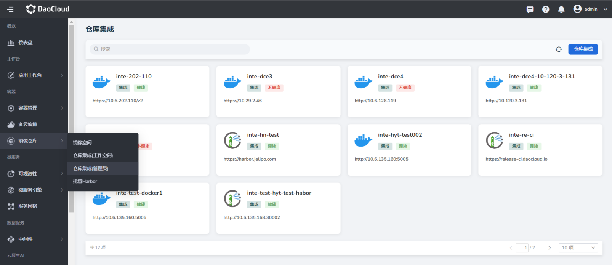

---
hide:
  - toc
---

# 镜像空间

Harbor 提供了基于镜像空间（project）的镜像隔离功能。镜像空间分为公开和私有两种类型：

- 公开镜像仓库：所有用户都可以访问，通常存放公开的镜像，默认有一个公开镜像空间。
- 私有镜像仓库：只有授权用户才可以访问，通常存放镜像空间本身的镜像。

前提条件：已经创建或集成了一个外部 Harbor 仓库。

1. 使用具有 Admin 角色的用户登录 Web 控制台，从左侧导航栏点击`镜像仓库` -> `仓库集成(管理员)`。

    

1. 点击某个仓库名称。

    

1. 在左侧导航栏点击`镜像空间`，在右上角点击`创建镜像空间`。

    

1. 填写镜像空间名称，勾选类型后点击`确定`。

    

1. 返回镜像空间列表，提示`镜像空间创建成功`。

    

1. 找到刚创建的镜像空间，点击右侧的 `⋮`，可以执行[绑定/解绑工作空间](./bind-to-ws.md)、删除等操作。

    

!!! info

    - 若镜像空间状态为`公开`，则空间中的镜像能够被平台上的所有 Kubernetes 命名空间拉取使用；
    - 若镜像空间状态为`私有`，则只有在管理员 Admin 将该镜像空间绑定到一个或多个工作空间（租户）后，才能被工作空间（租户）下的 Kubernetes 命名空间拉取使用。

下一步：[绑定工作空间](./bind-to-ws.md)
