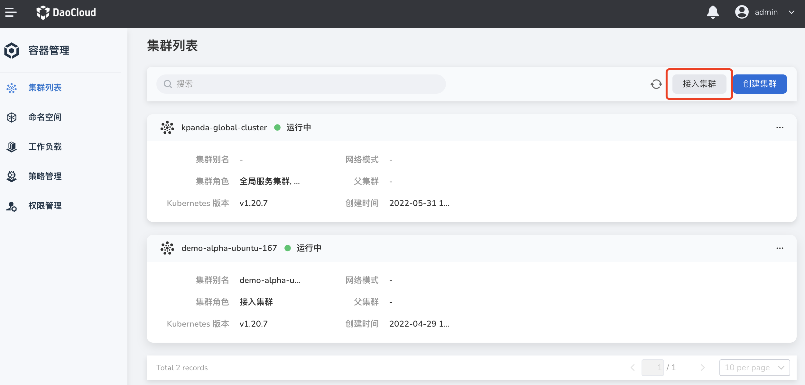
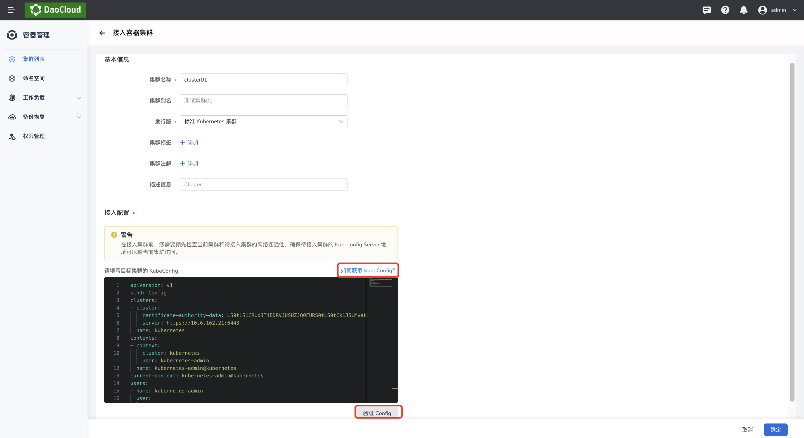

# 接入集群

通过接入集群操作，能够对众多云服务平台集群和本地私有物理集群进行统一纳管，形成统一治理平台，有效避免了被厂商锁定风险，助力企业业务安全上云。

容器管理平台支持接入多种主流的容器集群：

- DaoCloud KubeSpray
- DaoCloud ClusterAPI
- DaoCloud DCE4
- Redhat Openshift
- SUSE Rancher
- VMware Tanzu
- Amazon EKS
- Aliyun ACK
- Huawei CCE
- Tencent TKE
- 标准 Kubernetes 集群

## 前提条件

- 准备一个待接入的集群，确保容器管理集群和待接入集群之间网络通畅。
- 当前操作用户应具有 [`NS Edit`](../Permissions/PermissionBrief.md) 或更高权限。

## 填写基本配置

1. 进入`集群列表`页面，点击右上角的`接入集群`按钮。

    

2. 在 `接入容器集群` 页面中，配置基本信息。

    - 集群名称：名称应具有唯一性，设置后不可更改。名称最大长度为 63 个字符，只能包含小写字母、数字及分隔符("-")，且必须以小写字母或数字开头及结尾。
    - 集群别名：可输入任意字符，不超过 60 个字符。
    - 发行版：集群的发行厂商，包括市场主流云厂商和本地私有物理集群。对于本地私有物理集群或列表中未显示的集群厂商，可选择其它厂商，自定义厂商名。

        

## 填写接入配置

1. 在`接入配置`区域，点击右上角的`如何获取 kubeConfig`。

    

2. 遵循屏幕提示获取目标集群的 KubeConfig。

    

3. 填写目标集群的 KubeConfig 后，点击`验证 Config`。

    如果信息无误，屏幕右上角将出现验证成功的提示。

    

4. 确认所有参数填写正确，在页面右下角点击`确定`。

    页面会自动跳转至集群列表。新接入的集群状态为`接入中`，接入成功后变为`运行中`。

    

!!! note

    如果集群状态一直处于`接入中`，请确认接入脚本是否在对应集群上执行成功。有关集群状态的更多详情，请参考[集群状态](ClusterStatus.md)。
