# 网格多云部署

本页说明如何在多云环境下部署服务网格。

## 前置条件

### 集群要求

1. **集群类型与版本** ：明确当前集群的类型与版本，确保后续安装的服务网格能够在该集群中正常运行。
2. **提供可靠的 IP** ：控制面集群必须提供一个可靠的 IP 给其他数据面集群来访问控制面。
3. **授权** ：加入网格的集群需要提供一个拥有足够权限的远程秘钥，允许 Mspider 对集群进行安装组件以及 Istio 控制面访问其他集群的 API Server。

### 多集群区域规划

在 Istio 中，Region、Zone 和 SubZone 是用于维护多集群部署中的服务可用性的概念。具体来说：

- **Region** 表示一个大区域，通常用于表示整个云提供商的数据中心区域；在 Kubernetes 中，标签 [`topology.kubernetes.io/region`](https://kubernetes.io/docs/reference/kubernetes-api/labels-annotations-taints/#topologykubernetesioregion) 确定节点的区域。
- **Zone** 表示一个小区域，通常用于表示数据中心中的一个子区域；在 Kubernetes 中，标签 [`topology.kubernetes.io/zone`](https://kubernetes.io/docs/reference/kubernetes-api/labels-annotations-taints/#topologykubernetesiozone) 确定节点的区域。
- **SubZone** 则是一个更小的区域，用于表示 Zone 中的一个更小的部分。Kubernetes 中不存在分区的概念，因此 Istio 引入了自定义节点标签 [`topology.istio.io/subzone`](https://github.com/istio/api/blob/82b9feb5a1c091ad9a28311c62b4f6f07803a9fa/label/labels.yaml#L84) 来定义分区。

这些概念的作用主要在于帮助 Istio 管理不同区域间的服务可用性。例如，在多集群部署中，如果一个服务在 Zone A 中出现故障，Istio 可以通过配置自动将服务流量转移到 Zone B，从而保证服务可用性。

配置方式是通过在集群的 **每个节点** 添加相应的 Label：
区域 | Label|
--|------|
Region | topology.kubernetes.io/region|
Zone | topology.kubernetes.io/zone |
SubZone | topology.istio.io/subzone|

添加 Label 可以通过容器管理平台找到对应的集群，给相应节点配置 Label

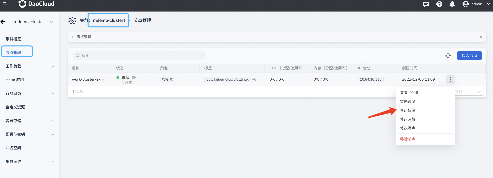

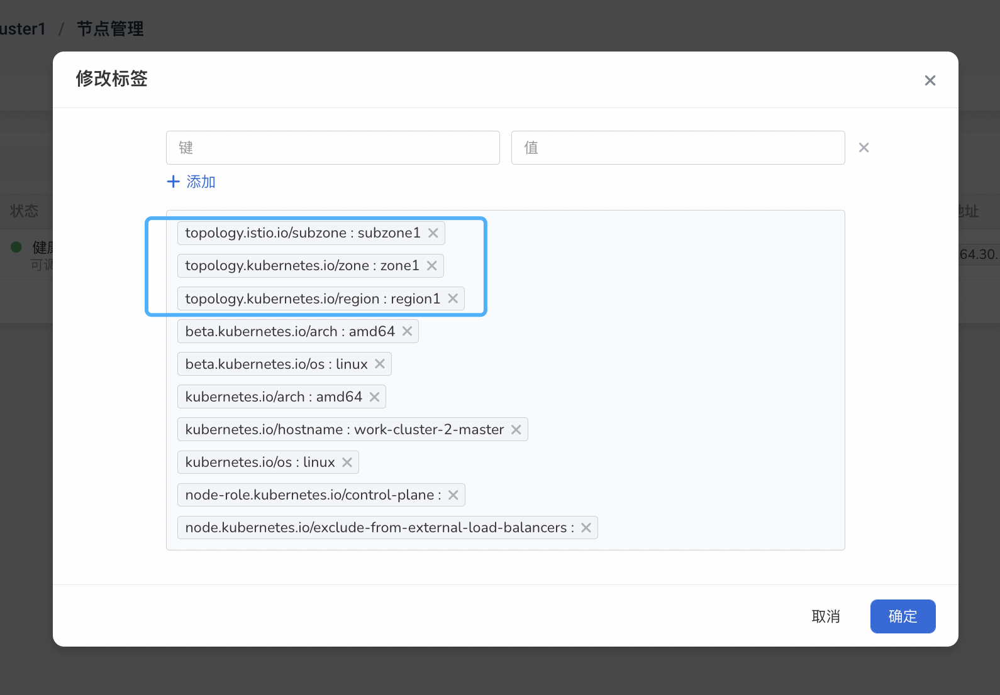

### 网格规划

#### 网格基础信息

- 网格 ID
- 网格版本
- 网格集群

#### 网络规划

确认集群之间网络状态，根据不同状态配置
这部分主要在于多网络模式两部分的配置：

- 规划网络 ID
- 东西网格的部署与配置
- 如何将网格控制面暴露给其他工作集群。

网络模式有如下两种：

- 单网络模式
  > 明确集群之间 Pod 网络是否能够直接通。
  > 如果 Pod 网络能够直接通讯，证明是同网络模式，但是要注意如果其中 **Pod 网络出现冲突** ，就需要选择不同网络模式
- 多网络模式
  > 如果集群之间网络不通，需要给集群划分 **网络 ID** ，并且需要不同网络区域的集群安装东西网关，并且配置相关配置，具体操作步骤在下面章节[不同网络模式的网格组件安装与配置](#不同网络模式的网格组件安装与配置)中。

### 规划表单

将上述所提到的集群与网格相关规划汇聚成一张表单，便于用户更加方便的参考。

#### 集群规划

| 集群名         | 集群类型 | 集群 pod 子网 (podSubnet) | pod 网络互通关系 | 集群节点 & 网络区域             | 集群版本 | Master IP    |
| -------------- | -------- | ------------------------- | ---------------- | ------------------------------- | -------- | ------------ |
| mdemo-cluster1 | 标准 k8s | "10.201.0.0/16"           | -                | master： region1/zone1/subzone1 | 1.25     | 10.64.30.130 |
| mdemo-cluster2 | 标准 k8s | "10.202.0.0/16"           | -                | master： region1/zone2/subzone2 | 1.25     | 10.6.230.5   |
| mdemo-cluster3 | 标准 k8s | "10.100.0.0/16"           | -                | master： region1/zone3/subzone3 | 1.25     | 10.64.30.131 |

#### 网格规划

| 配置项   | 值                                             |
| -------- | ---------------------------------------------- |
| 网格 ID  | mdemo-mesh                                     |
| 网格模式 | 托管模式                                       |
| 网络模式 | 多网络模式（需要安装东西网关，规划网络 ID）    |
| 网格版本 | 1.15.3-mspider                                 |
| 托管集群 | mdemo-cluster1                                 |
| 工作集群 | mdemo-cluster1、mdemo-cluster2、mdemo-cluster3 |

#### 网络规划

由于上面的表单所知，集群之间不存在网络互通的情况，因此网格为多网络模式，需要规划如下配置：

| 集群名         | 集群网格角色       | 集群网络标识 (网络 ID) | hosted-istiod LB IP | eastwest LB IP | ingress LB IP |
| -------------- | ------------------ | ---------------------- | ------------------- | -------------- | ------------- |
| mdemo-cluster1 | 托管集群，工作集群 | network-c1             | 10.64.30.71         | 10.64.30.73    | 10.64.30.72   |
| mdemo-cluster2 | 工作集群           | network-c2             | -                   | 10.6.136.29    | -             |
| mdemo-cluster3 | 工作集群           | network-c3             | -                   | 10.64.30.77    | -             |

## 接入集群以及组件准备

用户需要准备符合要求的集群，集群可以新创建（创建集群也可以采用容器管理平台的创建能力），也可以是已经存在的集群。

但是后续网格所需的集群都必须将其接入容器管理平台。

### 接入集群

如果不是通过 Kpanda 容器管理平台创建的集群，例如已经存在的集群，或者通过自定义方式（类似 kubeadm 创建 or Kind 集群）创建的集群都需要将集群接入 Kpanda。

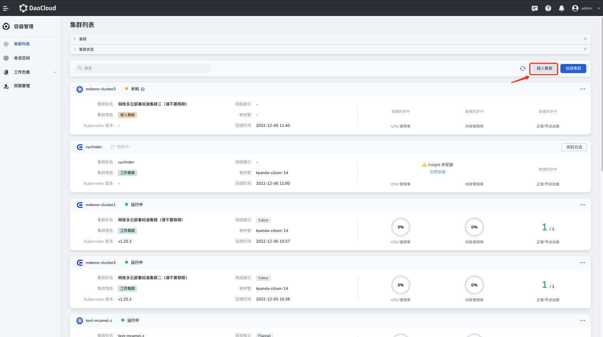


### 确认可观测组件（可选）

网格的关键能力可观测性，其中需要关键的观测性组件便是 Insight Agent，因此如果需要拥有网格的观测能力，需要安装其组件。

Kpanda 创建集群方式创建的集群将默认安装 Insight Agent 组件。

其他方式需要在 Kpanda 界面中，找到本集群中的 Helm 应用，选择 insight-agent 安装。

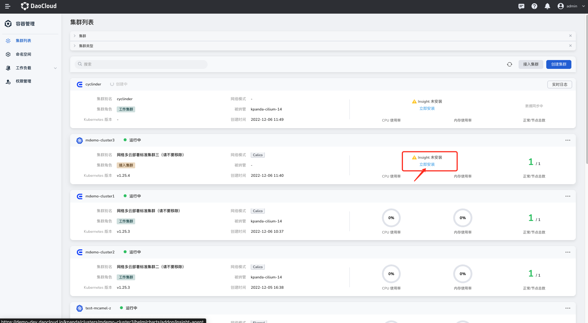

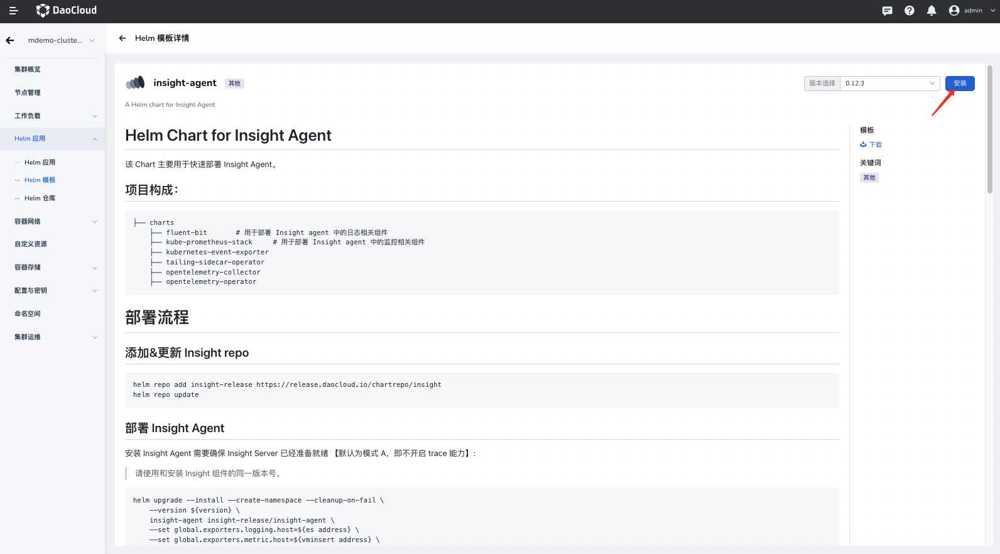

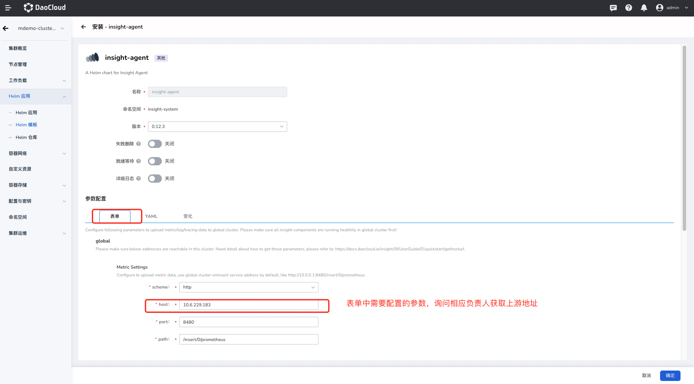

## 网格部署

通过 Mspider 服务网格创建网格，并且将规划的集群加入到对应的网格中。

### 创建网格

首先在网格管理页面 --> `创建网格`：

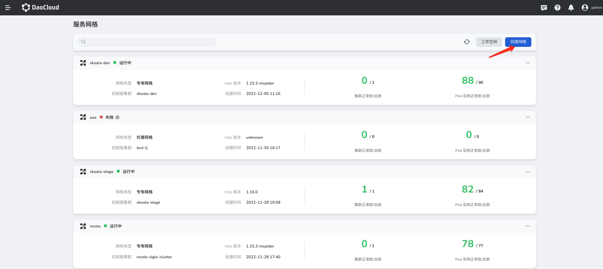

创建网格的具体参数如图显示：

1. 选择托管网格：多云环境下，只有托管网格模式能够纳管多集群
2. 输入唯一的网格名称
3. 按照前置条件环境，选择预选的符合要求的网格版本
4. 选择托管控制面所在的集群
5. 负载均衡 IP：该参数为暴露控制面的 Istiod 所需要的参数，需要预先准备
6. 镜像仓库：在私有云中，需要将网格所需的镜像上传仓库，公有云建议填入`release.daocloud.io/mspider`


网格处于创建中，需要等待网格创建完成后，状态由 `创建中`转变成`运行中`；

### 暴露网格托管控制面 Hosted Istiod

#### 确认托管网格控制面服务

确保网格状态正常后，观察控制面集群`mdemo-cluster1`的 `istio-system` 下面的 Service 是否都成功绑定了 LoadBalancer IP。

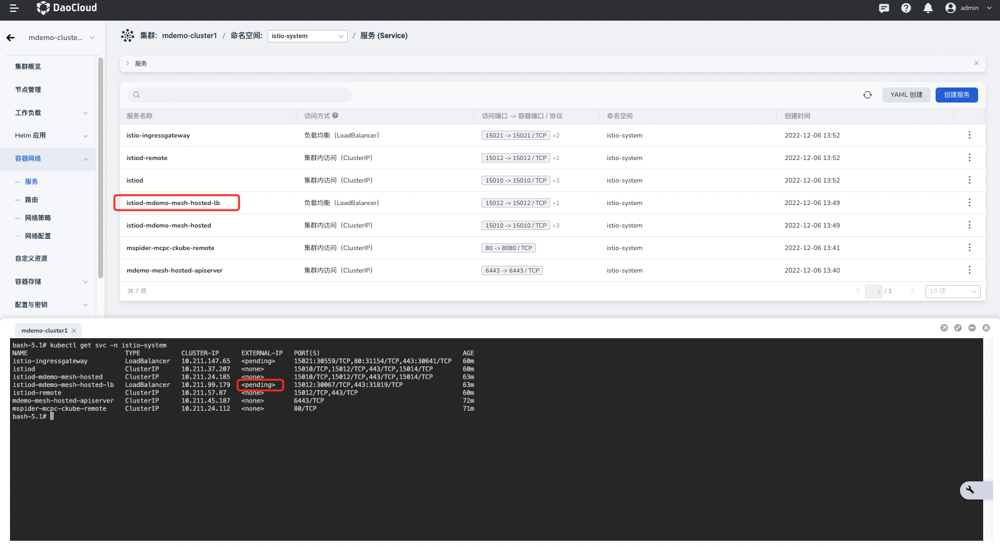

发现托管网格控制面的服务`istiod-mdemo-cluster-hosted-lb` 的没有分配 LoadBalancer IP 需要额外处理。

#### 分配 EXTERNAL IP

在不同的环境申请或者分配 LoadBalancer IP 的方式不同，尤其是公有云环境，需要根据公有云厂商所提供的方式去创建 LoadBalancer IP。

本文演示 demo 采用了 metallb 的方式，给所属 LoadBalancer Service 分配 IP，相关部署与配置参考[Metallb 安装配置](#metallb-安装配置)部分。

部署完 metallb 以后，再次[确认托管网格控制面服务](#确认托管网格控制面服务)。

#### 验证托管控制面 Istiod `EXTERNAL IP` 是否通畅

在非托管集群环境中验证托管控制面 Istiod，本次实践通过 curl 的方式验证，如果返回 400 错误，基本可以判定网络已经打通：

```bash
hosted_istiod_ip="10.64.30.71"
curl -I "${hosted_istiod_ip}:443"
# HTTP/1.0 400 Bad Request
```

#### 确认并且配置网格托管控制面 Istiod 参数

##### 获取托管网格控制面服务 `EXTERNAL IP`

在网格`mdemo-mesh` 控制面集群`mdemo-cluster1`中去确认托管网格控制面服务`istiod-mdemo-mesh-hosted-lb `已经分配 LoadBalancer IP 以后，并且记录其 IP，示例如下：

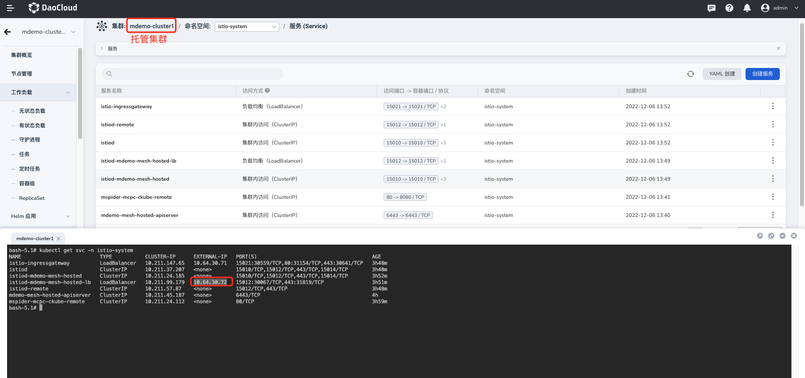

确认托管网格控制面服务 `istiod-mdemo-mesh-hosted-lb ` `EXTERNAL-IP` 为 `10.64.30.72`。

##### 手动配置网格托管控制面 Istiod 参数

首先， 在容器管理平台进入全局控制面集群 `kpanda-global-cluster`（如果无法确认相关集群的位置，可以询问相应负责人或者通过[查询全局服务集群](#查询全局服务集群)）
--> `自定义资源模块` 搜索资源 `GlobalMesh`
--> 接下来在`mspider-system` 找到对应的网格`mdemo-mesh`
--> 然后编辑 YAML

> 在 YAML 中 `.spec.ownerConfig.controlPlaneParams` 字段增加 `istio.custom_params.values.global.remotePilotAddress` 参数；
> 其值为上文中记录的 `istiod-mdemo-mesh-hosted-lb ` `EXTERNAL-IP`地址：`10.64.30.72`；


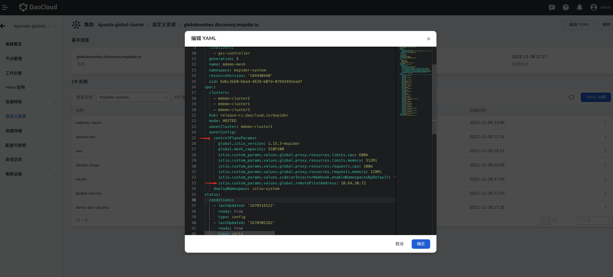

### 添加工作集群

#### 界面添加集群

等待网格控制面创建成功后，选中对应网格，进入网格管理页面 --> 集群纳管 --> 添加集群：


选中所需的工作集群后，等待集群安装网格组件完成；


在接入过程中，集群状态会由`接入中`转变成`接入成功`：


#### 检测多云控制面是否正常

由于当前工作集群与网格控制面集群 Pod 网络不同，需要通过上文[暴露网格托管控制面 Hosted Istiod](#暴露网格托管控制面-hosted-istiod)部分将控制面的 Istiod 暴露给公网。

验证工作集群 Istio 相关组件是否能运行正常，需要在工作集群中检查 `istio-system` 命名空间下的 `istio-ingressgateway` 是否能够正常运行：


## 不同网络模式的网格组件安装与配置

在本部分主要分为两个部分：

1. 给所有工作集群配置 `网络 ID`
2. 在所有网络不互通的集群中安装东西网关

这里先提到一个问题：为什么需要安装东西网关呢？
由于工作集群之间 Pod 网格无法直达，因此服务跨集群通讯时也会出现网络问题，Istio 提供了一个解决方案就是东西网关，当目标服务位于不同网络时，其流量将会转发到目标集群的东西网关，东西网关将解析请求，将请求转发到真正的目标服务。

由上面对东西网关的原理理解以后，又有一个新的问题，Istio 如何区分服务在什么网络中呢？
Istio 要求用户每个工作集群安装 Istio 时，显示的定义`网络 ID`，这也是第一步分存在的原因。

### 手动为工作集群配置`网络 ID`

由于工作集群网络的不同，需要手动给每个工作集群配置 `网络 ID`，如果在实际环境中，集群之间 Pod 网络能够相互直达，就可以配置成同一个 `网络 ID`。

让我们开始配置`网络 ID` ，其具体流程如下：

1. 首先进入全局控制面集群 `kpanda-global-cluster`（如果无法确认相关集群的位置，可以询问相应负责人或者通过[查询全局服务集群](#查询全局服务集群)）
2. 然后在`自定义资源模块` --> 搜索资源 `MeshCluster`
3. `mspider-system`命名空间下找到加入网格的工作集群，本次案例的工作集群有：`mdemo-cluster2`、`mdemo-cluster3`
4. 以 `mdemo-cluster2` 为例，编辑 YAML
    - 找到字段 `.spec.meshedParams[].params`， 给其中参数列增加 `网络 ID` 字段
    - 参数列的注意事项：
        > 需要确认 `global.meshID: mdemo-mesh` 是否为同一个网格 ID
        > 需要确认集群角色 `global.clusterRole: HOSTED_WORKLOAD_CLUSTER` 是否为工作集群
    - 添加参数 `istio.custom_params.values.global.network`，其值按照最初的[规划表单](#规划表单)中的网络 ID：`network-c2`

    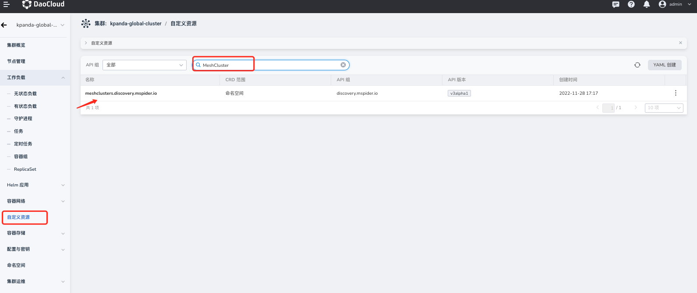

    

    

重复上述步骤，给所有工作集群 (`mdemo-cluster1、mdemo-cluster2、mdemo-cluster3`) 加上 `网络 ID`

### 为工作集群的 `istio-system` 标识 `网络 ID`

进入容器管理平台，进入对应的工作集群：`mdemo-cluster1、mdemo-cluster2、mdemo-cluster3` 的命名空间添加网络的标签

> 标签 Key ： `topology.istio.io/network`
> 标签 值： `${CLUSTER_NET}`

下面以 mdemo-cluster3 为例，找到 【命名空间】模块 ，选中 `istio-system` --> 修改标签

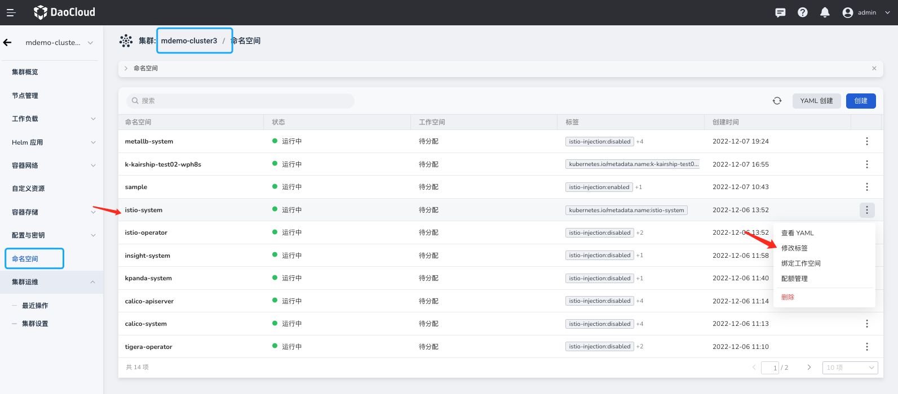

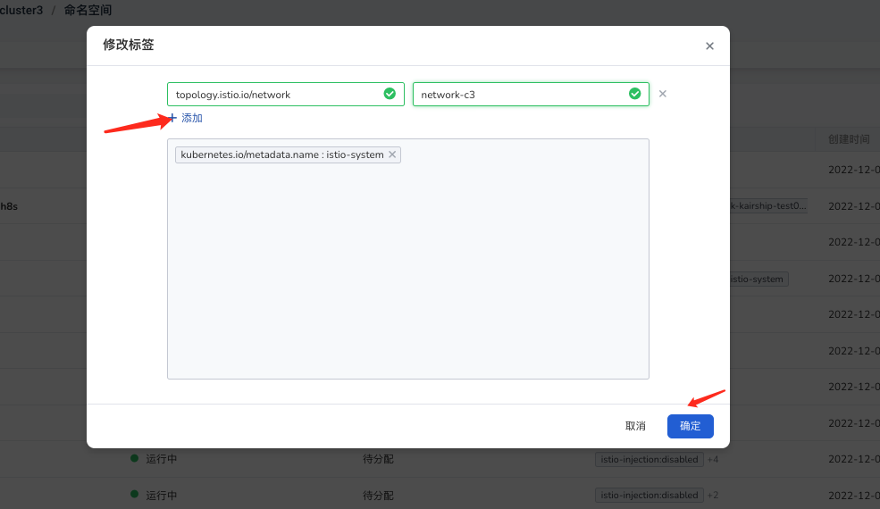

### 手动安装东西网关

#### 创建网关实例

确认所有工作集群中的 Istio 相关组件都就绪以后，开始安装东西网关。

在工作集群中通过 IstioOperator 资源安装东西网关，东西网关的 YAML 如下：

!!! note

    一定要根据当前集群的 `网络 ID` 修改参数。

```bash linenums="1"
# cluster1
CLUSTER_NET_ID=network-c1
CLUSTER=mdemo-cluster1
LB_IP=10.64.30.73

# cluster2
CLUSTER_NET_ID=network-c2
CLUSTER=mdemo-cluster2
LB_IP=10.6.136.29

# cluster3
CLUSTER_NET_ID=network-c3
CLUSTER=mdemo-cluster3
LB_IP=10.64.30.77

MESH_ID=mdemo-mesh
HUB=release-ci.daocloud.io/mspider
ISTIO_VERSION=1.15.3-mspider
cat <<EOF > eastwest-iop.yaml
apiVersion: install.istio.io/v1alpha1
kind: IstioOperator
metadata:
  name: eastwest
  namespace: istio-system
spec:
  components:
    ingressGateways:
      - enabled: true
        k8s:
          env:
            - name: ISTIO_META_REQUESTED_NETWORK_VIEW
              value: ${CLUSTER_NET_ID}  # 修改为当前集群的网络 ID
          service:
            loadBalancerIP: ${LB_IP}  # 修改为本集群为东西网关规划的 LB IP
            ports:
              - name: tls
                port: 15443
                targetPort: 15443
            type: LoadBalancer
        label:
          app: istio-eastwestgateway
          istio: eastwestgateway
          topology.istio.io/network: ${CLUSTER_NET_ID}  # 修改为当前集群的网络 ID
        name: istio-eastwestgateway
  profile: empty
  tag: ${ISTIO_VERSION}
  values:
    gateways:
      istio_ingressgateway:
        injectionTemplate: gateway
    global:
      network: ${CLUSTER_NET_ID}  # 修改为当前集群的网络 ID
      hub: ${HUB}  # 可选，如果无法翻墙或者私有仓库，请修改
      meshID: ${MESH_ID}  # 修改为当前集群的 网格 ID（Mesh ID）
      multiCluster:
        clusterName: ${CLUSTER}  # 修改为当前
EOF
```

其创建方式为：

1. 在 Kpanda 容器管理平台进入相应的工作集群
2. `自定义资源`模块搜索`IstioOperator`
3. 选中 `istio-system` 命名空间
4. 点击`创建YAML`


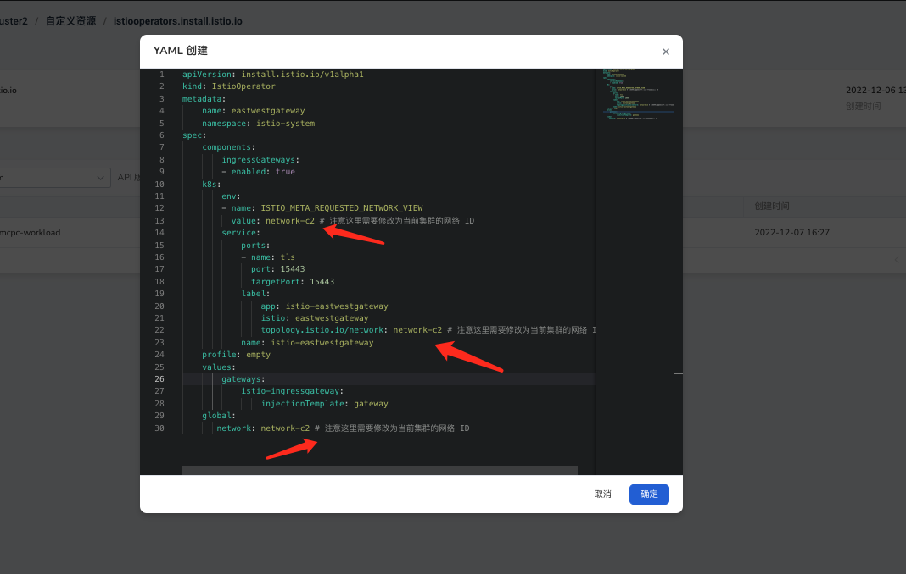

### 创建东西网关 Gateway 资源

在网格的【网关规则】中创建规则

```yaml
apiVersion: networking.istio.io/v1beta1
kind: Gateway
metadata:
  name: cross-network-gateway
  namespace: istio-system
spec:
  selector:
    istio: eastwestgateway
  servers:
    - hosts:
        - "*.local"
      port:
        name: tls
        number: 15443
        protocol: TLS
      tls:
        mode: AUTO_PASSTHROUGH
```

### 设置网格全局网络配置

在安装完东西网关以及网关的解析规则以后，需要再所有集群中声明网格中的东西网关配置。
在 容器管理平台进入全局控制面集群 `kpanda-global-cluster`（如果无法确认相关集群的位置，可以询问相应负责人或者通过[查询全局服务集群](#查询全局服务集群)）

--> `自定义资源模块` 搜索资源 `GlobalMesh`
--> 接下来在`mspider-system` 找到对应的网格`mdemo-mesh`
--> 然后编辑 YAML

> 在 YAML 中 `.spec.ownerConfig.controlPlaneParams` 字段增加一系列 `istio.custom_params.values.global.meshNetworks` 参数

```YAML
# ！！该两行配置缺一不可
# 格式：istio.custom_params.values.global.meshNetworks.${CLUSTER_NET_ID}.gateways[0].address
#      istio.custom_params.values.global.meshNetworks.${CLUSTER_NET_ID}.gateways[0].port

istio.custom_params.values.global.meshNetworks.network-c1.gateways[0].address: 10.64.30.73  # cluster1
istio.custom_params.values.global.meshNetworks.network-c1.gateways[0].port: '15443'  # cluster3 东西网关端口
istio.custom_params.values.global.meshNetworks.network-c2.gateways[0].address: 10.6.136.29  # cluster2
istio.custom_params.values.global.meshNetworks.network-c2.gateways[0].port: '15443'  # cluster2  东西网格端口
istio.custom_params.values.global.meshNetworks.network-c3.gateways[0].address: 10.64.30.77  # cluster3
istio.custom_params.values.global.meshNetworks.network-c3.gateways[0].port: '15443'  # cluster3 东西网关端口
```

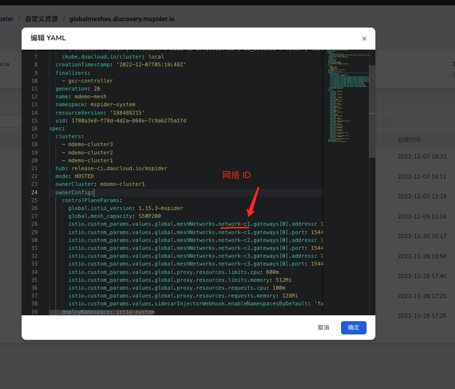

## 网络连通性 demo 应用与验证

### 部署 demo

主要是两个应用：[helloworld](https://github.com/istio/istio/blob/1.16.0/samples/helloworld/helloworld.yaml) 与 [sleep](https://github.com/istio/istio/blob/1.16.0/samples/sleep/sleep.yaml)（该两个 demo 属于 Istio 提供的测试应用）

集群部署情况：
集群 | helloworld 与版本 | sleep
---|----------------|------
mdemo-cluster1 | :heart: VERSION=vc1 | :heart:
mdemo-cluster1 | :heart: VERSION=vc2 | :heart:
mdemo-cluster1 | :heart: VERSION=vc3 | :heart:

#### 容器管理平台部署 demo

推荐使用容器管理平台创建对应工作负载与应用，在容器管理平台找到对应集群，进入【控制台】执行下面操作。

下面以 mdemo-cluster1 部署 helloworld vc1 为例：

其中每个集群需要注意的点：

- 镜像地址：

    - helloworld: docker.m.daocloud.io/istio/examples-helloworld-v1
    - Sleep: curlimages/curl

- **helloworld** 工作负载增加对应 **label**
    - app：helloworld
    - version：${VERSION}
- **helloworld** 工作负载增加对应的版本**环境变量**
    - SERVICE_VERSION: ${VERSION}

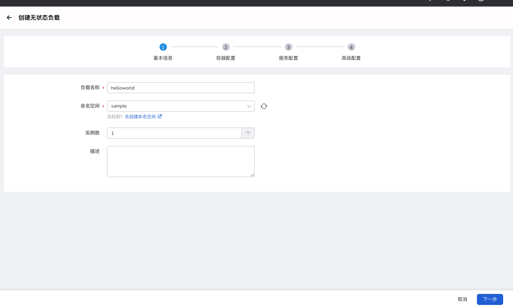

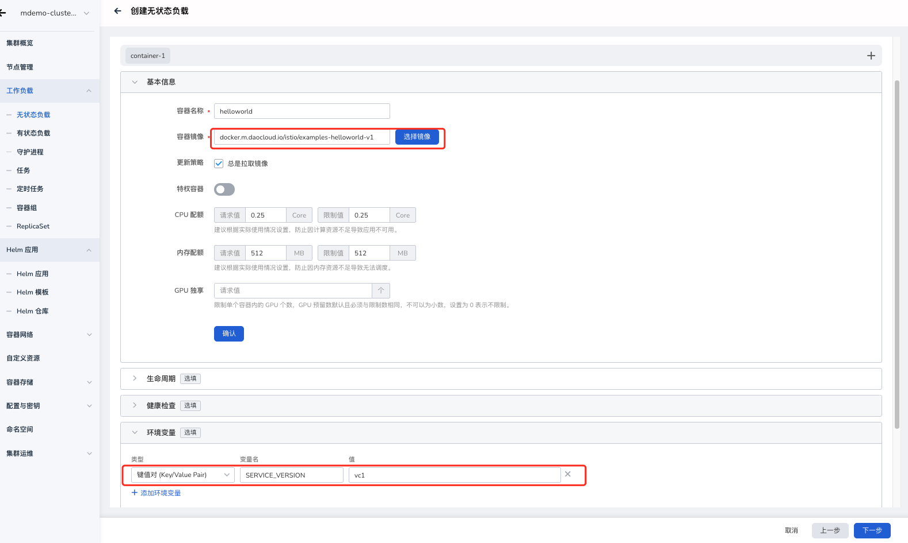

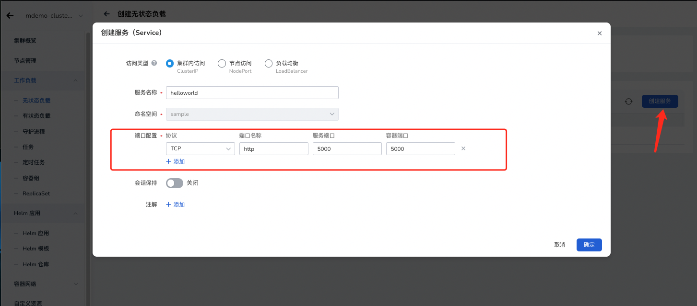


#### 命令行部署 demo

部署过程中需要用到的配置文件分别有：
[gen-helloworld.sh](https://github.com/istio/istio/blob/1.16.0/samples/helloworld/gen-helloworld.sh)
[sleep.yaml](https://github.com/istio/istio/blob/1.16.0/samples/sleep/sleep.yaml)

```bash linenums="1"
# -------------------- cluster1 --------------------
kubectl create  namespace sample
kubectl label namespace sample istio-injection=enabled

# deploy helloworld vc1
bash gen-helloworld.sh --version vc1 | sed -e "s/docker.io/docker.m.daocloud.io/" | kubectl apply  -f - -n sample

# deploy sleep
kubectl apply  -f sleep.yaml -n sample

# -------------------- cluster2 --------------------
kubectl create  namespace sample
kubectl label namespace sample istio-injection=enabled

# deploy helloworld vc2
bash gen-helloworld.sh --version vc2 | sed -e "s/docker.io/docker.m.daocloud.io/" | kubectl apply  -f - -n sample

# deploy sleep
kubectl apply  -f sleep.yaml -n sample

# -------------------- cluster3 --------------------
kubectl create  namespace sample
kubectl label namespace sample istio-injection=enabled

# deploy helloworld vc3
bash gen-helloworld.sh --version vc3 | sed -e "s/docker.io/docker.m.daocloud.io/" | kubectl apply  -f - -n sample

# deploy sleep
kubectl apply  -f sleep.yaml -n sample
```

### 验证 demo 集群网络

```bash linenums="1"
# 任意选择一个集群执行
while true; do kubectl exec -n sample -c sleep  \
               "$(kubectl get pod -n sample -l app=sleep -o jsonpath='{.items[0].metadata.name}')"    \
              -- curl -sS helloworld.sample:5000/hello; done

# 预期结果会轮询三个集群的不同版本，结果如下：
# Hello version: vc2, instance: helloworld-vc2-5d67bc48d8-2tpxd
# Hello version: vc2, instance: helloworld-vc2-5d67bc48d8-2tpxd
# Hello version: vc2, instance: helloworld-vc2-5d67bc48d8-2tpxd
# Hello version: vc2, instance: helloworld-vc2-5d67bc48d8-2tpxd
# Hello version: vc1, instance: helloworld-vc1-846f79cc4d-2d8kd
# Hello version: vc1, instance: helloworld-vc1-846f79cc4d-2d8kd
# Hello version: vc1, instance: helloworld-vc1-846f79cc4d-2d8kd
# Hello version: vc3, instance: helloworld-vc3-55b7b5869f-trl8v
# Hello version: vc1, instance: helloworld-vc1-846f79cc4d-2d8kd
# Hello version: vc3, instance: helloworld-vc3-55b7b5869f-trl8v
# Hello version: vc2, instance: helloworld-vc2-5d67bc48d8-2tpxd
# Hello version: vc1, instance: helloworld-vc1-846f79cc4d-2d8kd
# Hello version: vc2, instance: helloworld-vc2-5d67bc48d8-2tpxd
```

## 拓展

### 其他创建集群方式

#### 通过 Kpanda 创建集群

集群创建可以存在多种方式，推荐使用 Kpanda 容器管理中的创建集群功能，但是用户可以选择其他创建方式，本文提供的其他方案可以参考拓展章节的[其他创建集群方式](#其他创建集群方式)

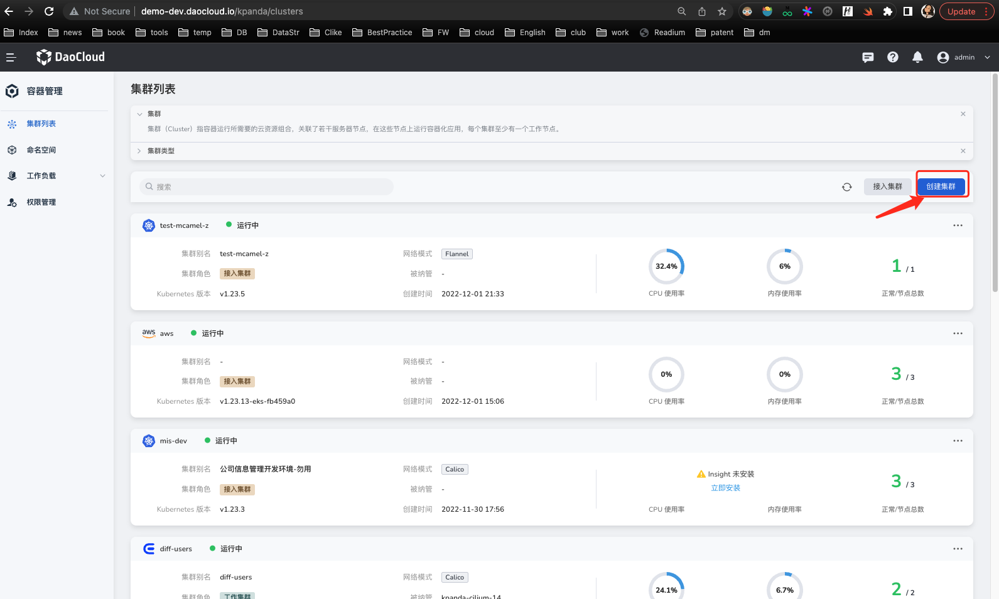

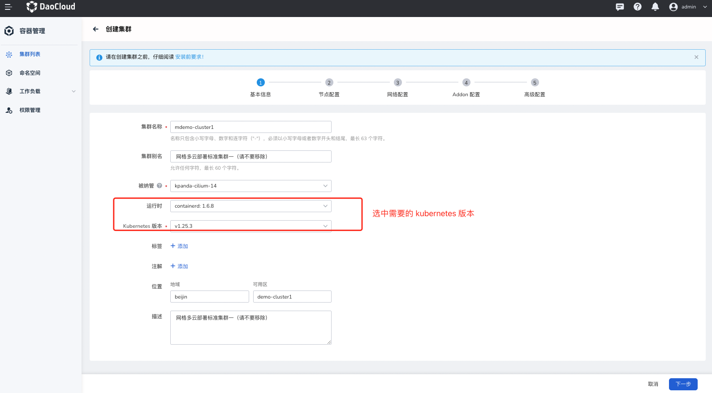


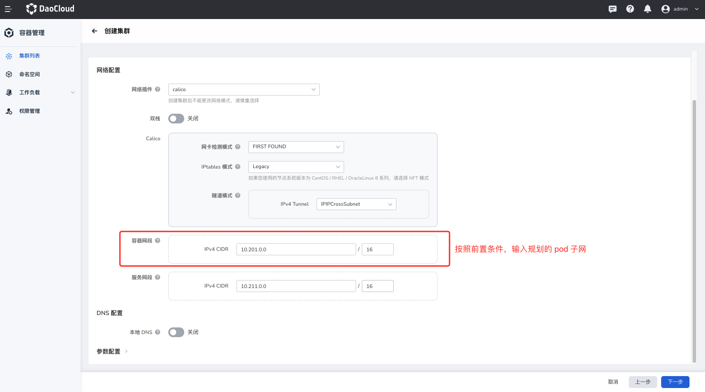

可以灵活的选择集群需要拓展的组件，网格的可观测能力必须依赖 Insight-agent

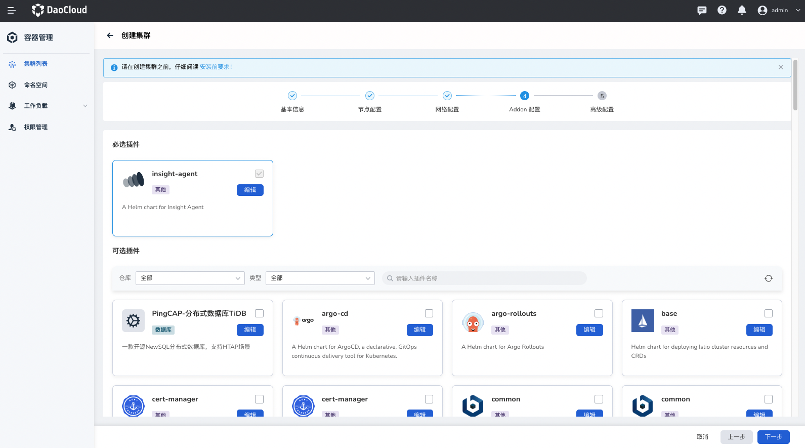

如果集群需要定义更多的集群高级配置，可以在本步骤添加。

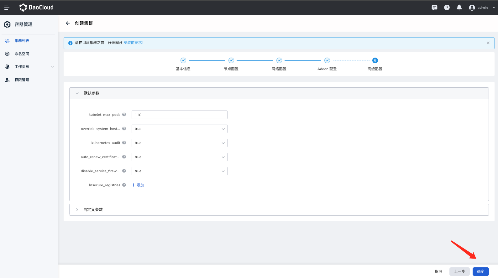

创建集群需要，等待 30 分钟左右

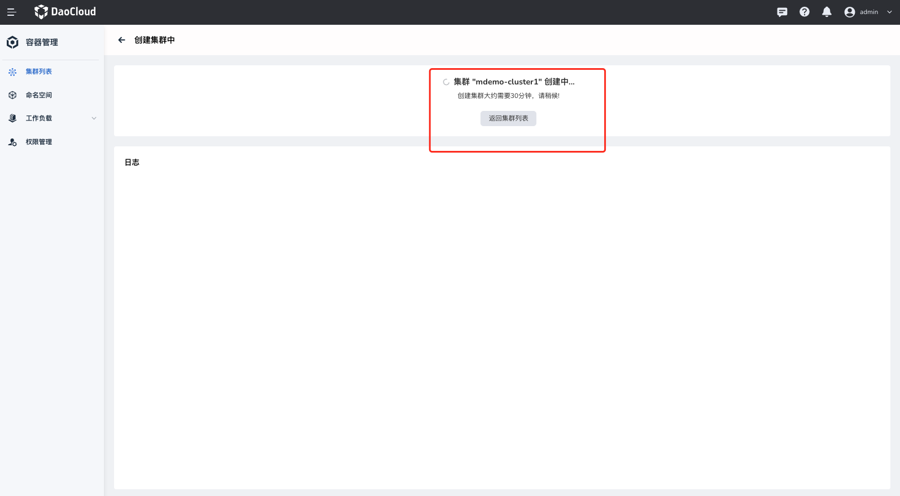

#### 通过 kubeadm 创建集群

```bash
kubeadm init --image-repository registry.aliyuncs.com/google_containers \
             --apiserver-advertise-address=10.64.30.131 \
             --service-cidr=10.111.0.0/16 \
             --pod-network-cidr=10.100.0.0/16 \
             --cri-socket /var/run/cri-dockerd.sock
```

#### 创建 kind 集群

```bash linenums="1"
cat <<EOF > kind-cluster1.yaml
kind: Cluster
apiVersion: kind.x-k8s.io/v1alpha4
networking:
  podSubnet: "10.102.0.0/16" # 安装网络规划阶段，定义规划的 pod 子网
  serviceSubnet: "10.122.0.0/16" # 安装网络规划阶段，定义规划的 service 子网
  apiServerAddress: 10.6.136.22
nodes:
  - role: control-plane
    image: kindest/node:v1.25.3@sha256:f52781bc0d7a19fb6c405c2af83abfeb311f130707a0e219175677e366cc45d1
    extraPortMappings:
      - containerPort: 35443 # 如果无法申请 LoadBalancer 可以临时采用 nodePort 方式
        hostPort: 35443 #  set the bind address on the host

EOF
cat <<EOF > kind-cluster2.yaml
kind: Cluster
apiVersion: kind.x-k8s.io/v1alpha4
networking:
  podSubnet: "10.103.0.0/16" # 安装网络规划阶段，定义规划的 pod 子网
  serviceSubnet: "10.133.0.0/16" # 安装网络规划阶段，定义规划的 service 子网
  apiServerAddress: 10.6.136.22
nodes:
  - role: control-plane
    image: kindest/node:v1.25.3@sha256:f52781bc0d7a19fb6c405c2af83abfeb311f130707a0e219175677e366cc45d1
    extraPortMappings:
      - containerPort: 35443 # 如果无法申请 LoadBalancer 可以临时采用 nodePort 方式
        hostPort: 35444 #  set the bind address on the host

EOF

kind create cluster --config kind-cluster1.yaml --name mdemo-kcluster1
kind create cluster --config kind-cluster2.yaml --name mdemo-kcluster2
```

### Metallb 安装配置

#### demo 集群 metallb 网络池规划记录

| 集群名         | IP 池                   | IP 分配情况 |
| -------------- | ----------------------- | ----------- |
| mdemo-cluster1 | 10.64.30.71-10.64.30.73 | -           |
| mdemo-cluster2 | 10.6.136.25-10.6.136.29 | -           |
| mdemo-cluster3 | 10.64.30.75-10.64.30.77 | -           |

#### 安装

#### 容器管理平台 Helm 安装

推荐使用 Kpanda 容器管理平台中 【Helm 应用】 --> 【Helm 模版】 --> 找到 metallb --> 【安装】


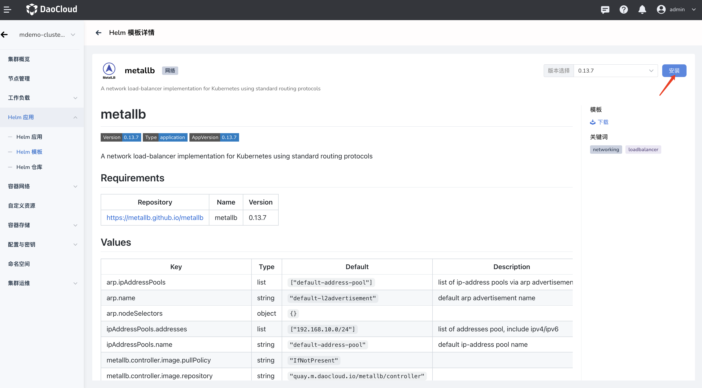

##### 手动安装

[MetalLB 官方文档](https://metallb.org/installation/)
注意：如果集群的 CNI 使用的是 calico,你需要禁用 calico 的 BGP 模式，否则会影响 MetalLB 的正常工作。

```bash linenums="1"
# 如果 kube-proxy 使用的是 IPVS 模式，你需要启用 staticARP
# see what changes would be made, returns nonzero returncode if different
kubectl get configmap kube-proxy -n kube-system -o yaml | \
sed -e "s/strictARP: false/strictARP: true/" | \
kubectl diff -f - -n kube-system

# actually apply the changes, returns nonzero returncode on errors only
kubectl get configmap kube-proxy -n kube-system -o yaml | \
sed -e "s/strictARP: false/strictARP: true/" | \
kubectl apply -f - -n kube-system

# 部署 metallb
kubectl apply -f https://raw.githubusercontent.com/metallb/metallb/v0.13.7/config/manifests/metallb-native.yaml

# 检查 pod 运行状态
kubectl get pods -n metallb-system

# 配置 metallb
cat << EOF | kubectl apply -f -
apiVersion: metallb.io/v1beta1
kind: IPAddressPool
metadata:
  name: first-pool
  namespace: metallb-system
spec:
  addresses:
  - 10.64.30.75-10.64.30.77  # 根据规划修改
EOF
cat << EOF | kubectl apply -f -
apiVersion: metallb.io/v1beta1
kind: L2Advertisement
metadata:
  name: example
  namespace: metallb-system
spec:
  ipAddressPools:
  - first-pool
  interfaces:
  - enp1s0
  # - ens192  # 根据不同机器的网卡命名不同，请修改
EOF
```

#### 增加给对应服务增加指定 IP

```bash
kubectl annotate service -n istio-system istiod-mdemo-mesh-hosted-lb metallb.universe.tf/address-pool='first-pool'
```

#### 验证

```bash linenums="1"
kubectl create deploy nginx --image docker.m.daocloud.io/nginx:latest --port 80 -n default
kubectl expose deployment nginx --name nginx-lb --port 8080 --target-port 80 --type LoadBalancer -n default

# 获取对应服务 EXTERNAL-IP
kubectl get svc -n default
# NAME         TYPE           CLUSTER-IP       EXTERNAL-IP   PORT(S)          AGE
# kubernetes   ClusterIP      10.212.0.1       <none>        443/TCP          25h
# nginx-lb     LoadBalancer   10.212.249.64    10.6.230.71   8080:31881/TCP   10s

curl -I 10.6.230.71:8080
# HTTP/1.1 200 OK
# Server: nginx/1.21.6
# Date: Wed, 02 Mar 2022 15:31:15 GMT
# Content-Type: text/html
# Content-Length: 615
# Last-Modified: Tue, 25 Jan 2022 15:03:52 GMT
# Connection: keep-alive
# ETag: "61f01158-267"
# Accept-Ranges: bytes
```

### 查询全局服务集群

通过 Kpanda 容器管理的集群列表界面，通过搜索 `集群角色：全局服务集群`。


