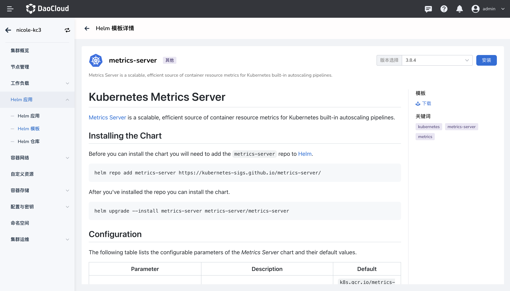

# 组件资源弹性伸缩
用户可以在[容器管理](../../../kpanda/user-guide/workloads/create-deployment.md)对服务网格的[控制面组件](../../intro/cp-component.md)实现弹性伸缩策略，目前提供了三种弹性伸缩方式：`指标收缩（HPA）`、`定时收缩（CronHPA）`、`垂直伸缩（VPA）`，用户可以根据需求选择合适的弹性伸缩策略。下面以`指标收缩（HPA）`为例，介绍创建弹性伸缩策略的方法。

## 前提条件
确保集群已安装 helm 应用 `Metrics Server`。

    

!!! Note：应用安装操作方式可参考[安装 metrics-server 插件](../../../kpanda/user-guide/scale/install-metrics-server.md) 

## 策略创建操作

以专有集群的 `istiod` 为例，具体操作如下：

1. 在[容器管理]中选择对应集群，点击进入`工作负载` -> `无状态负载`页面查找 `istiod`；

    

2. 点击工作负载名称进入`弹性伸缩`标签页；

    

3. 点击`编辑`按钮，配置弹性伸缩策略参数；

    

- `策略名称`：输入弹性伸缩策略的名称，请注意名称最长 63 个字符，只能包含小写字母、数字及分隔符（“-”），且必须以小写字母或数字开头及结尾，例如 `hpa-my-dep`。
- `命名空间`：负载所在的命名空间。
- `工作负载`：执行弹性伸缩的工作负载对象。
- `目标 CPU 利用率`：工作负载资源下 Pod 的 CPU 使用率。计算方式为：工作负载下所有的 Pod 资源 / 工作负载的请求（`request`）值。当实际 CPU 用量大于/小于目标值时，系统自动减少/增加 Pod 副本数量。
- `目标内存用量`：工作负载资源下的 Pod 的内存用量。当实际内存用量大于/小于目标值时，系统自动减少/增加 Pod 副本数量。
- `副本范围`：Pod 副本数的弹性伸缩范围。默认区间为为 1 - 10。

6. 点击`确定`完成创建，

## 更多弹性伸缩配置，请参考：

- [创建 HPA 弹性伸缩策略](../../../kpanda/user-guide/scale/create-hpa.md)

- [创建 VPA 弹性伸缩策略](../../../kpanda/user-guide/scale/create-vpa.md)