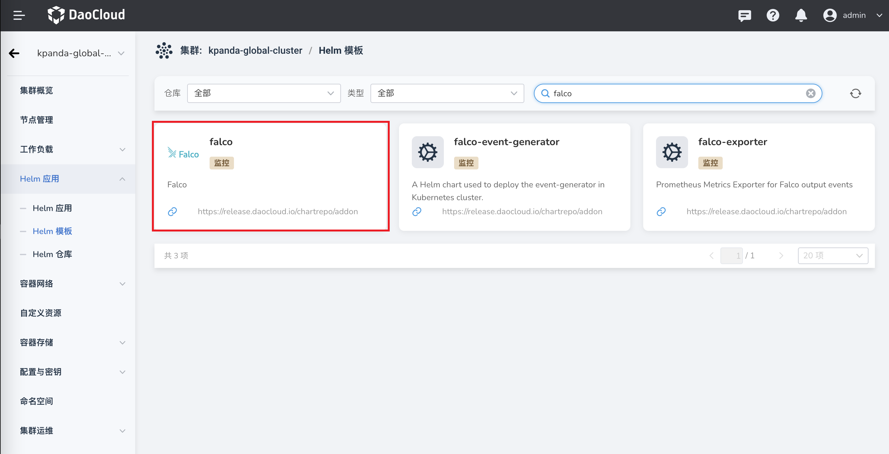
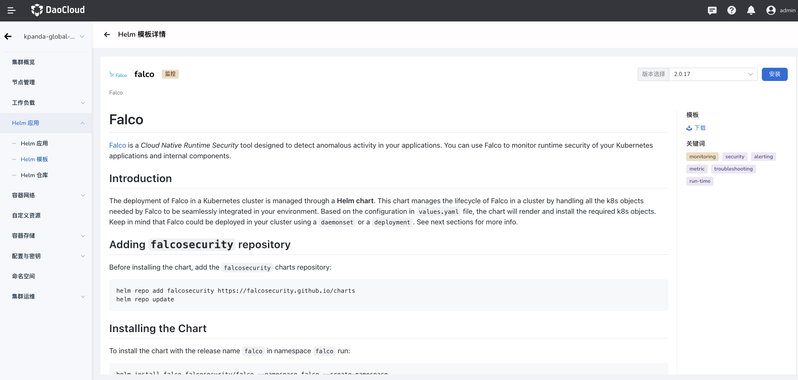

# 安装

本章节介绍如何安装 Falco 组件

## 集群安装组件步骤

1. 在浏览器打开集群的管理界面，点击侧边栏导航的 `Helm 应用`，然后点击 `Helm 模板`。

2. 在 `Helm 模板`中，点击安装 `falco`。

   

3. 在`版本选择`中选择希望安装的版本，点击`安装`。

4. 在安装界面，填写所需的安装参数。

   

   在如上界面中，填写`应用名称`、`命名空间`、`版本`等。

   
   在如上界面中:

   - `Falco -> Image Settings -> Registry`：设置 Falco 镜像的仓库地址，默认已经填写了可用的在线仓库，如果是私有化环境，可修改为私有仓库地址。

   - `Falco -> Image Settings -> Repository`：设置 Falco 镜像名。

   - `Falco -> Falco Driver -> Image Settings -> Registry`：设置 Falco Driver 镜像的仓库地址，默认已经填写了可用的在线仓库，如果是私有化环境，可修改为私有仓库地址。

   - `Falco -> Falco Driver -> Image Settings -> Repository`：设置 Falco Driver 镜像名。

   - `Falco -> Falco Driver -> Image Settings -> Driver Kind `：设置 Driver Kind，提供以下两种选择：

     (1) ebpf：使用ebpf来检测事件，这需要Linux内核支持ebpf，并启用CONFIG_BPF_JIT和sysctl net.core.bpf_jit_enable=1。
     (2) module：使用内核模块检测，支持有限的操作系统版本，参考 module 支持[系统版本](https://download.falco.org/?prefix=driver)。

   - `Falco -> Falco Driver -> Image Settings -> Log Level `：要包含在日志中的最小日志级别。

      可选择值为：`emergency`, `alert`, `critical`, `error`, `warning`, `notice`, `info`, `debug`。

   点击右下角`确定`按钮即可完成创建。