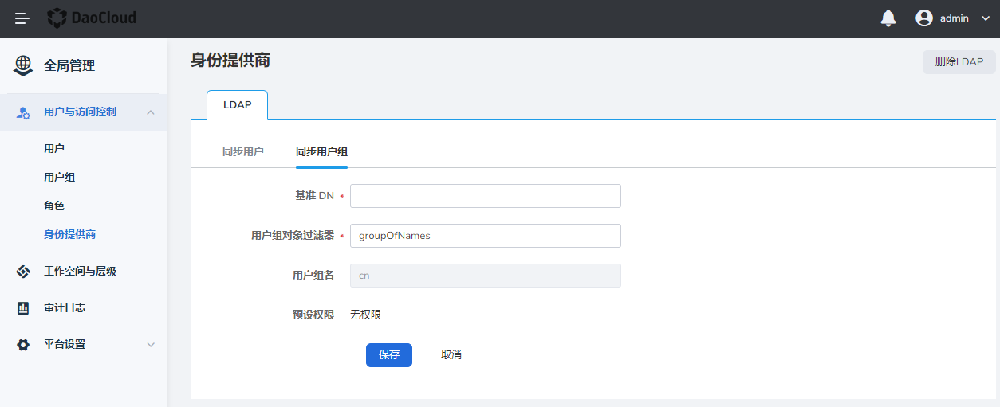

# LDAP

LDAP 英文全称为 Lightweight Directory Access Protocol，即轻型目录访问协议，这是一个开放的、中立的，工业标准的应用协议，通过 IP 协议提供访问控制和维护分布式信息的目录信息。

如果您的企业或组织已有自己的账号体系，同时您的企业用户管理系统支持 LDAP 协议，就可以使用全局管理提供的基于 LDAP 协议的身份提供商功能，而不必在 DCE 5.0 中为每一位组织成员创建用户名/密码。
您可以向这些外部用户身份授予使用 DCE 5.0 资源的权限。

在全局管理中，其操作步骤如下：
  
1. 使用具有 `admin` 角色的用户登录 Web 控制台。

2. 点击左上角的 ，选择**全局管理**。

    

3. 导航至`全局管理`下的`用户与访问控制`，选择`身份提供商`。

    

4. 在`LDAP`页签中，创建身份提供商并填写以下字段配置身份提供商信息，可以在`用户与访问控制`中建立与身份提供商的信任关系及用户的映射关系。

    - 服务器地址：LDAP 服务的地址和端口号。
    - 用户名：登录 LDAP 服务的用户名。
    - 密码：登录 LDAP 服务的密码。
    - 基准 DN：LDAP admin 的 DN，DCE 5.0 将使用该 DN 访问 LDAP 服务器。
    - 用户对象过滤器：LDAP 中用户的 LDAP objectClass 属性的所有值以逗号分隔。

        例如："inetOrgPerson, organizationalPerson"。
        新创建的用户将与所有这些对象类一起写入 LDAP，并且只要它们包含所有这些对象类，就会找到现在的 LDAP 用户记录。
        DCE 5.0 已经帮用户自动填入，如需修改可直接编辑。

    - 自动同步：每十分钟自动同步一次。启用后仍可通过手动同步按钮，随时同步用户。
    - 是否启用 TLS：启用后将加密 DCE 5.0 与 LDAP 的连接。
    - 全名映射：姓-sn；名-cn。映射关系不可更改。
    - 邮箱映射：mail；映射关系不可更改。
  
5. 点击`保存`后，在`同步用户组`页签中，填写以下字段配置用户组的映射关系后，再次点击`保存`。

    - 基准 DN：用户组在 LDAP 树状结构中的位置，例如 “ou=groups,dc=example,dc=org”。
    - 用户组对象过滤器：用户组的对象类，如果需要更多类，则用逗号分隔。在典型的 LDAP 部署中，通常是 “groupOfNames”，系统已自动填入，如需更改请直接编辑。
    - 用户组名：cn；映射关系不可更改.

    
  
!!! note

    1. 当您通过 LDAP 协议将企业用户管理系统与 DCE 5.0 建立信任关系后，可通过手动同步或每十分钟自动同步一次的方式，将企业用户管理系统中的用户或用户组一次性同步至 DCE 5.0。

    2. 同步后管理员可对用户组/用户组进行批量授权，同时用户可通过在企业用户管理系统中的账号/密码登录 DCE 5.0。
