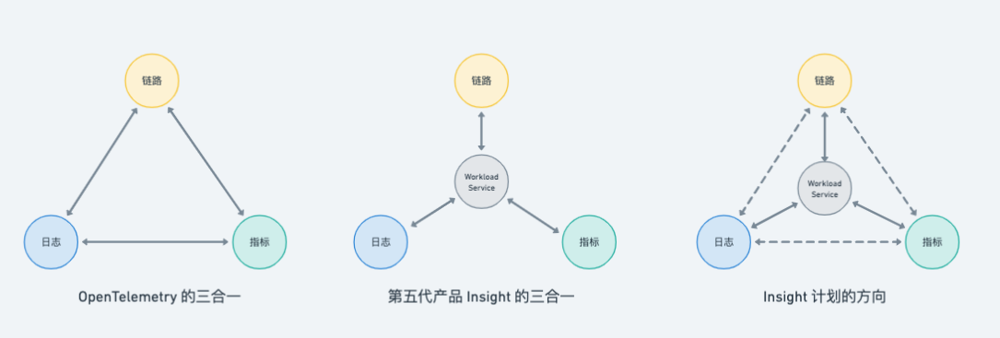
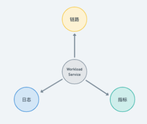
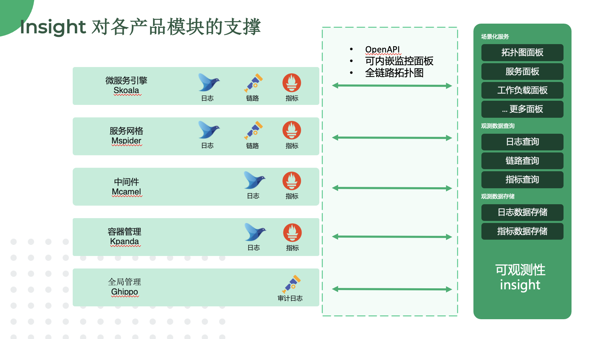

# 常见问题

本节列出有关可观测模块的常见问题。

## Insight 是否能做到“日志、链路和监控”三合一呢

Insight 目前已支持部分广义的“三合一”。我们通过产品层面的三合一弥补了数据层面的三合一不足。

我们通常所说的“三合一”是遵从 OpenTelemetry 协议实现将日志、链路和数据层面彼此关联，那么 OpenTelemetry 如何实现数据关联呢？要回答这个问题，首先会涉及上下文 (Context) 的概念；然后将上下文关联到三种数据 (Signal) 中。不同的数据关联方式多少还有些差别：

- 日志，将上下文写入日志的元数据中
- 链路，以 Baggage 的方式将不同的 Span 关联起来
- 指标，通过 Exemplar 将指标与链路关联起来

虽然，OpenTelemetry 可以完美地将三种数据关联起来，但是这种关联是有成本的，您需要以”代码侵入“的方式使用 OpenTelemetry 的 SDK 来改造应用。虽然不同语言的代码改造成本各不相同，但短时间内将应用完成云原生可观测性的改造，显然是不现实，而且在挺长的一段时间内都是不太现实的。

所以，**如何基于现有三种数据进行三合一联动**才是目前绝大多数可观测产品的**真实的使用场景**。

和 OTel 协议的思路一样，**Insight 也要基于“上下文“来联动数据**。

**Insight 选择以”时空“作为上下文关联数据**，即通过”特定的时间“与”空间（Workload 与 Service）“将日志、链路和指标关联起来，再通过”时空“这个上下文作为中间代理，实现数据的间接联动，如下图所示。

这么处理的好处是：

1. **降低数据关联的复杂度**：将数据两两对接复杂度，降低为只要与上下文关联（从 N 的阶乘，降低为 N），即便未来接入了 eBPF 等非 OTel 纳管的数据（Signal），Insight 也只需要将新增的数据类型与上下文进行关联，即可拓展该数据与其他数据的关联关系。
2. **兼顾现在和未来**：OTel 规范落地到项目还需要一定时间，目前的方案从实用角度展开，既满足非 OTel 应用体验三合一，未来过渡到 OTel 体系下也非常自然。对应用而言，这是一个渐进增强的过程。
3. **更符合用户直觉**：Insight 以工作负载和服务代替广义的”应用”的概念，通过应用来查看指标、链路和日志非常符合用户的操作体验。

综上，Insight 已经支持了部分广义的“三合一”，通过产品层面的三合一弥补了数据层面三合一的不足。

以下内容会随着版本发布而更新，目前 Insight 0.6.x 已经完成通过上下文查询三类数据的能力。如下图所示：

接下来会通过”拓扑“增加链路和网格的数据。

## Insight 与客户已有的 APM 的区别

可以从两个角度回答这个问题。

1. Insight 是 DCE 5.0 的核心组件之一。如果缺少了 Insight 模块，微服务、服务网格、中间件、甚至最核心的容器管理模块都将无法正常使用。

  下图是 Insight 对各个模块数据能力的支撑关系：

  

2. 可观测性和 APM 监控对象的维度还存在差别。

- 时至今日，APM（Application Performance Monitoring，应用性能监控）的概念已被不断扩充；但究其根本，APM 还是以应用为着力点，通过检测性能问题，然后诊断其根源，是应用开发和 DevOps 的得力工具。
- 可观测性则通过更加丰富的监控维度（大到集群，小到容器）以及多样的数据来为开发（指标、日志、链路），为更多的用户（开发、测试、运维和运营）人员提供丰富的服务。

乍一看，可观测性和 APM 似乎非常相似，它们都提供了对应用程序端到端性能的深入了解。但是可观测性与 APM 之间的主要区别在于特定团队所需的洞察深度。

这里有一个可观测性和 APM 关系的经典描述：

> **可观测性（理解为名词）是一种理解系统复杂性的方法，APM 应用程序性能监控（理解为动词）是实现该方法的动作**

可观测性并不能消除对 APM 的需求，APM 是实现可观测性的重要技术手段之一。

## Insight Agent 模式资源的消耗量是多少

Insight Agent 部署在需要监控的 Kubernetes 集群上，由多个组件构成。

资源占用量与监控对象成正比，即具体的占用量与客户集群的大小、部署的 Pod 数量和采集周期等密切相关。

关于 Insight Agent 资源占用量计算规则将在 Insight 正式发布之前提供。
