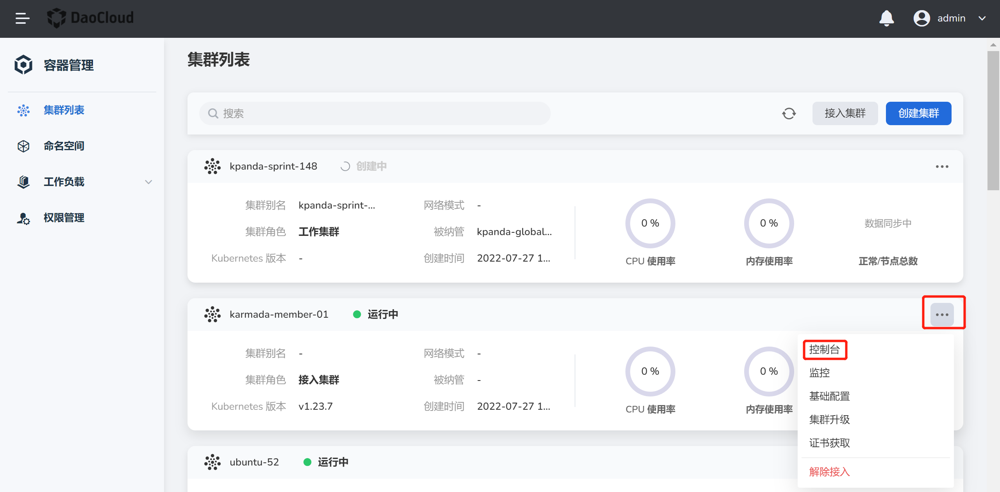
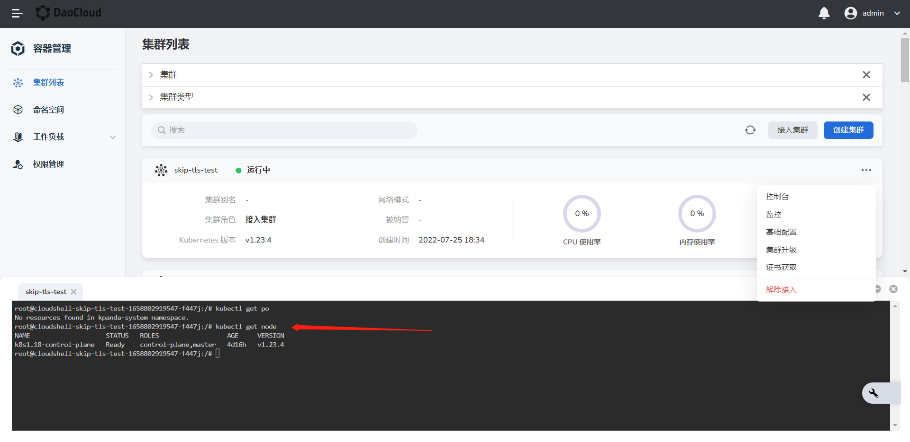

# 访问集群

使用 Daocloud 第五代容器管理平台接入或创建的集群，除了在界面上直接进行访问控制外，还支持额外的两种方式对集群进行管理和访问：

- 通过 CloudShell 在线访问

- 下载集群证书后在本地通过 kubectl 进行访问

## 前提条件

- 能够访问容器管理平台的 UI 界面，并且在容器管理平台创建或接入一个集群。
- 当前操作用户应具有 [`Cluster Admin`](../Permissions/PermissionBrief.md) 权限或更高权限。

## 通过 CloudShell 访问集群

1. 在`集群列表`页选择需要通过 CloudShell 访问的集群，点击右侧的 `...` 操作图标并在下拉列表中点击`控制台`。

    

2. 在 CloudShell 控制台执行 `kubectl get node` 命令，验证 CloudShell 与集群的连通性。如图，控制台将返回集群下的节点信息。

    

现在，您可以通过 CloudShell 来访问该集群了。

## 通过集群证书和 kubectl 进行访问

如果您需要通过本地节点访问并管理云端集群，需要将集群证书下载至本地节点，然后使用 kubectl 工具访问集群。在开始操作之前，需要满足以下条件：

- 确保本地节点和云端集群的网络互联互通。
- 确保本地节点已经安装了 kubectl 工具。关于详细的安装方式，请参阅安装 [kubectl](https://kubernetes.io/docs/tasks/tools/)。

### 下载集群证书

1. 在`集群列表`页选择需要下载证书的集群，点击右侧的 `...` 操作图标并在下拉列表中点击`证书获取`。

    

2. 选择证书有效期并点击`下载证书`

    

### 通过 kubectl 访问集群

kubectl 工具默认会从本地节点的 `$HOME/.kube` 目录下查找名为 `config` 的文件。该文件存储了相关集群的访问凭证，kubectl 可以凭此配置文件连接至集群。

1. 找到并打开下载的集群证书，将其内容复制至本地节点的 `config` 文件。

2. 在本地节点上执行如下命令验证集群的连通性:

    ```
    kubectl get pod -n default
    ```
    
    预期的输出类似于:

    ```
    NAME                            READY   STATUS      RESTARTS    AGE
    dao-2048-2048-58c7f7fc5-mq7h4   1/1     Running     0           30h
    ```

现在您可以在本地通过 kubectl 访问该集群了。
