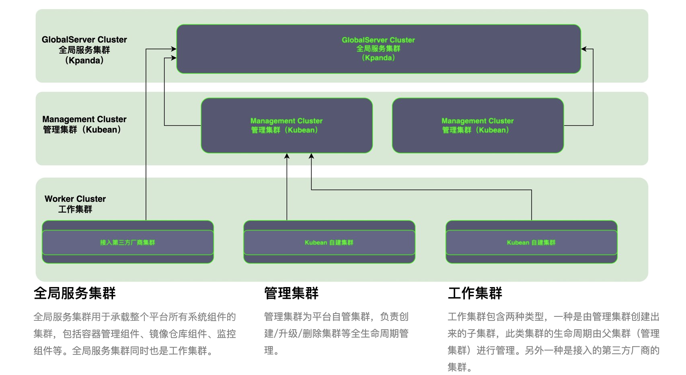

# 纳管集群及集群角色说明

## 纳管类型

容器管理统一管理的集群主要分为两种纳管类型：

1. **接入集群**，接入集群分为两种类型：

    - 接入符合一定版本要求的任意 Kubernetes 集群，目前已支持标准的 Kubernetes 集群接入，但平台不负责接入集群的生命周期管理，接入集群仅用于承载应用业务的工作负载。
    - 接入管理集群，平台基于 Kubespray 技术，实现多集群的全生命周期管理，通过管理集群进行工作集群的创建/升级/删除等操作。接入前需要先完成管理集群搭建，接入后可实现多集群（工作集群）的全生命周期管理。

2. **自建集群**，可在容器管理平台界面创建的工作集群，工作集群用于承载应用工作负载，全生命周期可被管理。

| 支持的功能                                                   | 接入标准 Kubenetes 集群      | 接入管理集群   | 工作集群            |
| ------------------------------------------------------------ | ---------------------------- | --------------------- | -------------------------- |
| Kubernetes 版本                                              | 1.18 +                           | 1.18 +                    | 1.18 +                         |
| 集群全生命周期管理                                           | 不支持                       | 界面不支持            | 支持集群的创建、升级、删除 |
| Namespace 管理                                               | 支持                         | 支持                  | 支持                       |
| Kubernetes 资源管理 （有状态负载、无状态负载、守护进程等） | 支持                         | 支持                  | 支持                       |
| 权限管理                                                     | 支持                         | 支持                  | 支持                       |
| 策略管理 （网络策略、配额策略、资源限制、灾备策略、安全策略） | 支持                         | 支持                  | 支持                       |
| 网络模式                                                     | 依赖于接入集群发行版网络模式 | Calico/Cillium/Multus | Calico/Cillium/Multus      |
| 存储管理                                                     | 支持                           | 支持                    | 支持                         |

## 集群角色

集群角色一般仅为 **工作集群** 的角色，接入的集群默认无角色。当接入的集群升级为全局服务集群/管理集群时，则具备相应的角色身份。更多信息，请参阅[权限说明](../Permissions/PermissionBrief.md)。

集群角色分为如下三类：

- 管理集群

  管理集群为平台自管集群，负责 **工作集群** 的创建/升级/删除等全生命周期管理。管理集群只能从第三方厂商接入，参见[接入集群](JoinACluster.md)。

- 工作集群
  
  工作集群是由管理集群创建出来的子集群，或者是从第三方厂商接入的集群，主要用于承担用户的业务负载。工作集群可基于界面进行创建，参见[创建集群](CreateCluster.md)。

- 全局服务集群

  全局服务集群用于承载整个平台所有系统组件，包括容器管理组件、镜像仓库组件、监控组件等。

一个集群可以有多重集群角色，例如一个集群可以同时充当工作集群、管理集群、全局服务集群。不同集群角色对应的操作权限见下表：

| 管理集群    | 工作集群    | 全局服务集群 |
| :---------- | :---------- | :----------- |
| Cloud Shell | Cloud Shell | Cloud Shell  |
| 集群编辑    | 集群编辑    | 集群升级     |
| 集群升级    | 集群升级    | 证书更新     |
| 证书更新    | 证书更新    |     -         |
| 解除接入    | 删除        |      -        |

