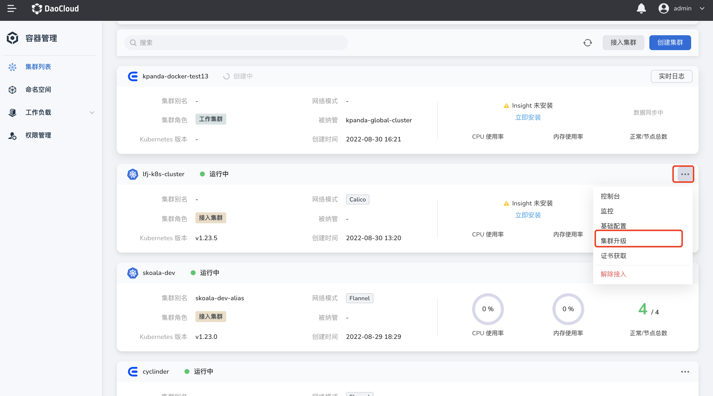

# 集群升级

Kubernetes 社区每个季度都会发布一次小版本，每个版本的维护周期大概只有 9 个月。版本停止维护后就不会再更新一些重大漏洞或安全漏洞。手动升级集群操作较为繁琐，给管理人员带来了极大的工作负担。容器管理模块提供了界面化一键式升级 Kubernetes 集群的能力。

!!! note

    Kubernetes 版本以 **x.y.z** 表示，其中 **x** 是主要版本， **y** 是次要版本，**z** 是补丁版本，不允许跨次要版本对集群进行升级。

1. 进入集群列表，选择需要更新的集群，在集群右侧点击 `...` 图标后，在下拉操作中选择 `集群升级`。
   
    

2. 系统将自动根据您当前集群的版本，在`可升级的版本`中展示当前集群能够进行升级的版本。

    !!! danger
   
        集群版本升级后将无法回退至之前版本，请谨慎操作。

      

3. 选择`可升级版本`后，输入集群名称，点击`确定`返回集群列表，可以在集群列表看到此时的集群状态为`升级中`。

4. 集群升级预计需要 30 分钟，可以点击`实时日志`按钮，查看集群升级的详细日志。

    
