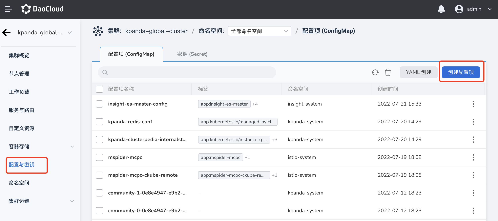
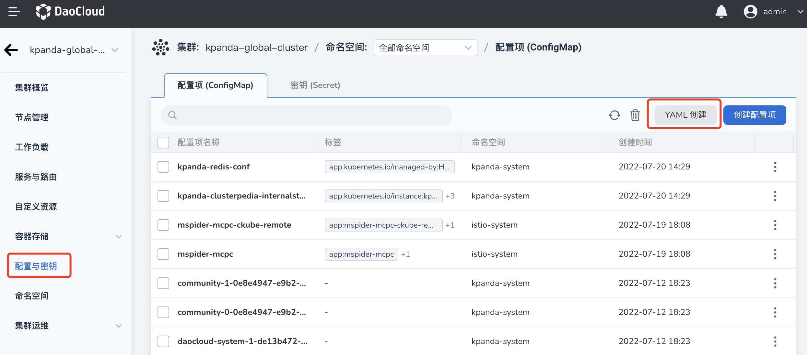
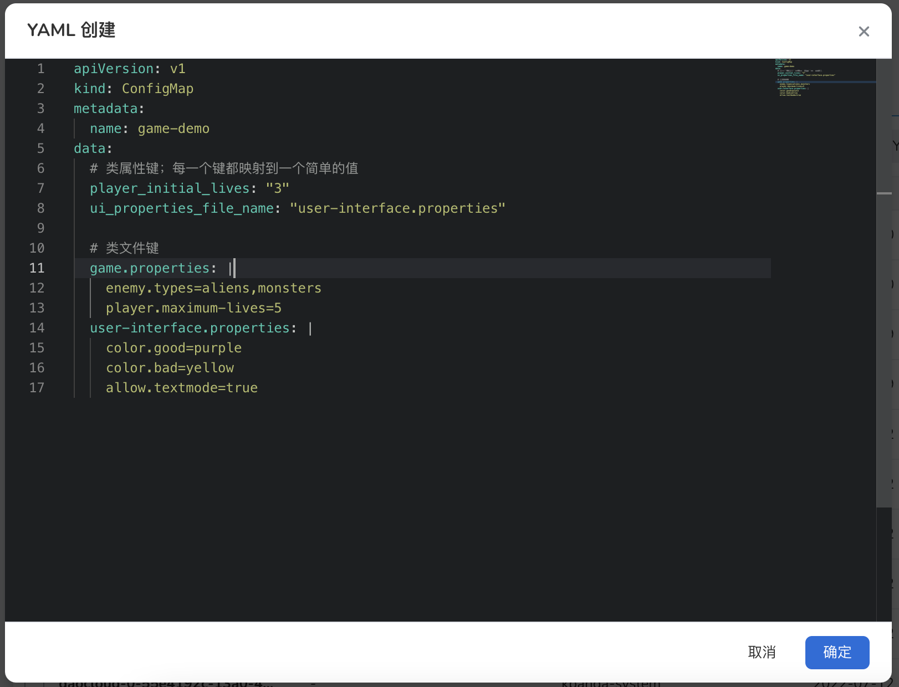

# 创建配置项

配置项（ConfigMap） 用于保存非机密性的配置数据到键值对中。使用时，容器组可以将其用作环境变量、命令行参数或者存储卷中的配置文件。ConfigMap 将您的环境配置信息和容器镜像解耦，便于应用配置的修改。

配置项使用场景：

- 使用配置项功能可以管理不同环境、不同业务的配置。
- 方便部署相同工作负载的不同环境，配置文件支持多版本，进行更新和回滚工作负载。
- 方便快速配置以文件的形式导入到容器中。

支持两种创建方式：

1. 图形化创建
2. 通过 YAML 创建

## 前提条件

- 容器管理平台[已接入 Kubernetes 集群](../Clusters/JoinACluster.md)或者[已创建 Kubernetes]()，且能够访问集群的 UI 界面

- 已完成一个[命名空间的创建](../Namespaces/README.md)、[用户的创建]()，并将用户授权为`NS Edit`角色 ，详情可参考[命名空间授权]()

## 操作步骤

### 图形化创建

1. 点击一个集群名称，进入`集群详情`。
  

2. 在左侧导航栏，点击`配置与密钥`，点击右上角`创建配置项`按钮，
  

3. 在`创建配置项`页面中，参照下表配置参数后，点击`确定`。
  

| 参数         | 参数说明                                                     |
| ------------ | ------------------------------------------------------------ |
| 配置名称     | 【类型】必填<br />【含义】新建的配置名称，同一个命名空间里命名必须唯一。 |
| 集群命名空间 | 【类型】必填<br />【含义】新建配置所在的命名空间。若不选择，默认配置为default。 |
| 描述         | 【类型】必填<br />【含义】配置项的描述信息。                 |
| 手动输入     | 【类型】可选<br />【含义】工作负载配置的数据可以在容器中使用，或被用来存储配置数据。其中，“键”代表文件名；“值”代表文件中的内容。单击“添加更多配置数据” 。 |
| 文件上传     | 【类型】可选<br />【含义】配置项（ConfigMap）可以以文件进行上传，上传后默认将文件解析为 ”键“、”值“ 对。 |
| 标签         | 【类型】可选<br />【含义】标签其实就一对 Key/Value，被关联到对象上，比如 Pod。标签的使用我们倾向于能够标示对象的特殊特点，并且对用户而言是有意义的，但是标签对内核系统是没有直接意义的。 |
| 注解         | 【类型】可选<br />【含义】注解（Annotation ）可以将 Kubernetes 资源对象关联到任意的非标识性元数据。可以通过注解检索到这些元数据。 |

### 通过 YAML 创建

1. 点击一个集群名称，进入`集群详情`。
  

2. 在左侧导航栏，点击`配置与密钥`，点击右上角`YAML 创建`按钮，
  

3. 在 `YAML 创建`页面中，填写 YAML 语句后，点击`确定`。
  

**配置项示例：**

```yaml
apiVersion: v1
kind: ConfigMap
metadata:
  name: game-demo
data:
  # 类属性键；每一个键都映射到一个简单的值
  player_initial_lives: "3"
  ui_properties_file_name: "user-interface.properties"

  # 类文件键
  game.properties: |
    enemy.types=aliens,monsters
    player.maximum-lives=5    
  user-interface.properties: |
    color.good=purple
    color.bad=yellow
    allow.textmode=true  
```

有关配置项的使用说明，请参考[使用配置项](UsedConfigMap.md)。
