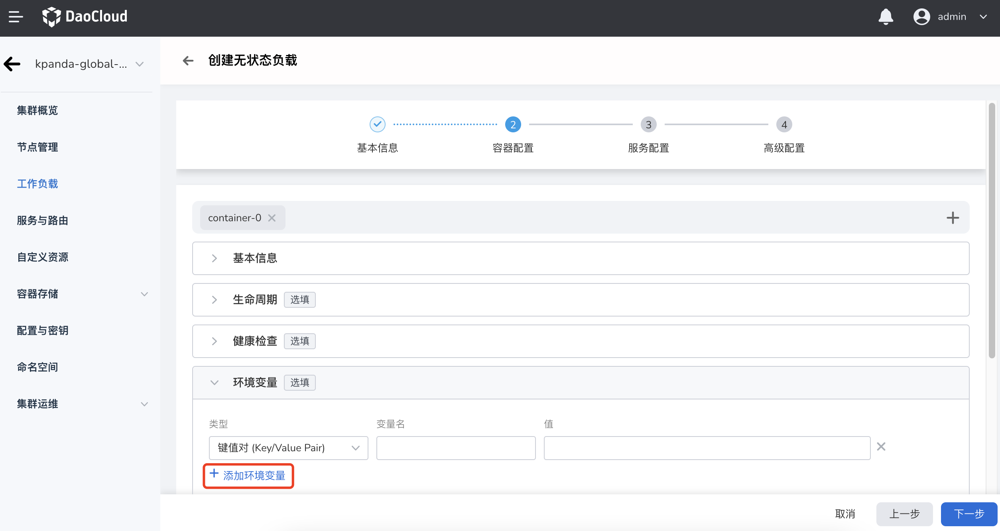
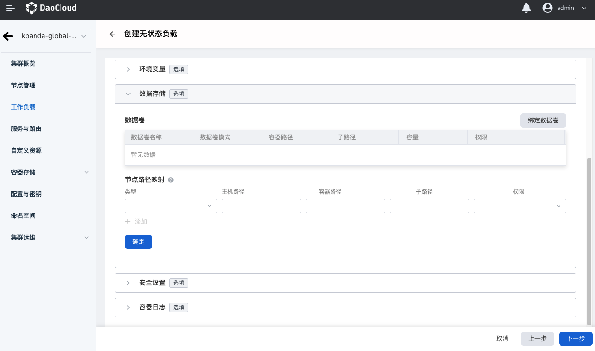

# 使用配置项

配置项（ConfigMap）是 Kuberneters 的一种 API 对象，用来将非机密性的数据保存到键值对中，让你可以存储其他对象所需要使用的配置。
使用时， 容器可以将其用作环境变量、命令行参数或者存储卷中的配置文件。通过使用配置项，能够将您的配置数据和应用程序代码分开，为应用配置的修改提供更加灵活的途径。

> 注意：配置项并不提供保密或者加密功能。如果要存储的数据是机密的，请使用[密钥](#)，或者使用其他第三方工具来保证数据的私密性，而不是用配置项。此外在容器里使用配置项时，容器和配置项必须处于同一集群的命名空间中。

## 使用场景

您可以在 Pod 中使用配置项，有多种使用场景，主要包括：

- 使用配置项设置容器的环境变量

- 使用配置项设置容器的命令行参数

- 使用配置项作为容器的数据卷

## 使用配置项设置容器的环境变量

您可以通过图形化界面或者终端命令行来使用配置项作为容器的环境变量。

> 注意：配置项导入是将配置项作为环境变量的值；配置项键值导入是将配置项中某一参数作为环境变量的值。

### 图形化操作

在通过镜像创建工作负载时，您可以在`环境变量`界面通过选择`配置项导入`或`配置项键值导入`为容器设置环境变量。

1. 进入[镜像创建工作负载](../Workloads/CreateDeploymentByImage.md)页面中，在`容器配置`这一步中，选择`环境变量`配置，点击`添加环境变量`按钮。

    

2. 在环境变量类型处选择`配置项导入`或`配置项键值导入`。

    - 当环境变量类型选择为`配置项导入`时，依次输入`变量名`、`前缀`名称、`配置项`的名称。

    - 当环境变量类型选择为`配置项键值导入`时，依次输入`变量名`、`配置项`名称、`键`的名称。

### 命令行操作

您可以在创建工作负载时将配置项设置为环境变量，使用 valueFrom 参数引用 ConfigMap 中的 Key/Value。

```yaml
apiVersion: v1
kind: Pod
metadata:
  name: configmap-pod-1
spec:
  containers:
    - name: test-container
      image: busybox
      command: [ "/bin/sh", "-c", "env" ]
      env:
        - name: SPECIAL_LEVEL_KEY
          valueFrom:                             ##使用valueFrom来指定env引用配置项的value值
            configMapKeyRef:
              name: kpanda-configmap                ##引用的配置文件名称
              key: SPECIAL_LEVEL                 ##引用的配置项key
  restartPolicy: Never
```

## 使用配置项设置容器的命令行参数

您可以使用配置项设置容器中的命令或者参数值，使用环境变量替换语法$(VAR_NAME)来进行。如下面的编排示例所示。

```yaml
apiVersion: v1
kind: Pod
metadata:
  name: configmap-pod-3
spec:
  containers:
    - name: test-container
      image: busybox
      command: [ "/bin/sh", "-c", "echo $(SPECIAL_LEVEL_KEY) $(SPECIAL_TYPE_KEY)" ]
      env:
        - name: SPECIAL_LEVEL_KEY
          valueFrom:
            configMapKeyRef:
              name: kpanda-configmap
              key: SPECIAL_LEVEL
        - name: SPECIAL_TYPE_KEY
          valueFrom:
            configMapKeyRef:
              name: kpanda-configmap
              key: SPECIAL_TYPE
  restartPolicy: Never
```

这个 Pod 运行后，输出如下内容。

```none
Hello Kpanda
```

## 使用配置项作为容器的数据卷

您可以通过图形化界面或者终端命令行来使用配置项作为容器的环境变量。

### 图形化操作

在通过镜像创建工作负载时，您可以通过在`数据存储`界面选择存储类型为`配置项`，将配置项作为容器的数据卷。

1. 进入[镜像创建工作负载](../Workloads/CreateDeploymentByImage.md)页面中，在`容器配置`这一步中，选择`数据存储`配置，在`节点路径映射`列表点击`添加`按钮。

    

2. 在存储类型处选择`配置项`，并依次输入`容器路径`、`子路径`等信息。

### 命令行操作

要在一个 Pod 的存储卷中使用 ConfigMap。

下面是一个将 ConfigMap 以卷的形式进行挂载的 Pod 示例：

```yaml
apiVersion: v1
kind: Pod
metadata:
  name: mypod
spec:
  containers:
  - name: mypod
    image: redis
    volumeMounts:
    - name: foo
      mountPath: "/etc/foo"
      readOnly: true
  volumes:
  - name: foo
    configMap:
      name: myconfigmap
```

如果 Pod 中有多个容器，则每个容器都需要自己的 `volumeMounts` 块，但针对每个 ConfigMap，您只需要设置一个 `spec.volumes` 块。

> 注意：将配置项作为容器挂载的数据卷时，配置项只能作为只读文件进行读取。
