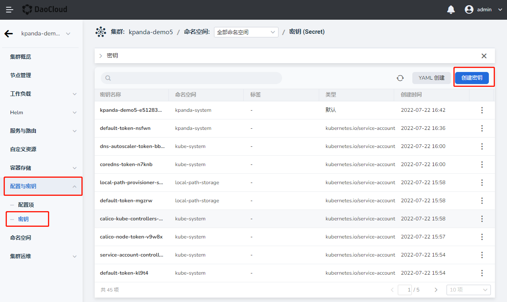
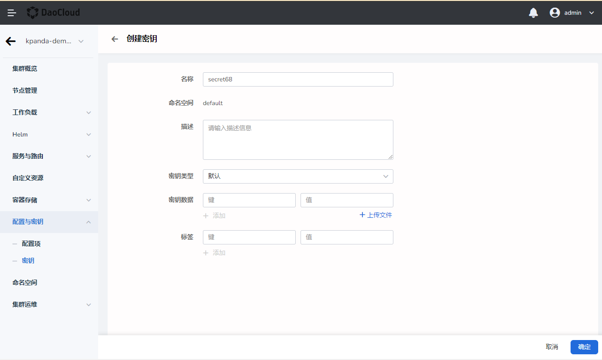
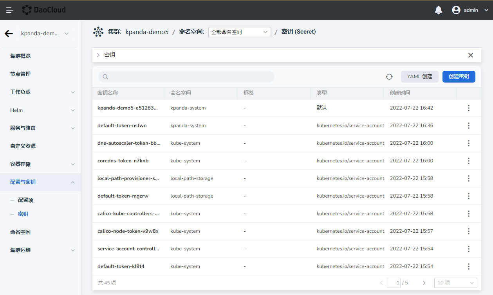
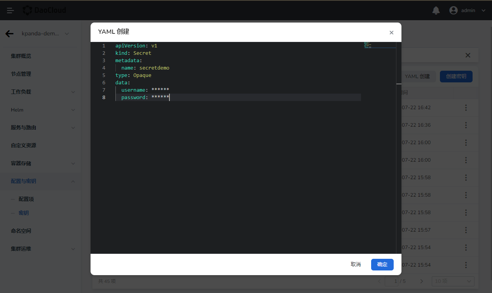

# 创建密钥

密钥是一种用于存储和管理密码、OAuth 令牌、SSH、TLS 凭据等敏感信息的资源对象。 使用密钥意味着您不需要在应用程序代码中包含敏感的机密数据。

密钥使用场景：

- 作为容器的环境变量使用，提供容器运行过程中所需的一些必要信息。
- 使用密钥作为 Pod 的数据卷。
- 在 kubelet  拉取容器镜像时作为镜像仓库的身份认证凭证使用。

支持两种创建方式：

- 图形化创建
- 通过 YAML 创建

## 前提条件

- 容器管理平台[已接入 Kubernetes 集群](../Clusters/JoinACluster.md)或者[已创建 Kubernetes](../Clusters/CreateCluster.md)，且能够访问集群的 UI 界面

- 已完成一个[命名空间的创建](../Namespaces/createns.md)、[用户的创建](../../../ghippo/04UserGuide/01UserandAccess/User.md)，并将用户授权为 `NS Edit` 角色 ，详情可参考[命名空间授权](../Namespaces/createns.md)

## 操作步骤

### 图形化创建

1. 用户成功登录平台后，点击一个集群名称，进入`集群详情`。

    

2. 在左侧导航栏，点击`配置与密钥`->`密钥`，点击右上角`创建密钥`按钮。

    

3. 在`创建密钥`页面中，参照下表配置参数后，点击`确定`。

    

| 参数     | 参数说明                                                     |
| -------- | ------------------------------------------------------------ |
| 名称     | 【类型】必填<br />【含义】新建的密钥名称，同一个命名空间里命名必须唯一。 |
| 命名空间 | 【类型】必填<br />【含义】新建密钥所在的命名空间。若不选择，默认配置为default。 |
| 描述     | 【类型】必填<br />【含义】密钥的描述信息。                   |
| 密钥类型 | 【类型】可选<br />【含义】新建密钥的类型，枚举值如下：<br>默认（Opaque）：Kubernetes 默认的密钥类型，支持用户定义的任意数据。<br/>TLS (kubernetes.io/tls)：用于 TLS 客户端或者服务器端数据访问的凭证。<br/>镜像仓库信息 (kubernetes.io/dockerconfigjson)：用于镜像仓库访问的凭证<br/>用户名和密码（kubernetes.io/basic-auth）：用于基本身份认证的凭证。<br/>自定义：用户根据业务需要自定义的类型。 |
| 密钥数据 | 【类型】必填<br />【含义】密钥所存储的数据，依据密钥类型的不同，需要的配置也不同，具体如下：<br>当密钥类型为默认（Opaque）时，您可以填入多个键值对数据。<br>当密钥类型为TLS (kubernetes.io/tls)时，您需要填入证书凭证和私钥数据。证书是自签名或CA签名过的凭据，用来进行身份认证。证书请求是对签名的请求，需要使用私钥进行签名。<br/>当密钥类型为镜像仓库信息 (kubernetes.io/dockerconfigjson)时：需要填入私有镜像仓库的帐号和密码。<br/>当密钥类型为用户名和密码（kubernetes.io/basic-auth）：您需要指定用户名和密码。<br/>当密钥类型为自定义时：您可以填入多个键值对数据。 |
| 标签     | 【类型】可选<br />【含义】为密钥添加标签。                   |

### 通过 YAML 创建

1. 用户成功登录平台后，点击一个集群名称，进入`集群详情`。

    

2. 在左侧导航栏，点击`配置与密钥`->`密钥`，点击右上角`YAML 创建`按钮。

    

3. 在`YAML 创建`页面中，参照下表配置参数后，点击`确定`。

    

    **密钥示例：**

    ```yaml
    apiVersion: v1
    kind: Secret
    metadata:
      name: secretdemo
    type: Opaque
    data:
      username: ******
      password: ******
    ```

下一步：[使用配置](use-secret.md)。
