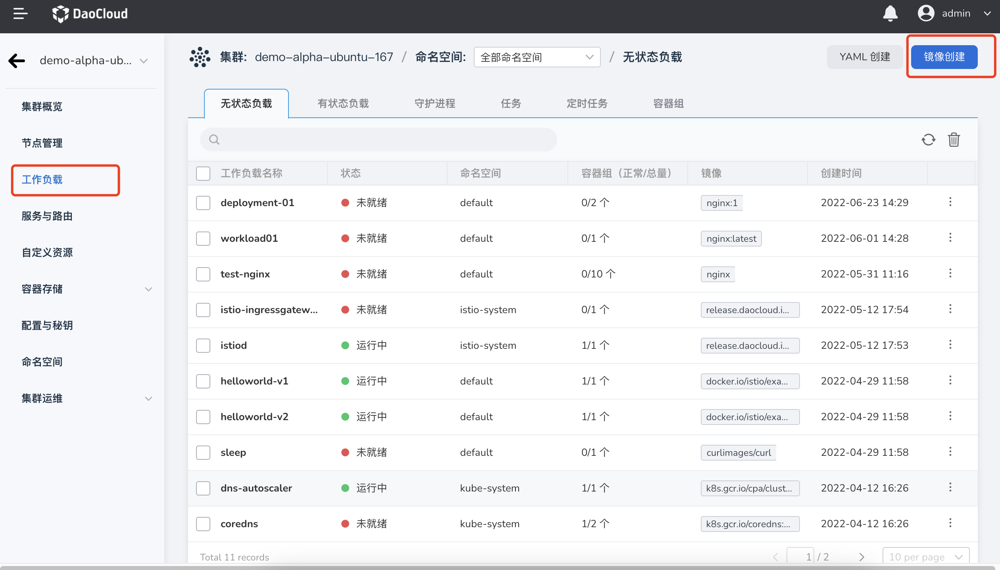
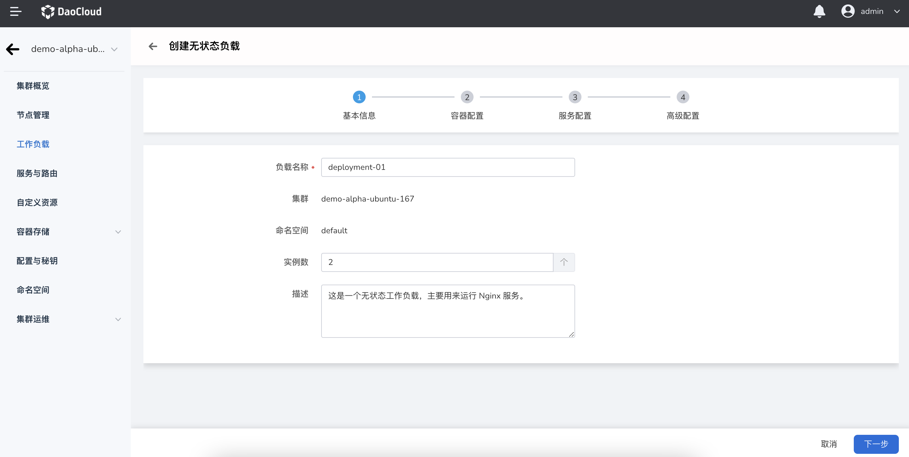
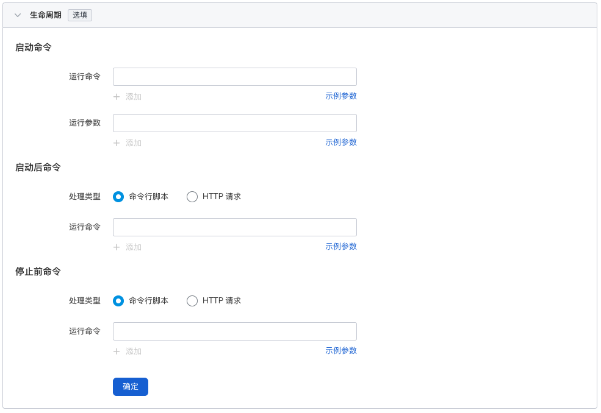
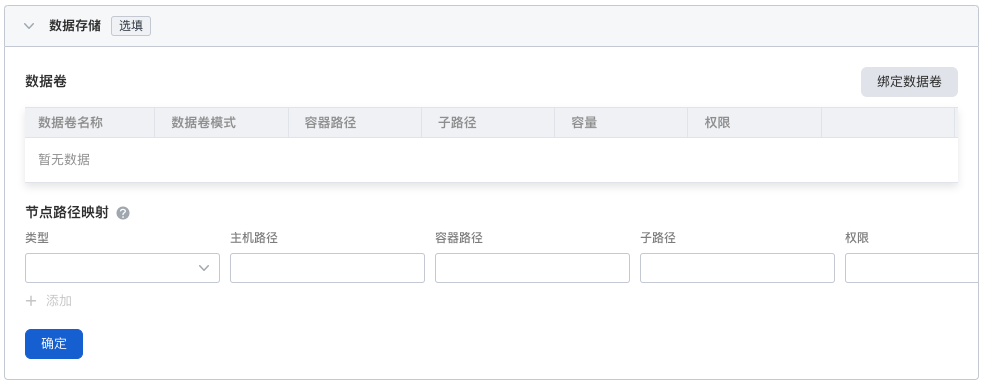
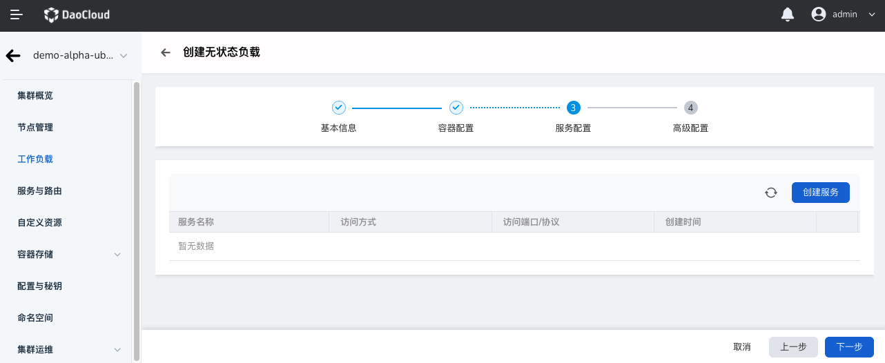
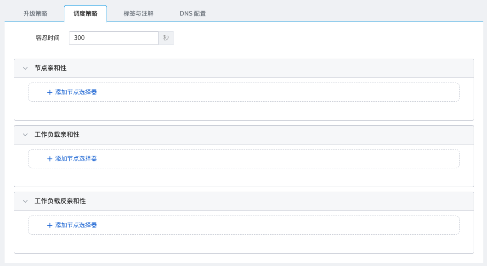
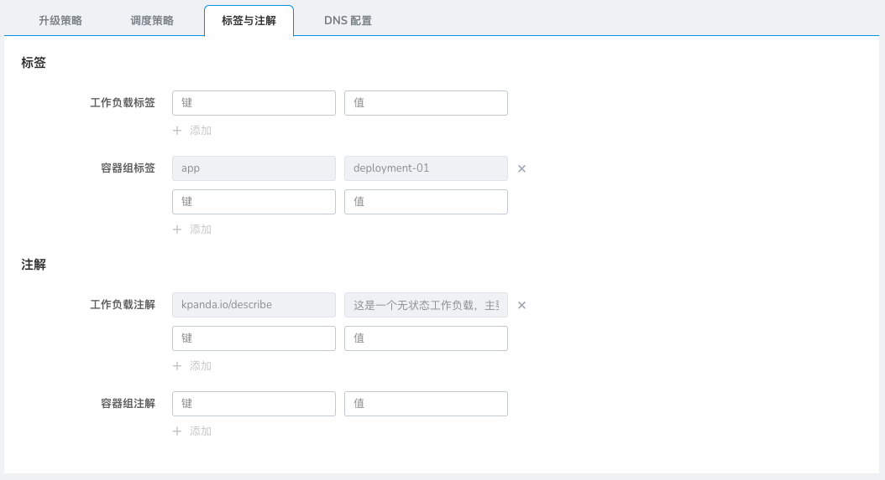
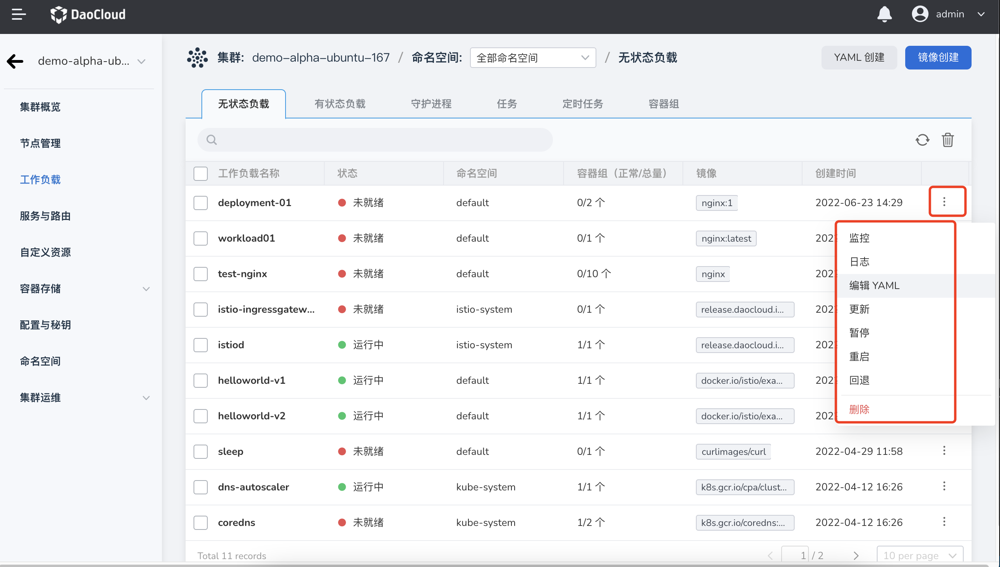

# 通过镜像创建无状态负载

无状态负载（Deployment）的容器组之间完全独立、功能相同，具有弹性伸缩、滚动升级等特性，您可以部署无状态负载实现快速伸缩。其实例数量可以灵活伸缩，若一个无状态负载配有多个副本，在宕机或者发生故障时可自动切换。

## 前提条件

通过镜像创建无状态负载之前，需要满足以下前提条件：

- 容器管理平台[已接入 Kubernetes 集群](../Clusters/JoinACluster.md)或者[已创建 Kubernetes 集群](../Clusters/CreateCluster.md)，且能够访问集群的 UI 界面。

- 已完成一个[命名空间的创建]()、[用户的创建]()，并将用户授权为 `NS Edit` 角色 ，详情可参考[命名空间授权]()。

- 单个实例中有多个容器时，请确保容器使用的端口不冲突，否则部署会失效。

参考以下步骤，创建一个无状态负载。

## 1. 登录容器管理平台

`NS Edit` 用户根据下表的信息成功登录后，点击左侧导航栏的`集群列表`进入集群列表。

| 参数                    | 说明                                                         | 举例值                       |
| :---------------------- | :----------------------------------------------------------- | :--------------------------- |
| UI 账户和密码          | 【含义】用来登录容器管理平台 Web UI 的管理员账户和密码 | 账户：root 密码：****** |
| 容器平台的 Web UI 地址 | 【含义】容器管理平台的 Web UI 的 IP 地址   | 10.6.124.110                 |

## 2. 镜像创建

1. 点击一个集群名称，进入`集群详情`。

  

2. 点击左侧导航栏的`工作负载`进入工作负载列表，点击右上角`镜像创建`按钮。

  

3. 屏幕将显示`创建无状态负载`页面。

## 3. 基本信息配置

在`创建无状态负载`页面中，根据下表输入基本信息后，点击`下一步`开始[容器配置](#4-容器配置)。

| 参数      | 说明                                                         | 举例值                                            |
| :-------- | :----------------------------------------------------------- | :------------------------------------------------ |
| 负载名称 | 【类型】必填 【含义】输入新建工作负载的名称，命名必须唯一。 【注意】请输入 4 到 63 个字符的字符串，可以包含小写英文字母、数字和中划线（-），并以小写英文字母开头，小写英文字母或数字结尾。 | Deployment-01                                     |
| 集群     | 【类型】必选 【含义】选择新建工作负载所在的集群。 【注意】在集群内创建工作负载时，将在当前集群中创建工作负载。集群不可更改。当在集群外部创建工作负载时，将在所选集群创建工作负载。 | Cluster-01                                        |
| 命名空间 | 【类型】必选 【含义】选择新建工作负载所在的命名空间。关于命名空间更多信息请参考[命名空间概述](http://dwiki.daocloud.io)。 【注意】若您不设置命名空间，系统会默认使用 default 命名空间。 | default                                      |
| 实例数    | 【类型】可选 【含义】输入工作负载的 [Pod](http://dwiki.daocloud.io) 实例数量。 【注意】若您不设置实例数量，系统会默认创建 2 个 Pod 实例。 | 2                                                 |
| 描述      | 【类型】可选 【含义】输入工作负载的描述信息，内容自定义。 【注意】字符数量应不超过 512 个。 | 这是一个无状态负载，主要用来运行 Nginx 服务。 |

## 4. 容器配置

容器配置仅针对单个容器进行配置，如需在一个容器组中添加多个容器，可点击右侧的 `+` 添加多个容器。

完成以下所有容器配置信息后，点击`下一步`进行[服务配置](#5-服务配置)。

### 基本信息（必填）

按照下表输入信息后，点击`确认`。

| 参数      | 说明                                                         | 举例值       |
| :-------- | :----------------------------------------------------------- | :----------- |
| 容器名称* | 【类型】必选 【含义】输入新建容器的名称。 【注意】请输入 4 到 63 个字符的字符串，可以包含小写英文字母、数字和中划线（-），并以小写英文字母开头，小写英文字母或数字结尾。 | deployment-01 |
| 容器镜像* | 【类型】必选 【含义】从镜像仓库选择的镜像名称，也支持手动输入镜像名称（名称需为镜像仓库中已有的镜像名，否则将无法获取）。 | nginx      |
| 更新策略  | 【类型】可选 【含义】容器执行更新时，镜像拉取策略。 【注意】开启后工作负载每次重启/升级均会重新拉取镜像，否则只会在节点上不存在同名同版本镜像时拉取镜像 | 总是拉取镜像 |
| 特权容器  | 【类型】可选 【含义】默认情况下，容器不可以访问宿主机上的任何设备，开启特权容器后，容器即可访问宿主机上的所有设备，享有宿主机上的运行进程的所有权限。 | 启用     |
| CPU 配额  | 【类型】可选 【含义】容器 CPU 资源的最低使用量和最高限度。 申请：容器需要使用的最小 CPU 值。 限制：允许容器使用的 CPU 最大值。建议设容器配额的最高限额，避免容器资源超额导致系统故障。 | 0.25，0.25       |
| 内存配额  | 【类型】可选 【含义】容器内存资源的最低使用量和最高限度。 申请：容器需要使用的最小内存值。 限制：允许容器使用的内存最大值。建议设容器配额的最高限额，避免容器资源超额导致系统故障。 |512 MB，512 MB       |

### 生命周期（选填）

容器生命周期配置用于设置容器启动时、启动后、停止前需要执行的命令。具体详情请参照[容器生命周期配置](PodConfig/lifescycle.md)。

### 健康检查（选填）

容器健康检查用于判断容器和应用的健康状态。有助于提高应用的可用性。具体详情请参考[容器健康检查配置](PodConfig/healthcheck.md)。

### 环境变量（选填）

容器环境变量配置用于配置 Pod 内的容器参数，为 Pod 添加环境标志或传递配置等。具体详情请参考[容器环境变量配置](PodConfig/EnvironmentVariables.md)。

### 数据存储（选填）

容器数据存储配置用于配置容器挂载数据卷和数据持久化设置。具体详情请参考[容器数据存储配置](http://dwiki.daocloud.io)。

### 安全设置（选填）

按照下表对容器权限进行设置，保护系统和其他容器不受其影响。

### 容器日志（选填）

设置容器日志采集策略、配置日志目录。用于收集容器日志便于统一管理和分析。具体详情请参考[容器日志配置](http://dwiki.daocloud.io)。

## 5. 服务配置

对工作负载访问方式进行设置，可以设置服务访问方式。

1. 点击`创建服务`按钮。

  

2. 选择访问服务的各项信息，具体详情请参考[创建服务]()。

  

3. 点击`确定`，点击`下一步`。

## 6. 高级配置

除了基本信息配置，DCE 还提供了丰富的高级配置，可对工作负载的升级策略、调度策略、标签与注解等功能进行配置。

### 升级策略

| 参数                | 说明                                                         | 举例值                                  |
| :------------------ | :----------------------------------------------------------- | :-------------------------------------- |
| 升级方式            | 【类型】可选 【含义】选择无状态负载的升级方式，包括滚动升级和重建升级。 【注意】  **滚动升级**：将逐步用新版本的实例替换旧版本的实例，升级的过程中，业务流量会同时负载均衡分布到新老的实例上，因此业务不会中断。  **重建升级**：将先把您工作负载的老版本实例删除，再安装指定的新版本，升级过程中业务会中断。 | 如以 root 权限运行，则填写 root 用户 ID |
| 最大无效 Pod 数     | 【类型】可选 【含义】用于指定 Deployment 在更新过程中不可用状态的 Pod 数量的上限 ，如果等于实例数有服务的风险。  | 25%                                     |
| 最大浪涌            | 【类型】可选 【含义】更新 Pod 的过程中 Pod 总数量超过 Pod 期望副本数量部分的最大值。或比率。 | 25%                                     |
| 最大保留版本数      | 【类型】可选 【含义】为回滚时保留的旧版本的数量。       | 10                                      |
| Pod 可用最短时间(s) | 【类型】可选 【含义】Pod 就绪的最短时间，只有超出这个时间 Pod 才被认为可用。 | 0                                       |
| 升级最大持续时间(s) | 【类型】可选 【含义】在标记 deployment 失败之前，等待部署进行的最大持续时间。 | 600                                     |
| 缩容时间窗(s)       | 【类型】可选 【含义】工作负载停止前命令的执行时间窗（0-9,999秒），默认30秒。 | 30                                      |

###  调度策略

用户可以设置容忍时间来定义当工作负载所在的节点损坏时，将工作负载调度到其它节点的容忍时间。也支持基于节点标签和 Pod 标签对工作负载所部署的节点进行调度。具体详情请参考[调度策略](http://dwiki.daocloud.io/)。

| 参数             | 说明                                                         | 举例值                                  |
| :--------------- | :----------------------------------------------------------- | :-------------------------------------- |
| 容忍时间         | 【类型】可选 【含义】工作负载实例所在的节点不可用的情况下，将工作负载实例重新调度到其它可用节点的时间，单位为秒。 | 如以 root 权限运行，则填写 root 用户 ID |
| 节点亲和性       | 【类型】可选 【含义】根据节点上的标签来约束 Pod 可以调度到哪些节点上。 | --                                      |
| 工作负载亲和性   | 【类型】可选 【含义】更新 Pod 的过程中 Pod 总数量超过 Pod 期望副本数量部分的最大值。 | --                                      |
| 工作负载反亲和性 | 【类型】可选 【含义】基于已经在节点上运行的 **Pod** 的标签来约束 Pod 不可以调度到的节点。 | --                                      |

### 标签与注解

可以点击添加按钮为工作负载和容器组添加标签和注解。

### DNS 配置

应用在某些场景下会出现冗余的 DNS 查询。Kubernetes 为应用提供了与 DNS 相关的配置选项，通过对应用进行 DNS 配置，能够在某些场景下有效地减少冗余的 DNS 查询，提升业务并发量。具体详情请参考 [DNS 配置](http://dwiki.daocloud.io/)。

| 参数       | 说明                                                         | 举例值                                  |
| :--------- | :----------------------------------------------------------- | :-------------------------------------- |
| DNS 策略   | 【类型】可选 【含义】对应用进行 DNS 配置，减少冗余的 DNS 查询，提升业务并发量。 Default：容器的域名解析文件使用kubelet的“--resolv-conf”参数指向的域名解析文件 。该配置只能解析注册到互联网上的外部域名，无法解析集群内部域名，且不存在无效的 DNS 查询。  ClusterFirst：应用对接 Kube-DNS/CoreDNS。 ClusterFirstWithHostNet：应用对接主机的域名文件。  None：Kubernetes v1.9（Beta in v1.10）中引入的新选项值。设置为 None 之后，必须设置 dnsConfig，此时容器的域名解析文件将完全通过 dnsConfig 的配置来生成。 | 如以 root 权限运行，则填写 root 用户 ID |
| 域名服务器 | 【类型】可选 【含义】根据节点上的标签来约束 Pod 可以调度到哪些节点上。 | 10.6.175.20                             |
| 搜索域     | 【类型】可选 【含义】域名查询时的 DNS 搜索域列表。指定后，提供的搜索域列表将合并到基于 dnsPolicy 生成的域名解析文件的 search 字段中，并删除重复的域名。Kubernetes 最多允许 6 个搜索域。 | --                                      |
| Options   | 【类型】可选 【含义】DNS 的配置选项，其中每个对象可以具有 name 属性（必需）和 value 属性（可选）。该字段中的内容将合并到基于 dnsPolicy 生成的域名解析文件的 options 字段中，dnsConfig 的 options 的某些选项如果与基于 dnsPolicy 生成的域名解析文件的选项冲突，则会被 dnsConfig 所覆盖。 | --                                      |
| 主机别名   | 【类型】可选 【含义】为主机设置的别名。                 | Host-demo                               |

## 7. 完成创建

确认所有参数输入完成后，点击`确定`按钮，完成工作负载创建，自动返回`无状态负载`列表。点击列表右侧的 `︙`，可以执行各项操作。

等待工作负载状态变为`运行中`。如果工作负载状态出现异常，请查看具体异常信息，可参考[工作负载状态]()。
