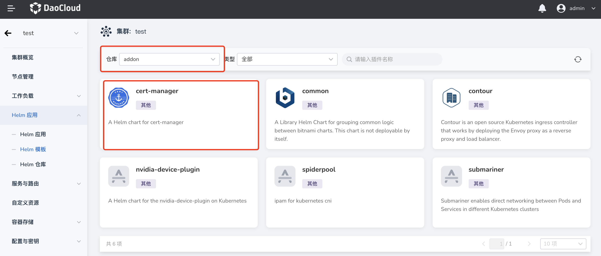
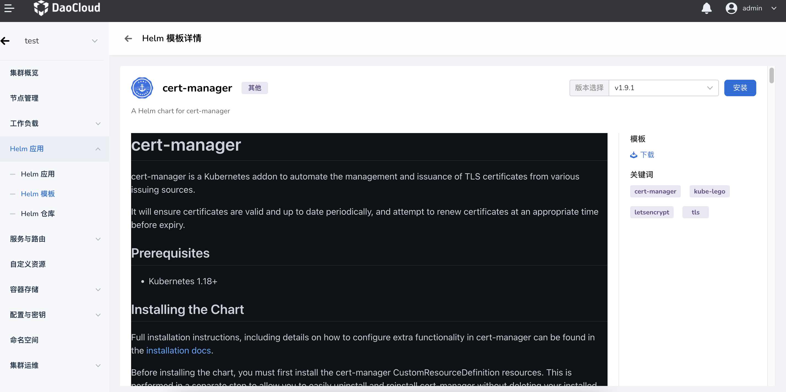
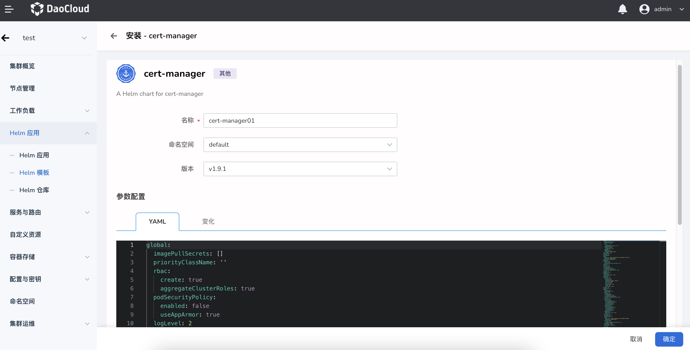
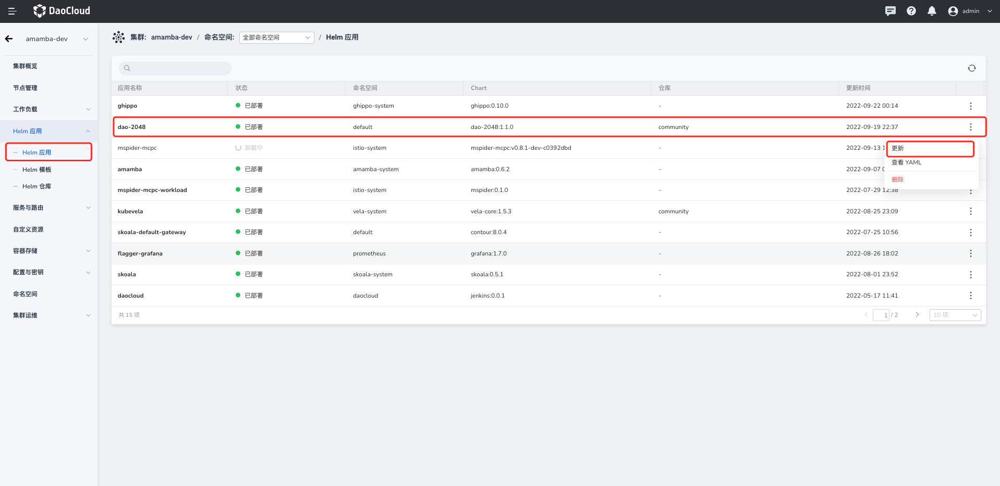
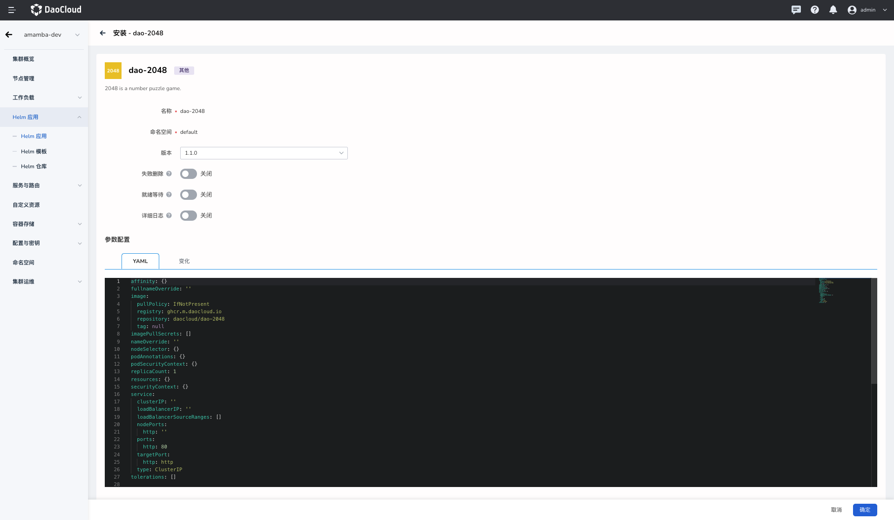
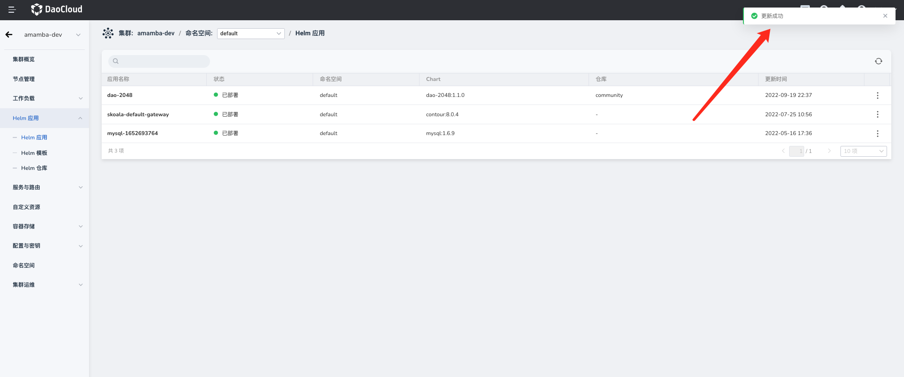
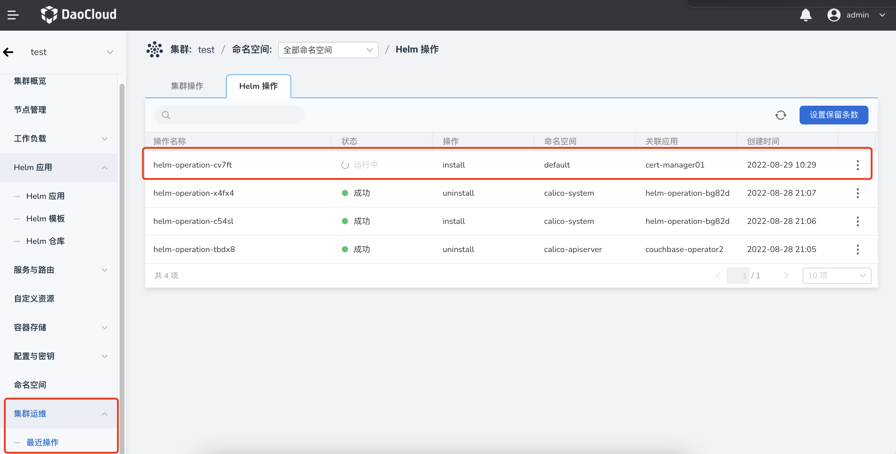
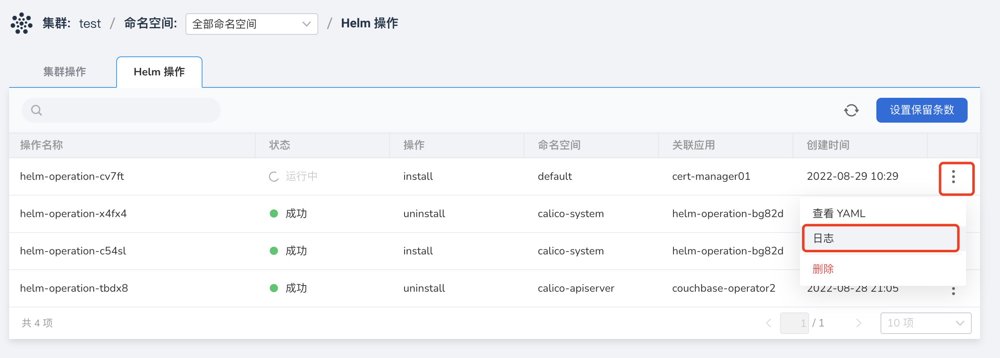
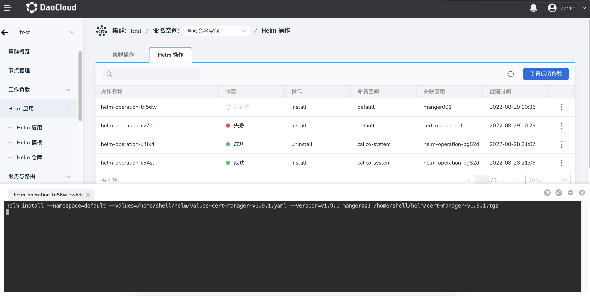
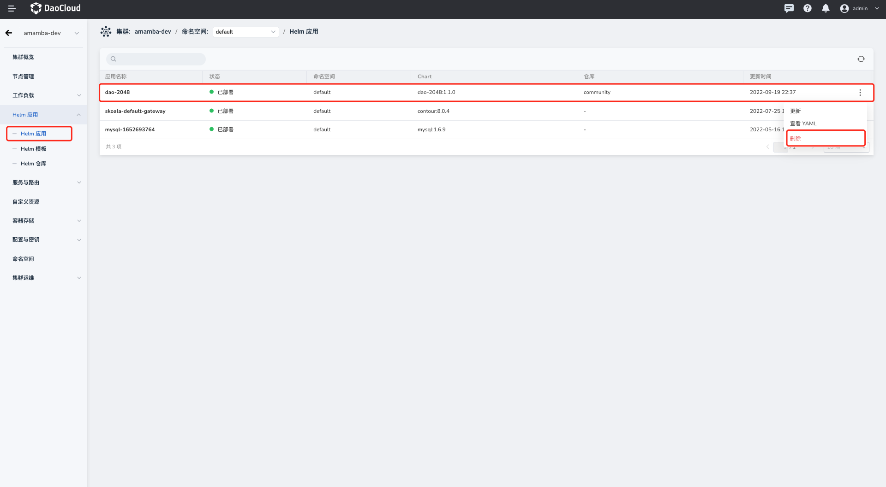

# 管理 Helm 应用

容器管理模块支持对 Helm 进行界面化管理，包括使用 Helm 模板创建 Helm 实例、自定义 Helm 实例参数、对 Helm 实例进行全生命周期管理等功能。

本节将以 [cert-manager](https://cert-manager.io/docs/) 的 Chart 模板为例，介绍如何通过容器管理界面创建并管理 Chart。

## 前提条件

- 容器管理平台[已接入 Kubernetes 集群](../Clusters/JoinACluster.md)或者[已创建 Kubernetes](../Clusters/CreateCluster.md)，且能够访问集群的 UI 界面。

- 已完成一个[命名空间的创建](../Namespaces/createns.md)、[用户的创建](../../../ghippo/04UserGuide/01UserandAccess/User.md)，并将用户授权为 [`NS Admin`](../Permissions/PermissionBrief.md#ns-admin) 角色 ，详情可参考[命名空间授权](../Permissions/Cluster-NSAuth.md)。

## 安装 Helm 应用

参照以下步骤安装 Helm 应用。

1. 点击一个集群名称，进入`集群详情`。

    

2. 在左侧导航栏，依次点击 `Helm 应用` -> `Helm 模板`，进入 Helm 模板页面。

    在 Helm 模板页面选择名为 `addon` 的 [Helm 仓库](helm-repo.md)，此时界面上将呈现 `addon` 仓库下所有的 Helm chart 模板。
    点击名称为 `cert-manager` 的 Chart。

    

3. 在安装页面，能够看到 Chart 的相关详细信息，在界面右上角选择需要安装的版本，点击`安装`按钮。此处选择 v1.9.1 版本进行安装。

    

4. 配置`名称`、`命名空间`及`版本信息`，也可以在下方的 **参数配置** 区域通过修改 YAML 来自定义参数。点击`确定`。

    

5. 系统将自动返回 Helm 应用列表，新创建的 Helm 应用状态为`安装中`表示正在安装，等待一段时间后状态变为`运行中`。

    

## 更新 Helm 应用

当我们通过界面完成一个 Helm 应用的安装后，我们可以对 Helm 应用执行更新操作。

注意：只有通过界面安装的 Helm 应用才支持使用界面进行更新操作。
参照以下步骤安装 Helm 应用。

1. 点击一个集群名称，进入`集群详情`。

    

2. 在左侧导航栏，点击`Helm 应用`，进入 Helm 应用列表页面。

    在 Helm 应用列表页选择您需要更新的 Helm 应用，点击列表右侧的 `...` 操作按钮，在下拉选择中选择`更新` 操作。

    

3. 点击`更新`按钮后，系统将跳转至更新界面，您可以根据需要对 Helm 应用进行更新，此处我们以更新 `dao-2048` 这个应用的 http 端口为例。

    

4. 修改完相应参数后。您可以在参数配置下点击`变化`按钮，检查刚刚的修改，确定无误后，点击底部 `确定` 按钮，完成 Helm 应用的更新。

    

5. 系统将自动返回 Helm 应用列表，新创建的 Helm 应用状态为`更新中`表示正在安装，等待一段时间后状态变为`运行中`。

    

## 查看 Helm 安装记录

在提交完 Helm 安装请求后，将返回至 `Helm 应用`列表，可以看到刚刚提交创建请求的 Helm 应用正在进行安装。可以通过以下步骤在`集群运维`中查看 Helm 安装的日志。

1. 在左侧导航栏，依次点击 `集群运维` -> `最近操作`，进入操作记录页面。在页面上方导航栏选择 `Helm 操作`页面。

    

2. 在列表右侧点击 `⋮`，在弹出菜单中选择`日志`。

    

3. 此时页面下方将以控制台的形式展示详细的运行日志。

    

## 删除 Helm 应用

参照以下步骤删除 Helm 应用。

1. 点击一个集群名称，进入`集群详情`。

    

2. 在左侧导航栏，点击 `Helm 应用`，进入 Helm 应用列表页面。

    在 Helm 应用列表页选择您需要更新的 Helm 应用，点击列表右侧的 `...` 操作按钮，在下拉选择中选择`删除`操作。

    

3. 执行上步操作后，系统将弹出确认删除弹窗，请在弹窗内输入 Helm 应用的名称，以确认删除应用，之后点击`删除`按钮，完成删除。

    