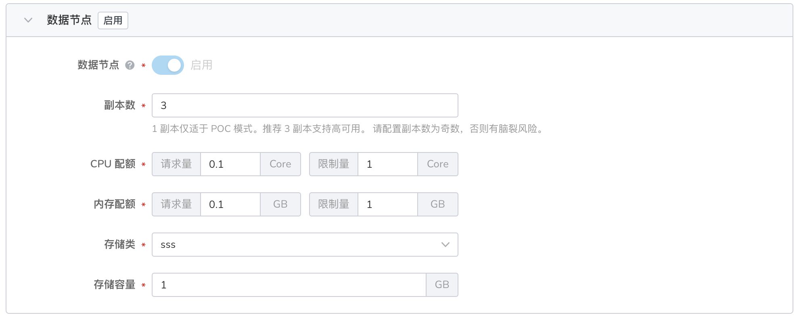
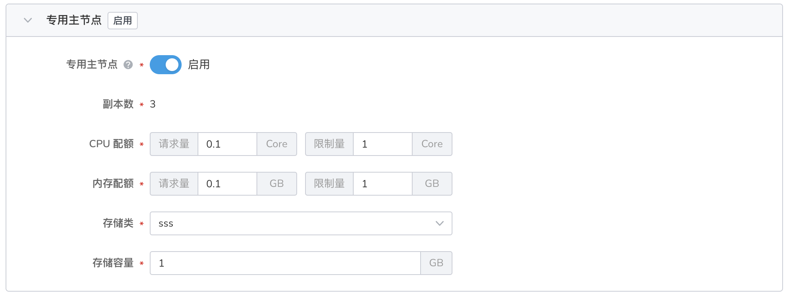
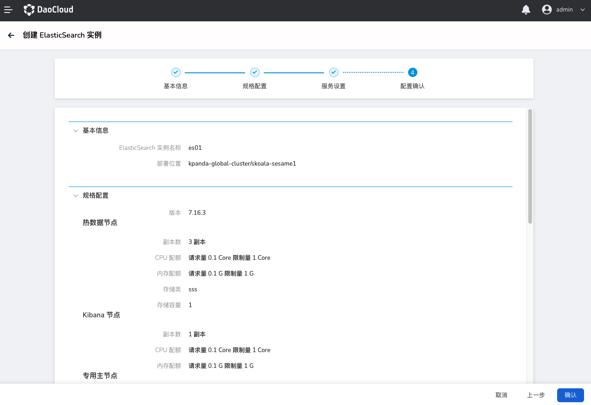
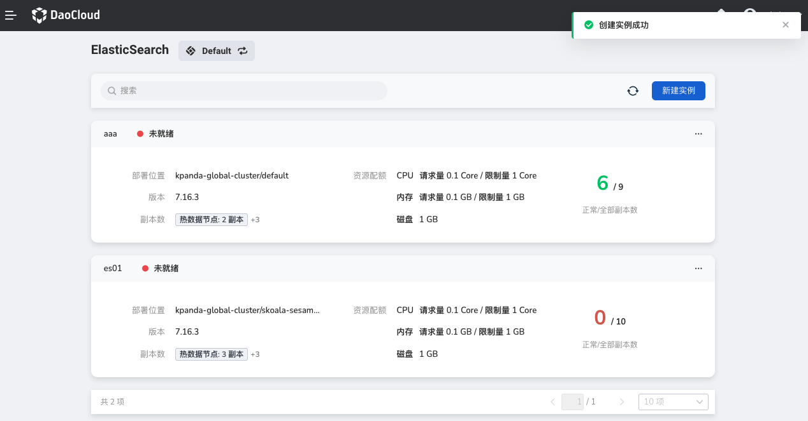

# 创建 Elasticsearch 实例

在 Elasticsearch 实例列表中，执行以下操作创建一个新的实例。

1. 在右上角点击`新建实例`。

  

2. 在创建 Elasticsearch 实例页面中，输入实例的基本信息后，点击`下一步`。

  

3. 选择一个版本，配置实例的以下规格后，点击`下一步`。可以视情况选择启用/禁用数据节点、Kibana 节点、专用主节点和冷数据节点。

  
  
  - 默认启用热数据节点，用于存放 Elasticsearch 搜索服务的日常活跃数据，默认 3 个副本，最少 1 个，最多 50 个。

    

  - 默认启用 Kibana 节点，用于存放 Elasticsearch 可视化数据的节点，默认为 1 个 Kibana 节点，不可增加或减少。

    

  - 可选的专用主节点。这是为了一些专用目的而设定的节点，默认 3 个专用主节点，不可增加和减少。

    

  - 可选的冷数据节点。这是存放一些 Elasticsearch 历史数据的节点，默认 3 个冷数据节点，最少 2 个，最多 50 个。

    

4. 设置访问类型（ClusterIP 或 NodePort）、用户名和密码后，点击`下一步`。

  

5. 确认上述基本信息、规格配置和服务设置无误后，点击`确认`。

  

6. 屏幕提示`创建实例成功`。

  
