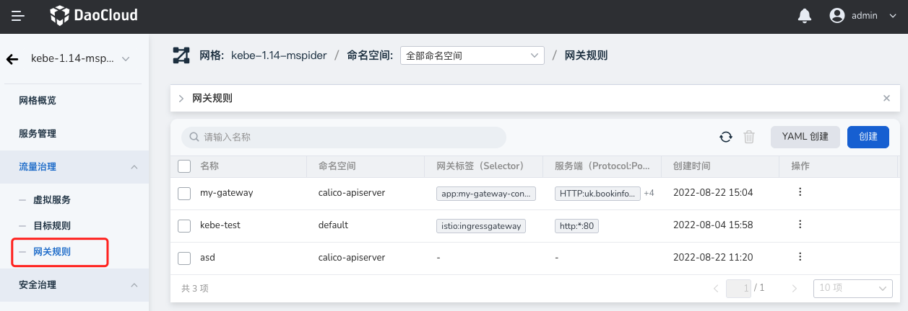
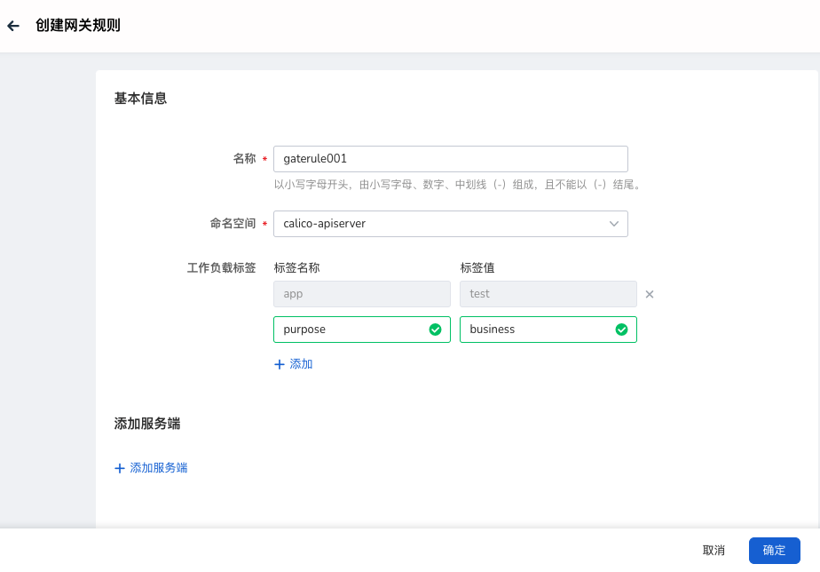
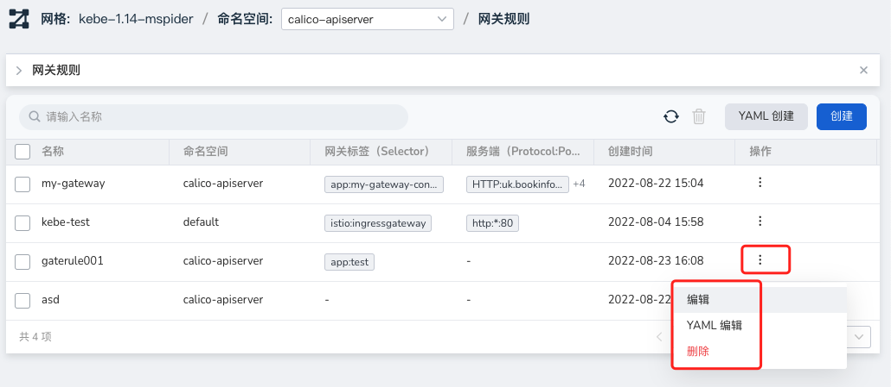

# 网关规则

网关规则用于将服务暴露于网格之外，相较于 k8s 的 ingress 对象，istio-gateway 增加了更多的功能：

- L4-L6负载均衡
- 对外mTLS
- SNI的支持
- 其他 istio中 已经实现的内部网络功能： Fault Injection，Traffic Shifting， Circuit Breaking， Mirroring

对于 L7 的支持，网关规则通过与虚拟服务配合实现。几个重要主字段如下：

- Selector

  选择用于南北流量的istio网关，可以使用多个，也可以与其他规则共用一个。

- Servers

  对外暴露服务的相关信息，包括hosts（服务名称）、监听端口、协议类型等。

- TLS

  提供对外的mTLS协议配置，用户可以启用三种TLS模式，并可以自定义CA证书等操作。

示例：

```yaml
spec: 
  selector: 
    istio: ingressgateway
  servers: 
  - port: 
    number: 80 
    name: http 
    protocol: HTTP 
  hosts: - istio-grafana.frognew.com
```

## 操作步骤

服务网格提供了两种创建方式：向导和 YAML。通过向导创建的具体操作步骤如下：

1. 在左侧导航栏点击`流量治理` -> `网关规则`，点击右上角的`创建`按钮。

  

2. 在`创建网关规则`界面中，配置基本信息，并根据需要添加服务端后点击`确定`。

  

3. 返回网关规则列表，屏幕提示创建成功。

  

4. 在列表右侧，点击操作一列的 `⋮`，可通过弹出菜单进行更多操作。

  
