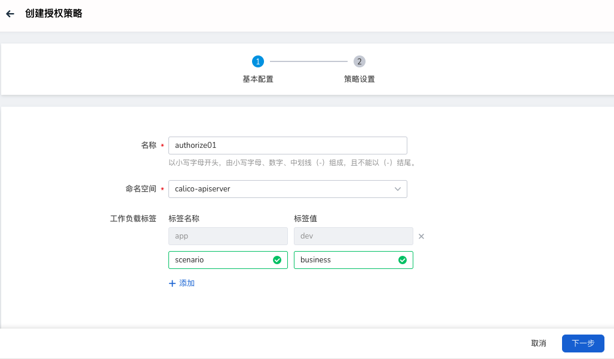
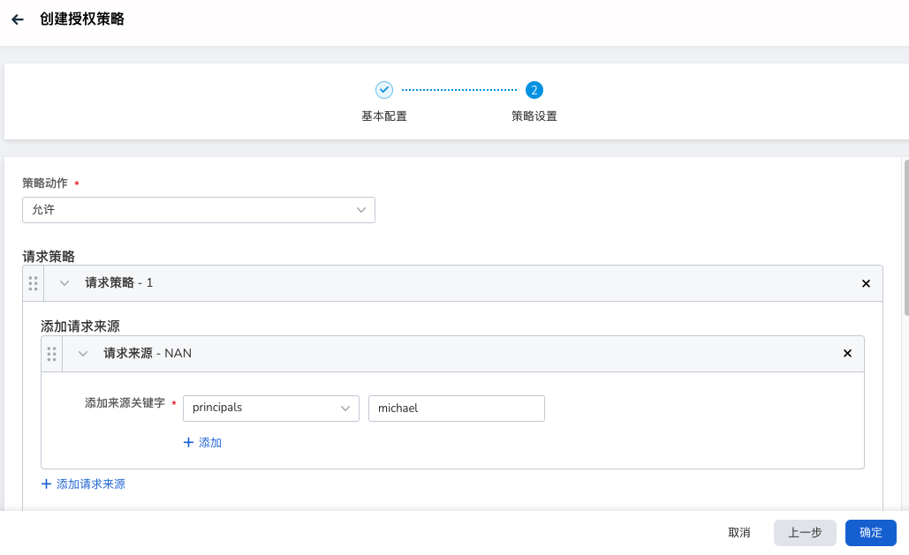
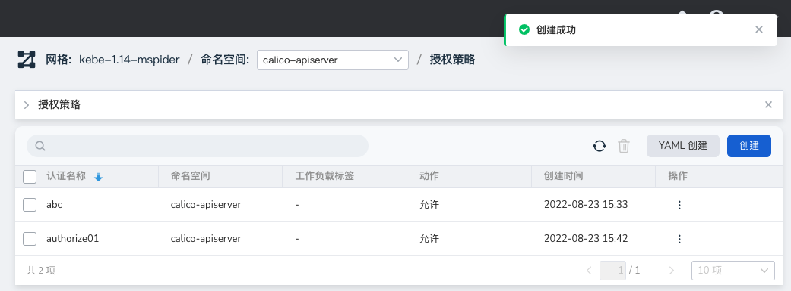

# 授权策略

授权策略类似于一种四层到七层的“防火墙”，它会像传统防火墙一样，对数据流进行分析和匹配，然后执行相应的动作。无论是来自外部的请求，或是网格内服务间的请求，都适用授权策略。
主要字段说明：

- Action

  操作内容，为 allow 和 deny，当匹配规则满足时将执行操作。

- Rules

  指定了如何针对当前的请求进行匹配，rules 字段下可以包含多条匹配规则，任意规则通过将操作生效。

- From

  针对请求的发送方进行匹配，包括以下字段：
  - principals：匹配发送方的身份
    
    在 Kubernetes 中可以认为是 pod 的 Service Account。使用这个字段时，首先需要开启 mTLS 功能。例如，当前请求是从 default namespace 中的 pod 中发出，且 pod 使用的 Service Account 名为 sleep，针对这个请求进行匹配，可将 principals 配置为 `cluster.local/ns/default/sa/sleep`。
  - requestPrincipals：匹配请求中的 JWT Token 的 `<issuer>/<subject>` 字段组合。
  - Namespaces：匹配发送方 pod 所在的 namespace。
  - ipBlocks：匹配请求的源 IP 地址段。

- To

  针对请求的接收方和请求自身进行匹配。包括以下字段：
  - Hosts：目标主机
  - Ports：目标端口
  - Methods：当前请求执行的 HTTP Method。针对 gRPC 服务，这个字段需要设置为 POST。
  > 注意：这个字段必须在 HTTP 协议时才进行匹配，如果请求不是 HTTP 协议，则认为匹配失败。
  - Path：当前请求执行的 HTTP URL Path。针对 gRPC 服务，需要配置为 `/package.service/method` 格式。

- When

  这是一个 key/value 格式的列表。这个字段会针对请求进行一些额外的检测，当这些检测全部匹配时才会认证当前规则匹配成功。例如 `key: request.headers[User-Agent]` 可以匹配 HTTP Header 中的 `User-Agent` 字段。

以上各匹配字段均有取反字段，例如 namespace，有对应的 notnamespace，具体可参见 istio 官网文档。

## 操作步骤

服务网格提供了两种创建方式：向导和 YAML。通过向导创建的具体操作步骤如下：

1. 在左侧导航栏点击`安全治理` -> `授权策略`，点击右上角的`创建`按钮。

  

2. 在`创建授权策略`界面中，先进行基本配置后点击`下一步`。

  

3. 按屏幕提示进行策略设置后，点击`确定`。

  

4. 返回授权列表，屏幕提示创建成功。

  

5. 在列表右侧，点击操作一列的 `⋮`，可通过弹出菜单进行更多操作。

  
