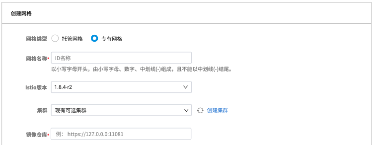

# 创建专有网格

专有网格指的是在用户集群中安装网格专有的控制面组件，对用户集群内的服务进行非侵入式的治理、遥测和安全等管理。专有网格只能对一个集群进行管理，最大管理实例数为 2000。

> 与托管网格的区别在于，专有网格不需要控制面集群。

## 基本配置

1. 在网格主页面中，点击`创建网格`按钮。

    

2. 选择`专有网格`，填写网格基本配置信息，各配置项的含义如下表。

| 配置项           | 描述                                                         |
| ---------------- | ------------------------------------------------------------ |
| 网格名称         | 必填项，以小写字母开头，由小写字母、数字、中划线(-)组成，且不能以中划线(-)结尾。                        |
| 别名| 用于提高易用性和网格识别度，可输入字母、数字、中文及其他符号，60 个字符以内 |
| istio 版本        | 当前系统可以支持的 istio 版本号                            |
| 集群       | 用于运行网格管理面的集群，列表包含当前网格平台可以访问且状态正常的集群。 该项附带一个刷新图标和一个`创建集群`按钮。 点击`创建集群`将跳转至`容器管理平台`创建新集群，创建完成后返回本页面，点击刷新图标更新列表。 |
| 镜像仓库         | 输入镜像仓库的 URL 地址。                             |

## 可选设置

完成基本配置后已经可以创建基本的托管网格。另可点击`可选设置`展开可选配置信息。

| 配置项       | 描述                                                         |
| ------------ | ------------------------------------------------------------ |
| 网格规模     | 包含四个规模选项，提供了与所选规模相关的资源建议信息         |
| 边车注入策略 | 可以启用/禁用网格层面的边车自动注入策略，启用后所有接入集群将自动注入边车 |
| 边车资源设置 | 对网格下所有集群的注入边车进行资源限制，可作为网格下的默认边车资源值。 各层级的边车资源限制规则执行优先级为：工作负载级资源限制 -> 集群级资源限制 - > 网格资源限制 |

最后点击`确定`按钮，完成网格创建。自动返回网格卡片列表，查看和管理新增的网格。
