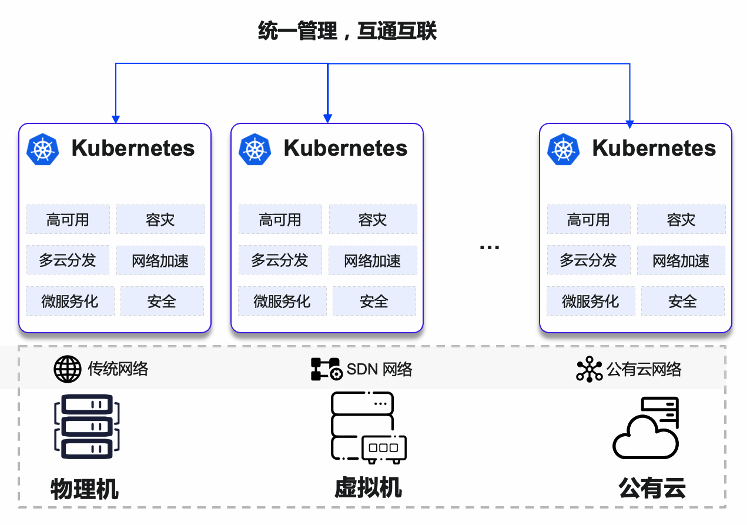

# 网络背景

**多云混合云背景**

随着云原生应用场景逐渐规模化，上云应用不断激增，场景越来越复杂，为应对高可用、容灾、业务流量激增等场景，用户逐步采用多集群、跨云部署，而在方案的实施过程中，应用的分发，应用的联通以及平台的管理等问题逐渐凸显。

其中网络是整体方案落地的关键，主要面临的问题如下：用户不再仅管理一个 Kubernetes 集群，多集群管理需求越来越多，并且底层基础设施变得多样化，需要考虑不同的公有云、私有云以及跨地域，在此环境异构的场景下，需要异构集群网络的互通互联，并且具备公共服务跨集群服务发现。

为保障高可用，微服务应用负载在不同集群中互为主备，在此场景中，同样需要保障网络的互联互通。

**传统应用云原生化**

一些传统行业企业，如制造、教育、能源、传统应用上云，未经微服务改造，很多应用仍需要通过 某个固定 IP 进行访问，并且需要对此类 IP 进行强管控，如严格的防火墙管控，因此需求更灵活及更高效 的 IP 管理能力，满足此类场景需求。

在传统应用微服务化过程中，用户会逐步将一部分应用容器化，部分容器化应用需要提供对外访问 IP，实现集群内外互联互通，因此此类应用同样也需要使用 固定并且可对外访问的 IP。

除此之外，基于对外访问 IP 的强管控需求，目前客户常在一个容器云平台中仅开放部分应用对外访问，而对于无需对外访问应用，仍使用动态虚拟 IP， 如部分应用使用 MacVLAN CNI 进行对外访问，部分使用 Calico CNI，因此网络类型多样化同样也逐渐成为应用上云需求。

**数据库、机器学习等应用上云**

随着云原生领域发展，数据库，机器学习等资源敏感性应用也开始运行在 Kubernetes 平台上，此类应用不仅对计算能力有很较高的要求，同时网络性能和时延也逐渐成为应用落地的瓶颈。因此 SR-IOV (Single Root I/O Virtualization) 等基于硬件的虚拟化加速网络方案，以及 ebpf 等网络加速方案同 Kubernetes 融合也是势在必行的一个发展方向。

**网络安全监管要求**

容器和云原生平台使企业能够实现自动化应用部署的许多方面，从而带来巨大的业务收益。但是平台内部 的 Pod 都是扁平的，横向的网络安全隔离缺少保障，另外随着云原生规模的扩张，以及微服务化的推进，东西向网络流量的剧增。尽管可以通过传统的防火墙和主机安全工具保护单体应用，但对于在主机之间甚至各种云之间动态部署的容器来说，必须增加监控东西向流量或以及内部流量的攻击。企业在构建容器云平台时，需要考虑更细粒度的网络策略，提升网络安全。
