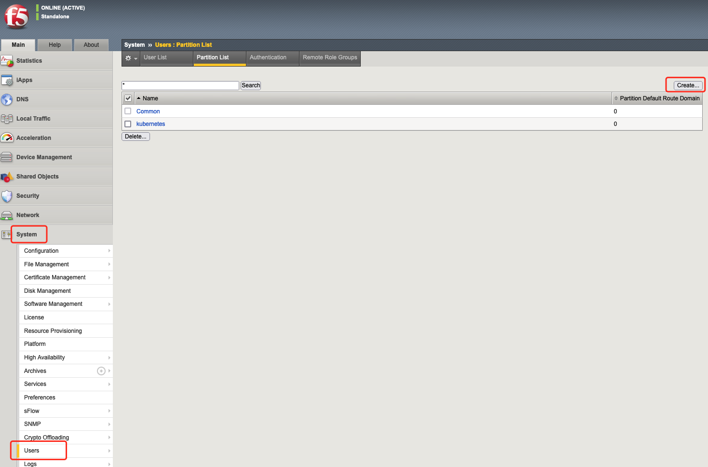
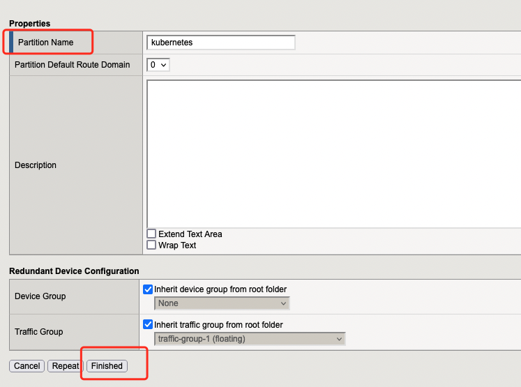
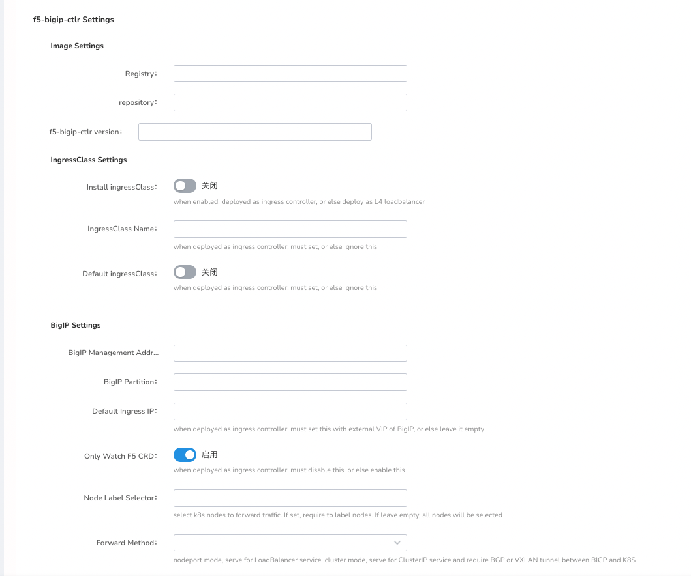
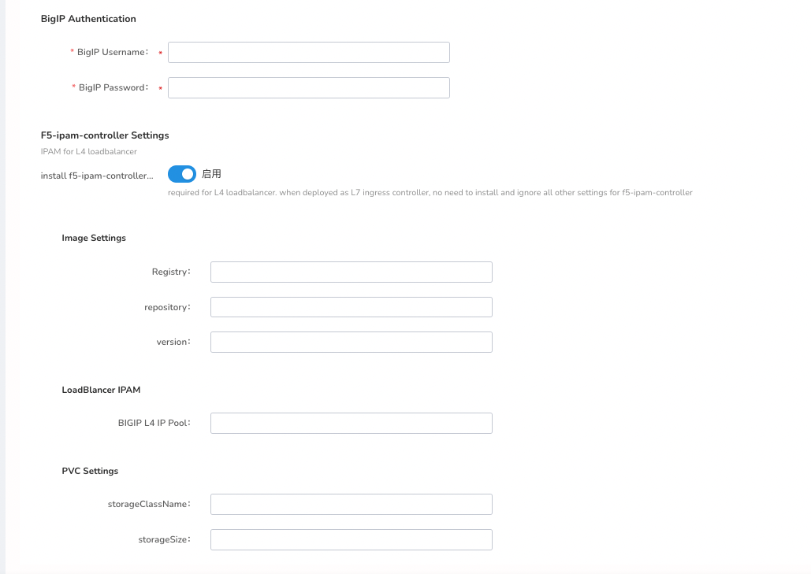

# 安装

本章节介绍如何安装 F5network 组件

## 安装需知

[AS3](https://clouddocs.f5.com/products/extensions/f5-appsvcs-extension/latest/userguide/) 是 F5 设备上的一个插件，其提供了 F5 设备远程网络可配置的接口，AS3 版本和 F5 设备的软件版本是有版本匹配要求的。

[k8s bigip ctlr](https://github.com/F5Networks/k8s-bigip-ctlr) 是 K8S 集群上的 F5 控制面组件，该组件与 K8S 之间是有版本匹配要求的，且 [k8s bigip ctlr](https://github.com/F5Networks/k8s-bigip-ctlr) 与 AS3 也有版本匹配要求。

因此，务必了解 F5 设备的软件版本和 K8S 集群的软件版本，才能正确掌握安装什么版本的 AS3 和 k8s-bigip-ctlr。

获取最新的版本匹配关系，可参考 [F5 官方文档的适配矩阵](https://clouddocs.f5.com/containers/latest/userguide/what-is.html#container-ingress-service-compatibility)

## F5 设备安装 AS3 服务

1. 登录 F5 设备的管理 WEBUI，点击导航栏的 `Statics -> Dashboard`，获取 F5 设备的版本号。

    

2. 根据`安装需知`中的版本匹配关系，下载匹配版本的 AS3 RPM 包到本地电脑 <https://github.com/F5Networks/f5-appsvcs-extension/releases>。

3. 登录 F5 设备的管理 Web UI，进入 `iApps -> Package Management Lx` 界面，点击右上角的 `import`。

    

4. 在 `import package` 界面中，点击`浏览`，选择本地电脑上的 AS3，完成 `upload`。

5. 完成安装后，可查看安装结果。

    

## F5 设备创建 partition

可在 F5 设备上创建一个独立的 partition，供 [k8s bigip ctlr](https://github.com/F5Networks/k8s-bigip-ctlr) 组件对接存储转发规则。具体步骤如下：

1. 登录 F5 设备的管理 WEBUI，进入 `System -> Users -> Partition List` 界面，点击右上角的 `create`。

    

2. 在创建界面中，填写 `Partion Name` 即可，其它按照默认值不需要修改，点击 `Finished` 完成创建。

    

## 集群安装 storage 存储组件（可选）

如果希望本组件安装在 4 层负载均衡模式下，要求安装 [f5 ipam controller](https://github.com/F5Networks/f5-ipam-controller) ，而 [f5 ipam controller](https://github.com/F5Networks/f5-ipam-controller) 要求集群具备 storage 组件提供 PVC 服务。可参考相关的存储组件安装手册。

如果希望本组件安装在 7 层负载均衡模式下，并不需要要求安装 [f5 ipam controller](https://github.com/F5Networks/f5-ipam-controller) ，因此可忽略存储组件的安装。

## 集群安装组件步骤

1. 拥有一个 DCE 集群，登录 global 集群的 WEBUI 管理界面，在导航的`容器管理`->`集群列表`中，登录希望安装本组件的集群。

2. 在 `Helm 应用` -> `Helm 模板`中，选择 `system` 仓库和`网络`组件，点击安装 `f5network`。

    

3. 在`版本选择`中选择希望安装的版本，点击`安装`。

4. 在安装参数界面，填写如下信息。

    
    
    在如上界面中，填写`安装名称`、`命名空间`、`版本`。

    
    
    在如上界面中:

    - `f5-bigip-ctlr Settings -> Registry`：设置 f5-bigip-ctlr 镜像的仓库地址，默认已经填写了可用的在线仓库，如果是私有化环境，可修改为私有仓库地址

    - `f5-bigip-ctlr Settings -> repository`：设置 f5-bigip-ctlr 镜像名

    - `f5-bigip-ctlr version`：设置 f5-bigip-ctlr 的镜像版本，默认值已经设置了最新的版本号。如果进行修改，注意`安装需知`中提到的版本适配问题

    - `Install ingressClass`：是否安装 ingressClass。如果希望使用 7 层转发模式，务必开启本选项，如果希望使用 4 层转发模式，请关闭本选项。

    - `IngressClass Name`：设置 ingressClass 的名字。如果希望使用 7 层转发模式，务必设置本选项，如果希望使用 4 层转发模式，请忽略本选项。

    - `Default ingressClass`：是否设置安装的 ingressClass 作为集群的默认ingressClass。如果希望使用 7 层转发模式，务必开启本选项，如果希望使用 4 层转发模式，可忽略本选项。
    
    - `BigIP Management Addr`：F5 设备的 WEBUI 登录地址

    - `BigIP Partition`：使用 F5 设备的上的 Partition 名字，即在 `F5 设备创建 partition` 步骤中创建的Partition

        注：若多个集群共用对接同一个 F5 设备，不同集群最好使用独立的 Partition

    - `Default Ingress IP`：当本组件安装在 7 层负载均衡模式下，本值设置了 F5 上的 ingress 入口 VIP，注意该 IP 应该是 F5 external interface 子网的IP地址。
     当本组件安装在 4 层负载均衡模式下，忽略本值
      注：若多个集群共用对接同一个 F5 设备，不同集群要使用独立的 IP

    - `Only Watch F5 CRD`：当打开本选项，本组件只会监控自己的 CRD，适用于工作在 4 层负载均衡模式；否则，会监控全部的K8S资源，适用于工作在 7 层负载均衡模式

    - `Node Label Selector`：设置 node label selector，被选择的 node 会作为 nodePort 转发模式下的入口节点，如果不设置本值，F5会把流量转发到集群所有节点的 nodePort 上

    - `Forward Method`：设置 F5 转发流量的模式，`nodePort` 和 `cluster` 模式，模式解释，可参考[介绍](./waht.md)
    
    
    
    在如上界面中:

    - `BigIP Username`：F5 设备的登录账户
    
    - `BigIP Password`：F5 设备的登录密码

    - `install f5-ipam-controller`：是否安装 f5-ipam-controller 组件。当希望工作在 7 层负载均衡模式下，请关闭本开关，当本希望工作在 4 层负载均衡模式下，请打开本开关

    - `F5-ipam-controller Settings -> Registry`：设置 f5-ipam-controller 镜像的仓库地址，默认已经填写了可用的在线仓库，如果是私有化环境，可修改为私有仓库地址。
      当关闭了 `install f5-ipam-controller`，可忽略本选项

    - `F5-ipam-controller Settings -> repository`：设置 f5-ipam-controller 镜像名。
      当关闭了 `install f5-ipam-controller`，可忽略本选项

    - `F5-ipam-controller version`：设置 F5-ipam-controller 的镜像版本，默认值已经设置了最新的版本号。
      当关闭了 `install f5-ipam-controller`，可忽略本选项

    - `BIGIP L4 IP Pool`：设置 F5 的 4 层负载均衡的 VIP 地址池，这些 IP 应该是 F5 external interface 子网的 IP 地址。
      本值的格式类似是 `{ `LabelName`: `172.16.1.1-172.16.1.5` }`， 其中 LabelName 将会用于创建应用 service 时的 annotation 上。
      
        注：创建应用 service 时，只要给 service 打上了 annotation `cis.f5.com/ipamLabel: LabelName`，就会被本组件分配 VIP，最终生效到 F5 设备上。
        当关闭了 `install f5-ipam-controller`，可忽略本选项
        注：若多个集群共用对接同一个 F5 设备，不同集群要使用独立的 IP 池

    - `storageClassName`：设置 storageClass Name，f5-ipam-controller 组件将用于常见 PVC 对象。
      当关闭了 `install f5-ipam-controller`，可忽略本选项

    - `storageSize`：设置存储池大小，f5-ipam-controller 组件将用于常见 PVC 对象。
      当关闭了 `install f5-ipam-controller`，可忽略本选项

## cluster 转发模式下的配置（可选）

当被组件安装为 cluster 转发模式时，需要在 F5 和 K8S 集群之间配置 VXLAN 隧道，或者 配置 BGP 邻居。

K8S 的 CNI 组件往往可配置 BGP，与 F5 组件 BPG 邻居，可实现网络打通。
例如 Calico 场景下，具体可参考 [F5 官方文档](https://clouddocs.f5.com/containers/latest/userguide/calico-config.html) 。

关于本组件的更多介绍，可参考 [F5 官方文档](https://clouddocs.f5.com/containers/latest/userguide/) 。
