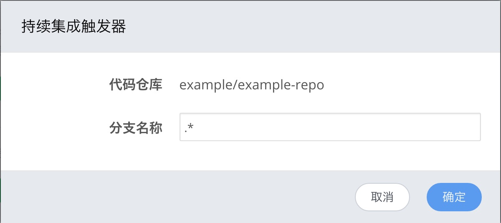
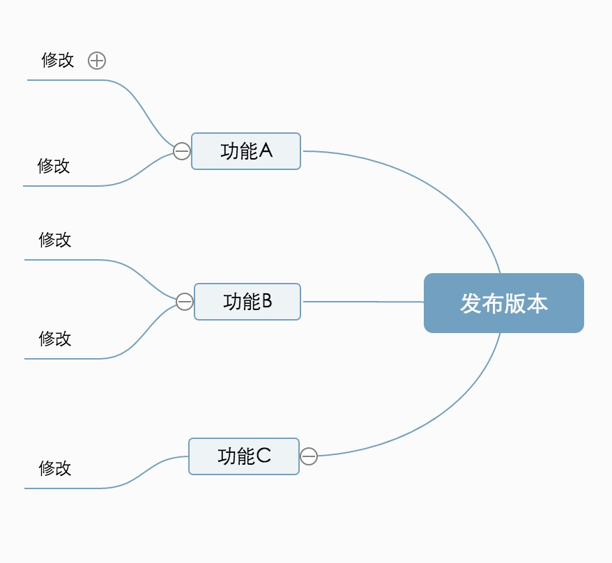
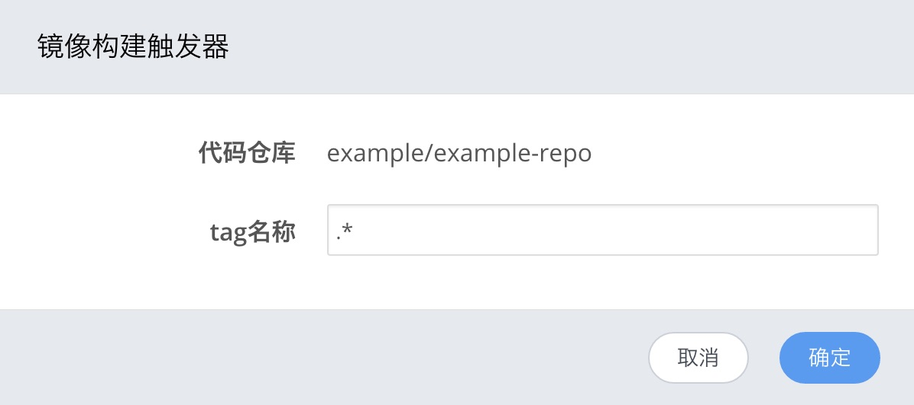

<!-- reviewed by fiona -->

<!--
说清楚 代码分支，实践，CI和镜像构建的关系

手动构建- >可以选择分支，也可以在构建规则是选择，手动是处理例外情况

自动构建

重新构建：适用于失败的项目，可以重新执行CI，也可以重新执行Build，但是，是根据build服务器上的code来重新执行，如果有新的 commit，需要调整，不要混淆。

项目属性的 tab，一些高级功能的设置方式，和使用的目的
-->

---

在 GitHub 等第三方代码托管平台上，支持让代码根据分支（`branch`）和标签（`tag`）来区分不同的版本，以更好地管理代码的修改。同样地， DaoCloud 也提供基于代码分支和代码标签的自动构建触发器，使得自动构建变得更灵活。

### 根据代码分支来触发持续集成

在 Git 的优秀实践中，我们建议在 `develop` 分支中进行功能的增加、修改等操作，当完成一个功能的开发或更新以后，再将 `develop` 分支中修改的 `commit` 合并（`merge`）到 `master` 分支中，这样就可以做到代码版本的更新迭代井然有序。

>>>>> 更多优秀的 Git 实践请参照「[git-flow](https://github.com/nvie/gitflow)」。

这种代码管理方式可以运用到 DaoCloud 中来。因为在代码迭代的过程中，并非每一次的修改都需要进行持续集成的测试；那么我们就可以将持续集成的触发机制定位——当 `master` 分支发成修改时，便触发持续集成。

#### 第一步

打开需要修改的项目中的「设置」页面，并看到「持续集成触发器」栏目。


#### 第二步

点击「修改」按钮，页面出现修改对话框。



#### 第三步

我们将「分支名称」栏目更改成 `master`，并点击「确定」按钮。


这样，该代码库只有在 `master` 分支出现变更时才会触发持续集成。

###  根据代码标签（`tag`）来触发自动构建

自动构建是持续集成的目的，但自动构建的触发频率应该要比持续集成更低，比如说发布版本的时候才会触发自动构建。

一个良好的代码版本迭代流程应该是这样的：



DaoCloud 可以让代码项目在打上 `tag` 的时候触发自动构建，而这个 `tag` 也是可以定下规则的。我们推荐使用 `release-***` 的形式表示一次功能发布，比如 `release-v0.1.0`。

#### 第一步

打开需要修改的项目中的「设置」页面，看到「自动构建触发器」栏目。


#### 第二步

点击「修改」按钮，页面出现修改对话框。



#### 第三步

我们将「tag 名称」栏目更改成 `release-(.*)`，并点击「确定」按钮。


完成 DaoCloud 项目的设置后，以后若需要进行自动构建，则在项目代码中添加符合 `release-(.*)` 的标签即可以。

``` shell
$ git tag -a release-v0.1.0 -m "Release v0.1.0: Update ...."
```
