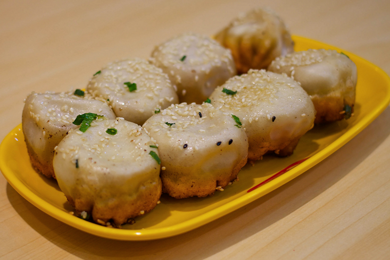

我为老东家的CTO部门工作的七年里，除了吃饭睡觉码代码，干的最多的事情就是布道。给工程师讲技术，给管理层讲业态，给客户讲故事。但让我很沮丧的是，在离职那天给我留言最多的一条，居然是“很遗憾，再也听不到你讲美食了”。好吧，虽然我们怀揣着改变世界的梦想踏上征程，却总是在路口的料理摊停下了脚步。这个插曲，就算是我这系列文章的引子。

> 每一个吃货的心里，都住着一个厨子。

> 每一个码农的心里，都憋着一个梦想。

因为出来创业了，开始有机会接触到形形色色的创业者。也可能我们的主业是技术型创业的关系，大家也愿意更敞开心扉的和我们分享他们的发展痛点，我们也总是尽量从技术的视角给到对方一些建议，久而久之有人给我们的沙龙取名”CTO as a Service“，”首席技术官急诊室“，或者更有地域特色的名字：”CTO老娘舅“。当然柏阿姨那是阅人无数，我们大概勉强能算个阅码无数。

上周沙龙的话题叫”我该不该用外包？“，来宾对此似乎都有切身感受，讨论很热烈都插不上嘴。那我就旁听了一会，发现几乎一半以上的来宾的项目，开发技术是外包的。好在当天的结论出的也很快，就是外包苦海，回头是岸。但究竟痛苦的根源在哪里，来宾也讲不清楚。于是给了我这个老娘舅开腔的机会。

上海最好吃的生煎包是哪里？你一定会说是小杨生煎。那为什么好吃，好吃在哪你想过吗？按我说，上海滩那么多生煎摊头，生煎包的配方和工艺没秘密可言，那秘诀在哪？我研究下来的结论：在流程。小杨生煎当年在吴江路也不是独此一家，最后他能做出来绝对有章可循。我们一般的生煎摊，一口锅，生意好一点的两口锅轮换。你们看过小杨几口吗？我仔细研究过，有三口。对，秘诀就在这三口锅里。小杨的店面一般5-10个平方，前店后厂，包馅的阿姨一般四个人组队。全速开动包一锅15分钟。包完煎锅师傅接过上油锅煎，5分钟后煎锅师傅把锅挪到第二口锅上大火，10分钟后挪到第三口锅上葱花芝麻准备出锅。15分钟时准时出锅。而此过程门口的排队长龙是始终处在流动状态的，一天周而复始如此。生煎的美味就在那出锅的一两分钟内，热油蒸腾的汤汁在咬破面皮那一刻喷薄而出。倘若过了这当口，风味就呈现断崖式的跌落，这就是小杨的秘密。

做移动互联网恰似开一家生煎铺，前店后厂，四五个厨子就能整出一出好戏。但竞争激烈，可复制强，时刻面对海量用户。各位作为CEO也好还是CTO也罢，你也要有小杨的两把刷子，加那三口锅。刷子我信你们都有，但这三口锅未必都有。

我们在一个最好的时代也是最坏的时代，用户变得更随意，因为他们的选择更多。我们应对客户的也不再是某个产品或者品牌，而是服务。能对客户产生最大的粘性取决于你不断改善服务的能力，让我们回到那三口锅。IT系统是一个设计与开发正交的系统，设计不是一蹴而就有个迭代的过程，软件质量也是不断趋于稳定。因此如果技术成分在你的业务模式里有着举足轻重的地位，那就要思考如何去构建属于自己的敏捷、迭代和持续的IT流程。因此，为什么今天我们听到的外包项目会失败，因为他帮助你做了第一锅包子，然后用的还是借来的锅。

现代IT技术的发展，伴随着云计算这波流，目标就是奔着自动化和服务化去了。这当中，自动化和碎片化的程度是呈线性关系的，有了技能的碎片化和标准化，才能带来管理的的科学与高效。你的组织在IT能力上具备不具备这个条件就很关键了。所以今天大家讨论的外包公司或团队好不好，负责不负责不是关键问题，而是你自己有没有持续交付的能力。

持续交付中那三口锅，用我们从业人员的话说，就叫开发，测试，生产。你问这东西谁能帮我管好，那就说到CTO了，也就是小杨的煎锅师傅。是啊，你们怎么没想到煎锅师傅不就是大家苦苦寻觅的CTO吗？你的业务沉淀为IT化的程序，要能够在这三口锅之间快速迭代和交付。小杨能做到15分钟迭代一个版本，一小时就是4个版本，一天就是32个版本。贵为互联网公司的你，一周能有小杨一天这个数字你已经很了不起了。如果你真的需要一个CTO，他应该首先帮你端好这三口锅。

下面的同学急了，要拉着我陪他去买锅。那关于炊具的故事，且听下回分解《砂锅馄饨的交付件》。

*待续*