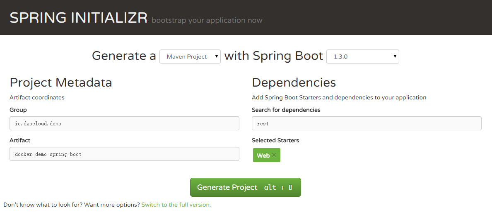

> 目标：用 Docker 的方式搭建一个 Java Spring Boot 应用
> 
> 本项目代码维护在 **[DaoCloud/docker-demo-java-springboot]()** 项目中。
>
> 您可以在 GitHub 找到本项目并获取本文中所提到的所有代码文件。

### 前言
Java 一直是企业应用开发的大头，在互联网时代，在云计算、大数据的推动下，Java 又焕发了新生。

Spring Framework 是 Java 应用开发中应用最广泛的框架，基于 AOP 及 IOC 的思想，让它能与任何 Java 第三方框架进行非常便利的集成。

Spring Boot 是由 Pivotal 团队提供的全新框架，其设计目的是用来简化新 Spring 应用的初始搭建以及开发过程。该框架使用了特定的方式来进行配置，从而使开发人员不再需要定义样板化的配置。通过这种方式，Spring Boot 致力于在蓬勃发展的快速应用开发领域（Rapid application development）成为领导者。

Maven 自从公布以来，在 Java 应用构建和管理中一直处于最重要的地位，基于 Project Object Model 的概念管理项目。

### Docker 化应用的关键元素
* 镜像是 Docker 应用的静态表示，是应用的交付件，镜像中包含了应用运行所需的所有依赖：包括应用代码、应用依赖库、应用运行时和操作系统。
* Dockerfile 是一个描述文件，描述了产生 Docker 镜像的过程。详细文档请参见 [Dockerfile文档](https://docs.docker.com/reference/builder/)
* 容器是镜像运行时的动态表示，如果把镜像想象为一个 Class 那么容器就是这个 Class 的 instance 实例。

一个应用 Docker 化的第一步就是通过 Dockerfile 产生应用镜像。

### 创建 Spring Boot 项目

访问 http://start.spring.io 站点，根据需要建立自己的应用。



在我们的教程中，我们将基于 Spring Boot 开发一个 RESTful API 应用，使用 MongoDB 来持久化我们的数据，项目使用 Maven 构建。

所以，我们在 Dependencies 中填写 Web ，然后点击 Generate Project 按钮，将会下载回来一个基于 Maven 的项目模板。

### 添加 Maven 插件及相关代码

Maven 有非常丰富的插件，包括 Docker 插件，在我们的教程中，将会使用 `maven-docker-plugin` 插件来辅助构建我们的 Docker 镜像。

在项目的 pom.xml 文件中，添加 `maven-docker-plugin` 插件配置，代码如下：

```
<plugin>
	<groupId>com.spotify</groupId>
	<artifactId>docker-maven-plugin</artifactId>
	<version>0.3.6</version>
	<executions>
		<execution>
			<phase>package</phase>
			<goals>
				<goal>build</goal>
			</goals>
		</execution>
	</executions>
	<configuration>
	<imageName>${project.artifactId}</imageName>
	<dockerDirectory>${project.basedir}/src/main/docker</dockerDirectory>
	<resources>
		<resource>
			<targetPath>/</targetPath>
			<directory>${project.build.directory}</directory>
			<include>${project.build.finalName}.jar</include>
		</resource>
	</resources>
	</configuration>
</plugin>

```

在 `src/main` 目录下新建 docker 文件夹，在该文件夹中放置构建 Docker 镜像所需的 Dockerfile。

```
FROM daocloud.io/java:8
VOLUME /tmp
ADD *.jar app.jar
RUN bash -c 'touch /app.jar'
EXPOSE 8080
ENTRYPOINT ["java","-Djava.security.egd=file:/dev/./urandom","-jar","/app.jar"]

```

编辑 `src/main/java/{pacakge}/*Application.java` 文件，添加一个方法，加上 `@RequestMapping` 注解，并添加类注解 `@RestController`。

```
@RequestMapping("")
public String hello(){
	return "Hello! Docker!";
}
	
```

> 本次基础镜像使用 Java 官方镜像，也可以根据自己的项目需求与环境依赖使用 [定制的 Java 基础镜像](http://open.daocloud.io/ru-he-zhi-zuo-yi-ge-ding-zhi-de-php-ji-chu-docker-jing-xiang/)。

> 因所有官方镜像均位于境外服务器，为了确保所有示例能正常运行，DaoCloud 提供了一套境内镜像源，并与官方源保持同步。

> 官方镜像维护了自 1.6 版本起的所有 Java 基础镜像，我们的选择官方的 `java:8` 镜像作为我们的基础镜像来构建我们的应用。

因为 Spring Boot 框架打包的应用是一个包含依赖的 jar 文件，内嵌了 Tomcat 或者 Jetty 支持，所以我们只需要使用 Java 镜像即可，不需要 Tomcat 镜像。

根据 pom.xml 文件的定义，将会在执行 `mvn package` 命令时，执行 `docker build` 命令，使用 `/src/main/docker` 路径下的 Dockerfile 文件。

在 Dockerfile 文件的最后，使用 `ENTRYPOINT` 指令执行启动 Java 应用的操作。

Dockerfile 具体语法请参考：**[Dockerfile](https://docs.docker.com/reference/builder/)**。

在一切准备好之后，在应用的根目录执行 `mvn package` 命令，Maven 将会自动下载应用依赖，并且打包 Docker 镜像，生成的镜像名称是应用的 `artifactId`，在本教程中，应用的 `artifactId` 为 `docker-java-demo`，所以镜像名称也是 `docker-java-demo`。

最后，让我们从镜像启动容器： 

`docker run -d -p 8080:8080 docker-java-demo`

打开浏览器，访问 `http://localhost:8080`，将会看到屏幕上显示 `Hello! Docker!` 文字。

如果看到这段字符串，那么就说明你成功将一个基于 Spring Boot 的应用 Docker 化了。

欢迎来到 Docker 的世界，这个世界有你意想不到的精彩！

#### 致谢

本文由 DaoCloud 社区用户**谭文科**提供