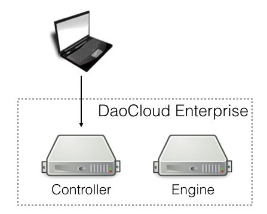
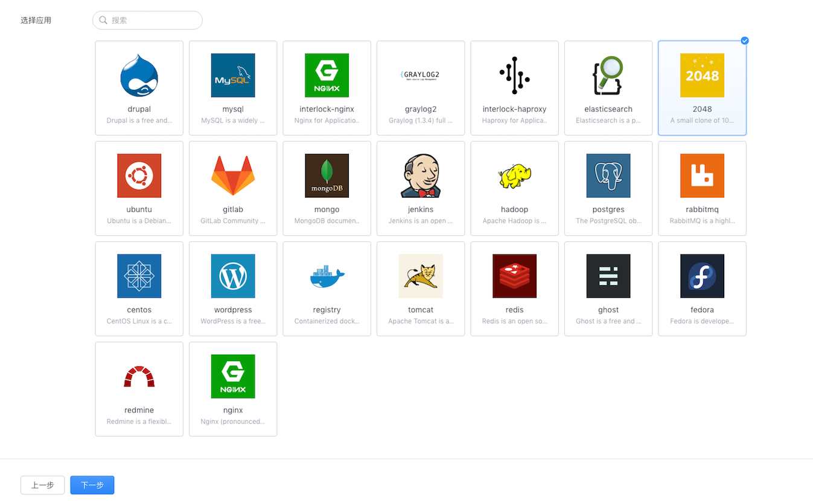
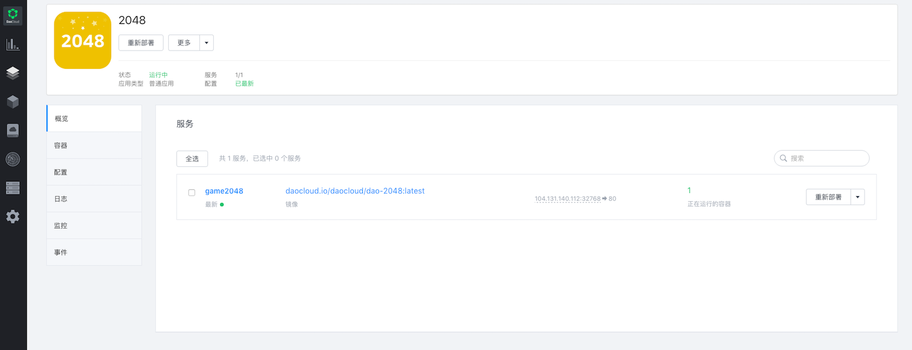

DCE 提供了一整套安装套件。你可以在10分钟之内安装 DaoCloud Enterprise (DCE)。 

这个页面将帮助你在你的主机上安装一套简单的 DaoCloud Enterprise (DCE) ，并使用 DCE 控制台部署你的一些应用。本页面的安装方式适用于 Linux 操作系统。如果你熟悉 DCE 和 Docker，你可以直接前往[应用部署](http://docs.daocloud.io/daocloud-enterprise/deploy-an-application)查看更详细的 DCE 安装与部署方案。 

一个基础的 DCE 包含了 DCE Controller 和 DCE Engine，DCE Controller 主机控制管理所有的 DCE Engine 主机。这两种角色的安装都依赖于 Docker 技术，只要你拥有带有 Docker 的主机，你将能够在这些主机上轻松安装 DCE。


## 简单介绍

本次示例将向你介绍如何使用安装 DCE，如何使用 DCE 控制台快速部署一个简单的 2048 应用。部署完成后，便可以通过浏览器进入该游戏。
>>>>> DaoCloud 向用户提供了应用仓库，在本次示例中，只要在应用仓库中找到 2048，然后点击立即部署即可完成应用部署，不需要用户编写任何代码。

## 准备环境

在安装 DCE 之前，你需要准备至少一台主机作为安装环境。在 DCE 安装中，将会指定你的主机中的一台作为 DCE Controller，如果还有其余主机，它们将会作为 DCE Engine 加入 DCE 集群。你可以通过 VirturalBox 在本地虚拟化多个主机来完成本次安装，当然，你也可以通过 ssh 连接到远程服务器，在远程服务器上完成本次安装。
>>>>> 用于安装 DCE 的主机必须是  64 位架构的计算机，机器的操作系统必须是 Linux，同时建议将系统内核升级到Linux 3.8 或更高版本。

因为 DCE 依赖于 Dcoker，所以你需要在准备好用于安装的主机后，再在每台主机上安装 Docker。如果你的主机已经完成 Docker 的安装，请跳过当前步骤，直接进入下一步——安装控制器。
Docker 安装方式如下：   
	&ensp;&ensp;&ensp;&ensp;1，登录用于安装 DCE 的主机，进入控制台；  
	&ensp;&ensp;&ensp;&ensp;2，执行 `sudo su` 切换到 # root 帐户状态；  
	&ensp;&ensp;&ensp;&ensp;3，执行如下命令安装 Docker . 

	curl -sSL https://get.daocloud.io/docker | sh

出现如下输出时，表示 Docker 安装成功。
```
Client:
 Version:      1.10.3
 API version:  1.22
 Go version:   go1.5.3
 Git commit:   20f81dd
 Built:        Thu Mar 10 15:54:52 2016
 OS/Arch:      linux/amd64

Server:
 Version:      1.10.3
 API version:  1.22
 Go version:   go1.5.3
 Git commit:   20f81dd
 Built:        Thu Mar 10 15:54:52 2016
 OS/Arch:      linux/amd64

If you would like to use Docker as a non-root user, you should now consider
adding your user to the "docker" group with something like:

  sudo usermod -aG docker ubuntu

Remember that you will have to log out and back in for this to take effect!
```
>>>>> 这里使用 DaoCloud 的镜像仓库来完成 Docker 安装，你也可以使用 Dokcer Hub 的仓库安装 Docker。


## 安装控制器

在这一步，你需要登录到被指定为 DCE Controller 的机器（后文称为 Controller 主机），进行 DCE 的安装。
为了安装 DCE，你需要先进入 Controller 机器终端，然后通过如下命令安装 DCE 控制器。

	sudo su
	bash -c "$(docker run -i --rm daocloud.io/daocloud/dce install)"

当控制台输出如下，则安装成功。如果安装失败，请重新检查你的安装环境是否正确，再重新安装。如果你确保安装环境无误，而 DCE 安装失败，请通过 DaoVoice 联系 DaoCloud 的技术人员，获取服务支持。
```
Installed DCE
DCE CLI at 'export DOCKER_HOST="192.168.2.125:2375"; docker info'
DCE WEB UI at http://192.169.2.125
```
安装过程可能出现 `Please run the script to enable Overlay Network ` 提示，此时，请通过重启 Docker。

ubuntu下：
```
service docker restart
```

centos下： 
```
systemctl restart docker 
```

 >>>>> 安装好 DCE 控制器后，便可以通过浏览器访问 Controller 机器对应的 IP，进入 DCE 控制台。


## 接入主机
目前你已经完成了 DCE Controller 的安装，如果你只有一台机器用于 DCE，你可以跳过当前步骤，进入下一步，开始部署应用。如果你有多台节点，那么当你在 Controller 机器上安装好 DCE Controller 后，你还需要在其他机器上安装 DCE Engine（后问称为 Engine 主机），从而使该节点接入 DCE。

DCE Engine 安装方法如下。
	1，获取 Controller 机器IP；
	2，登录 Engine 主机，进入终端交互；
	3，执行如下命令，安装 DCE Engine，将当前 Engine 机器加入 DCE。

	sudo su
	bash -c "$(docker run -i --rm daocloud.io/daocloud/dce join {你的控制器IP})"

完成主机接入后，你可以在 DCE 控制台「主机」页面查看、管理新加入的主机。


>>>>> 被接入的主机在接入前也需要安装 Docker。

## 部署应用

到现在，你已经完成 DCE 基本环境的安装，接下来，便可以通过 DCE 控制台完成 2048 应用的部署。

### 第一步
首先在 DCE 控制台点击「应用」，接着点击「应用」创建，开始创建应用，填写应用名称，然后选择创建方式，这里选择「应用仓库」。


>>>>> 更多创建方式的使用，可以参考[应用部署](http://localhost:8080/daocloud-enterprise/deploy-an-application)

### 第二步
浏览 DaoCloud 提供的应用仓库，从中选择选择「2048」。


### 第三步
点击「立即部署」，完成 2048 应用的部署。

>>>>> 在应用配置部署环节，可以通过修改「Compose YML」配置应用。 


## 管理应用
DCE 通过 WEB UI 提供了一套完整的 DCE 控制台。通过访问 Master 机器的 IP，进入 DCE 控制台。在 DCE 控制台，你可以对应用，容器，存储卷，网络，主机等进行配置和修改。
在本次示例中，安装完 2048 应用后，DCE 将自动跳转到应用管理页面，你可以在该页面对应用进行更加精细的控制和管理。

>>>>> 更多应用管理的信息，可以参考[应用管理](http://docs.daocloud.io/daocloud-enterprise/deploy-an-application)


